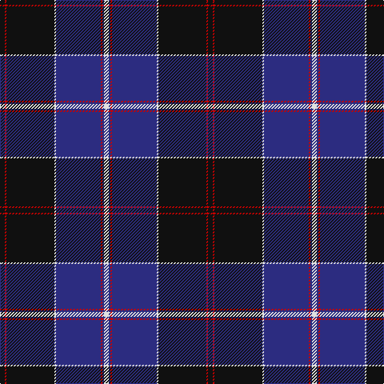

In pattern [KRKWBRBW](/stripes/krkwbrbw/).

This was sourced from register-of-tartans.  It is a [8 stripe tartan](/stripes/stripes8/).

Original link https://www.tartanregister.gov.uk/tartanDetails.aspx?ref=1045

## Attestations

This cloth appears in 4 source records; the oldest owns this page.

- 01/01/1982 — Dunlop (register-of-tartans, [record](https://www.tartanregister.gov.uk/tartanDetails.aspx?ref=1045))
- 1982 — Dunlop (Clan) (tartans-authority, [record](http://www.tartansauthority.com/tartan-ferret/display/1197/))
- undated — Dunlop (weddslist, [record](http://www.weddslist.com/cgi-bin/tartans/pg.pl?source=sts))
- undated — Dunlop Clan Tartan Tartan Number: 1197. Earliest known date: 1982 Revised version See products available Copyright © Blair Urquhart, Comrie, 2015 (house-of-tartan, [record](http://www.house-of-tartan.scotland.net/house/TartanViewjs.asp?colr=Def&tnam=1197))

## Register references

External register numbers recorded for this tartan.

- Scottish Register of Tartans: [1045](https://www.tartanregister.gov.uk/tartanDetails.aspx?ref=1045)
- Scottish Tartans Authority (ITI): 1197
- Scottish Tartans World Register: 1197

## Thread count
K/6 R2 K60 LN2 DB56 R2 DB2 LN/6

## Palette
Each colour and the base-6 reference it is a variant of.

| Colour | Shade | Base |
|---|---|---|
| DB | <code style="background-color:#2C2C80;">#2C2C80</code> `oklch(35.0% 0.138 276.6)` <small>#2C2C80</small> | B <code style="background-color:#2A418A;">#2A418A</code> |
| K | <code style="background-color:#101010;">#101010</code> `oklch(17.3% 0.000 89.9)` <small>#101010</small> | K <code style="background-color:#000000;">#000000</code> |
| LN | <code style="background-color:#E0E0E0;">#E0E0E0</code> `oklch(90.7% 0.000 89.9)` <small>#E0E0E0</small> | W <code style="background-color:#F7F7F7;">#F7F7F7</code> |
| R | <code style="background-color:#C80000;">#C80000</code> `oklch(52.3% 0.215 29.2)` <small>#C80000</small> | R <code style="background-color:#CC0000;">#CC0000</code> |

# Sample pattern

## Nearest tartans

The nearest existing variants by ΔTartan distance.

1. [Hill (Name)](/setts/s9/w3db2ly1db2ly1db31k28r2k2~x2/) — ΔT 0.90
1. [Finnie (Personal)](/setts/s8/k4w1dp5w1k20db37w4db4~x2/) — ΔT 0.90
1. [Binder Wedding (Personal)](/setts/s8/g1db1k1db30k30w2db5ly1~x2/) — ΔT 0.99
1. [NHS Grampian](/setts/s7/k4w1t2w1k16db36t4~x2/) — ΔT 1.10
1. [Fuller of Hopewell (Personal)](/setts/s7/k1w1k18db20w1r1lo1~x4/) — ΔT 1.12
1. [Koot Wedding (Personal)](/setts/s6/db48k32r1k8r3w3~x2/) — ΔT 1.20
1. [Scotland's Own](/setts/s12/db4w1db30k15p4db2k2db2k10db4p2db2~x2/) — ΔT 1.29
1. [Locky](/setts/s10/r3w2r2db2r2db24k28r2k3ly1~x2/) — ΔT 1.31
1. [Hope-Weir / Weir](/setts/s8/k8ly1k1db28k12g2k1t2~x2/) — ΔT 1.31
1. [MacBeth (Fashion)](/setts/s8/db42k6lo2k3lo2g10r7k2~x2/) — ΔT 1.32

## Neighbour map

Every grey dot is one of 14299 variants placed by the first two principal components of the ΔTartan feature space (44% of its variance). Red is this tartan; blue dots are its nearest — click one to open its page.

<svg viewBox="0 0 640 380" role="img" style="max-width:100%;height:auto;border:1px solid #e0e0e0;border-radius:4px;display:block" xmlns="http://www.w3.org/2000/svg"><image href="/nn/cloud.v1.png" width="640" height="380"/><a href="/setts/s9/w3db2ly1db2ly1db31k28r2k2~x2/"><circle cx="337.8" cy="113.6" r="4" fill="#3465a4"><title>Hill (Name)</title></circle></a><a href="/setts/s8/k4w1dp5w1k20db37w4db4~x2/"><circle cx="365.4" cy="135.6" r="4" fill="#3465a4"><title>Finnie (Personal)</title></circle></a><a href="/setts/s8/g1db1k1db30k30w2db5ly1~x2/"><circle cx="358.5" cy="127.2" r="4" fill="#3465a4"><title>Binder Wedding (Personal)</title></circle></a><a href="/setts/s7/k4w1t2w1k16db36t4~x2/"><circle cx="395.5" cy="147.4" r="4" fill="#3465a4"><title>NHS Grampian</title></circle></a><a href="/setts/s7/k1w1k18db20w1r1lo1~x4/"><circle cx="313.5" cy="144.1" r="4" fill="#3465a4"><title>Fuller of Hopewell (Personal)</title></circle></a><a href="/setts/s6/db48k32r1k8r3w3~x2/"><circle cx="390.4" cy="155.7" r="4" fill="#3465a4"><title>Koot Wedding (Personal)</title></circle></a><a href="/setts/s12/db4w1db30k15p4db2k2db2k10db4p2db2~x2/"><circle cx="365.1" cy="126.2" r="4" fill="#3465a4"><title>Scotland's Own</title></circle></a><a href="/setts/s10/r3w2r2db2r2db24k28r2k3ly1~x2/"><circle cx="296.1" cy="107.4" r="4" fill="#3465a4"><title>Locky</title></circle></a><a href="/setts/s8/k8ly1k1db28k12g2k1t2~x2/"><circle cx="320.6" cy="125.7" r="4" fill="#3465a4"><title>Hope-Weir / Weir</title></circle></a><a href="/setts/s8/db42k6lo2k3lo2g10r7k2~x2/"><circle cx="343.2" cy="139.7" r="4" fill="#3465a4"><title>MacBeth (Fashion)</title></circle></a><circle cx="359.5" cy="139.2" r="5" fill="#c00000"/></svg>

ID: /setts/s8/k3r1k30w1db28r1db1w3~x2/
