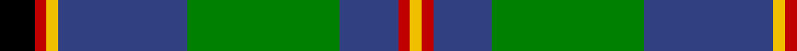
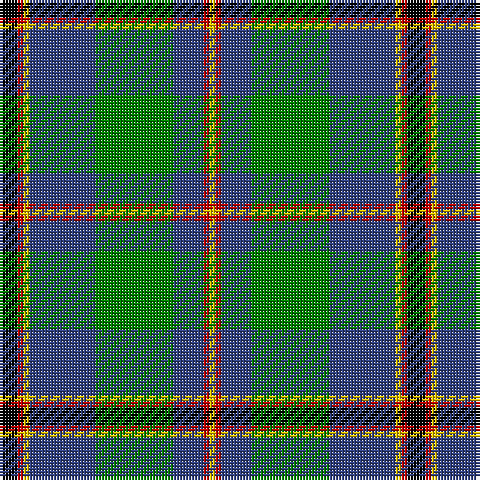

This page is one **sett** — a single exact thread-count. It belongs to the [tartan](/tartans/k3r1y1b11g13b5r1y1/)
(the same proportion at any scale), whose colour order is pattern [KRYBGBRY](/stripes/krybgbry/).

Sourced from weddslist.  It is a [8 stripe tartan](/stripes/stripes8/).

Original link http://www.weddslist.com/cgi-bin/tartans/pg.pl?source=sts

2 attestations — the source records this cloth was collapsed from (oldest owns this page)

<ul>
<li>undated — Snodgrass (weddslist, <a href="http://www.weddslist.com/cgi-bin/tartans/pg.pl?source=sts">record</a>)</li>
<li>undated — Snodgrass Family Tartan Tartan Number: 1216. Earliest known date: 1978 Designed for the Snodgrass Clan Association. It is based on the Cunningham tartan, and the colours chosen were, Black, Green and Gold - of the Snodgrass Coat of Arms, Green - for the 'grasy place' (sic) alluded to in the name, and Blue - representing the traditional Highland 'Blue Bonnet'. See products available Copyright © Blair Urquhart, Comrie, 2015 (house-of-tartan, <a href="http://www.house-of-tartan.scotland.net/house/TartanViewjs.asp?colr=Def&tnam=1216">record</a>)</li>
</ul>

## Thread count
K/6 R2 Y2 B22 G26 B10 R2 Y/2

## Palette
Each colour and the base-6 reference it is a variant of.

| Colour | Shade | Base |
|---|---|---|
| B | <code style="background-color:#304080;">#304080</code> `oklch(39.4% 0.109 270.2)` <small>#304080</small> | B <code style="background-color:#2A418A;">#2A418A</code> |
| G | <code style="background-color:#008000;">#008000</code> `oklch(52.0% 0.177 142.5)` <small>#008000</small> | G <code style="background-color:#006100;">#006100</code> |
| K | <code style="background-color:#000000;">#000000</code> `oklch(0.0% 0.000 0.0)` <small>#000000</small> | K <code style="background-color:#000000;">#000000</code> |
| R | <code style="background-color:#C00000;">#C00000</code> `oklch(50.7% 0.208 29.2)` <small>#C00000</small> | R <code style="background-color:#CC0000;">#CC0000</code> |
| Y | <code style="background-color:#F0C000;">#F0C000</code> `oklch(82.7% 0.169 90.5)` <small>#F0C000</small> | Y <code style="background-color:#F2BF00;">#F2BF00</code> |

# Sample pattern

## Nearest tartans

The nearest existing variants by ΔTartan distance, with this tartan at the top so the swatches line up against it.

ΔTartan

Tartan

Sett

—

<a href="/ttd/edit/#slug=k3r1ly1db11g13db5r1ly1~x2">Snodgrass</a> <a class="nn-out" href="/setts/s8/k3r1ly1db11g13db5r1ly1~x2/" title="open its dictionary page">↗</a>

0.67

<a href="/ttd/edit/#slug=r4b11k3b3k3b4k15g36w3~x2">Semple (Name)</a> <a class="nn-out" href="/setts/s9/r4b11k3b3k3b4k15g36w3~x2/" title="open its dictionary page">↗</a>

0.68

<a href="/ttd/edit/#slug=db3r2db22k11g24lp2g3~x2">MacThomas</a> <a class="nn-out" href="/setts/s7/db3r2db22k11g24lp2g3~x2/" title="open its dictionary page">↗</a>

0.69

<a href="/ttd/edit/#slug=r6db27t2g2t2g30w4~x2">MX-5 Owners' Club</a> <a class="nn-out" href="/setts/s7/r6db27t2g2t2g30w4~x2/" title="open its dictionary page">↗</a>

0.78

<a href="/ttd/edit/#slug=g3n5k4n33g12k4w2k18lo3~x2">Smoke Showing (UFES)</a> <a class="nn-out" href="/setts/s9/g3n5k4n33g12k4w2k18lo3~x2/" title="open its dictionary page">↗</a>

0.79

<a href="/ttd/edit/#slug=g5db24g7k10g24ly2db2ly2r2~x2">Maitland Chief</a> <a class="nn-out" href="/setts/s9/g5db24g7k10g24ly2db2ly2r2~x2/" title="open its dictionary page">↗</a>

0.80

<a href="/ttd/edit/#slug=db10ly3db30ly5k8g16r4g16r2~x2">MacMillan, hunting</a> <a class="nn-out" href="/setts/s9/db10ly3db30ly5k8g16r4g16r2~x2/" title="open its dictionary page">↗</a>

0.83

<a href="/ttd/edit/#slug=db2r1db10w1y4g8g1g2~x4">Ayrshire</a> <a class="nn-out" href="/setts/s8/db2r1db10w1y4g8g1g2~x4/" title="open its dictionary page">↗</a>

0.86

<a href="/ttd/edit/#slug=g28k4g5dr4g5k19db19y2~x2">City of Guelph</a> <a class="nn-out" href="/setts/s8/g28k4g5dr4g5k19db19y2~x2/" title="open its dictionary page">↗</a>

0.96

<a href="/setts/s8/dp19w2g12t3k4~x2/">Wilson's No.111</a>

0.97

<a href="/ttd/edit/#slug=r1g9db9k1db1w1~x6">Irving of Glentulchan</a> <a class="nn-out" href="/setts/s6/r1g9db9k1db1w1~x6/" title="open its dictionary page">↗</a>

## Neighbour map

Every grey dot is one of 14299 variants placed by the first two principal components of the ΔTartan feature space (44% of its variance). Red is this tartan; blue dots are its nearest — click one to open its page.

<svg viewBox="0 0 640 380" role="img" style="max-width:100%;height:auto;border:1px solid #e0e0e0;border-radius:4px;display:block" xmlns="http://www.w3.org/2000/svg"><image href="/nn/cloud.v1.png" width="640" height="380"/><a href="/setts/s9/r4b11k3b3k3b4k15g36w3~x2/"><circle cx="215.9" cy="155.2" r="4" fill="#3465a4"><title>Semple (Name)</title></circle></a><a href="/setts/s7/db3r2db22k11g24lp2g3~x2/"><circle cx="195.3" cy="176.2" r="4" fill="#3465a4"><title>MacThomas</title></circle></a><a href="/setts/s7/r6db27t2g2t2g30w4~x2/"><circle cx="242.9" cy="158.5" r="4" fill="#3465a4"><title>MX-5 Owners' Club</title></circle></a><a href="/setts/s9/g3n5k4n33g12k4w2k18lo3~x2/"><circle cx="240.3" cy="148.3" r="4" fill="#3465a4"><title>Smoke Showing (UFES)</title></circle></a><a href="/setts/s9/g5db24g7k10g24ly2db2ly2r2~x2/"><circle cx="241.8" cy="173.1" r="4" fill="#3465a4"><title>Maitland Chief</title></circle></a><a href="/setts/s9/db10ly3db30ly5k8g16r4g16r2~x2/"><circle cx="188.9" cy="161.6" r="4" fill="#3465a4"><title>MacMillan, hunting</title></circle></a><a href="/setts/s8/db2r1db10w1y4g8g1g2~x4/"><circle cx="177.6" cy="169.8" r="4" fill="#3465a4"><title>Ayrshire</title></circle></a><a href="/setts/s8/g28k4g5dr4g5k19db19y2~x2/"><circle cx="209.4" cy="179.4" r="4" fill="#3465a4"><title>City of Guelph</title></circle></a><a href="/setts/s8/dp19w2g12t3k4~x2/"><circle cx="183.3" cy="183.4" r="4" fill="#3465a4"><title>Wilson's No.111</title></circle></a><a href="/setts/s6/r1g9db9k1db1w1~x6/"><circle cx="239.4" cy="190.2" r="4" fill="#3465a4"><title>Irving of Glentulchan</title></circle></a><circle cx="222.0" cy="161.1" r="5" fill="#c00000"/></svg>

ID: /setts/s8/k3r1ly1db11g13db5r1ly1~x2/
