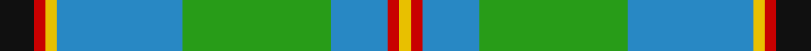

In pattern [KRYBGBRY](/stripes/krybgbry/).

This was sourced from tartans-authority.  It is a [8 stripe tartan](/stripes/stripes8/).

Original link http://www.tartansauthority.com/tartan-ferret/display/1216/

## Thread count
K/12 R4 Y4 B44 G52 B20 R4 Y/4

## Palette
Each colour and the base-6 reference it is a variant of.

| Colour | Shade | Base |
|---|---|---|
| B | <code style="background-color:#2888C4;">#2888C4</code> `oklch(60.1% 0.125 241.5)` <small>#2888C4</small> | B <code style="background-color:#2A418A;">#2A418A</code> |
| G | <code style="background-color:#289C18;">#289C18</code> `oklch(60.6% 0.191 141.6)` <small>#289C18</small> | G <code style="background-color:#006100;">#006100</code> |
| K | <code style="background-color:#101010;">#101010</code> `oklch(17.3% 0.000 89.9)` <small>#101010</small> | K <code style="background-color:#000000;">#000000</code> |
| R | <code style="background-color:#C80000;">#C80000</code> `oklch(52.3% 0.215 29.2)` <small>#C80000</small> | R <code style="background-color:#CC0000;">#CC0000</code> |
| Y | <code style="background-color:#E8C000;">#E8C000</code> `oklch(81.9% 0.168 93.7)` <small>#E8C000</small> | Y <code style="background-color:#F2BF00;">#F2BF00</code> |

# Sample pattern

## Nearest tartans

The nearest existing variants by ΔTartan distance.

1. [Presley of Lonmay](/setts/s7/k2lb25k2b8k2g28ly2~x2/) — ΔT 0.96
1. [Gift of Life Michigan (Corporate)](/setts/s7/r2t1r1t11g16dg1w1~x2/) — ΔT 1.07
1. [Boucherville (Tartan de..) District Tartan Tartan Number: 2119. Earliest known date: 1990 From the notes accompanying the petition for accreditation. "Les symboles ont cette remarquable propriete de reunir en une expression imagee des notions diverses. Ils refletent l'histoire, les croyances, les idealogies et les aspirations de groupes humains habitant un territoire precis. Les tisserands, c'est nous tous....!" See products available Copyright © Blair Urquhart, Comrie, 2015](/setts/s9/g20ly2o5w4g2o2g2o2db6~x2/) — ΔT 1.10
1. [Boucherville (Tartan de..)](/setts/s9/g20ly2y5w4g2y2g2y2b6~x2/) — ΔT 1.13
1. [Gillies (House of Edgar)](/setts/s8/b32k12b12g6r6g18k2ly3~x2/) — ΔT 1.15
1. [Tennessee](/setts/s10/r2db10w1m1g1r1g6m1g10w1~x2/) — ΔT 1.23
1. [Fox Hunting](/setts/s8/r4k2g36k2b18ly3b18k2~x2/) — ΔT 1.23
1. [Bahamas](/setts/s8/db3g11w11r2g7db22ly2db2~x2/) — ΔT 1.24
1. [Mission](/setts/s8/lo2t14k1g11k2w2g2k1~x4/) — ΔT 1.24
1. [Singh](/setts/s8/db3r3db36g17ly2g21w2r3~x2/) — ΔT 1.24

## Neighbour map

Every grey dot is one of 14299 variants placed by the first two principal components of the ΔTartan feature space (44% of its variance). Red is this tartan; blue dots are its nearest — click one to open its page.

<svg viewBox="0 0 640 380" role="img" style="max-width:100%;height:auto;border:1px solid #e0e0e0;border-radius:4px;display:block" xmlns="http://www.w3.org/2000/svg"><image href="/nn/cloud.v1.png" width="640" height="380"/><a href="/setts/s7/k2lb25k2b8k2g28ly2~x2/"><circle cx="217.9" cy="154.0" r="4" fill="#3465a4"><title>Presley of Lonmay</title></circle></a><a href="/setts/s7/r2t1r1t11g16dg1w1~x2/"><circle cx="289.6" cy="156.6" r="4" fill="#3465a4"><title>Gift of Life Michigan (Corporate)</title></circle></a><a href="/setts/s9/g20ly2o5w4g2o2g2o2db6~x2/"><circle cx="258.4" cy="163.8" r="4" fill="#3465a4"><title>Boucherville (Tartan de..) District Tartan Tartan Number: 2119. Earliest known date: 1990 From the notes accompanying the petition for accreditation. &quot;Les symboles ont cette remarquable propriete de reunir en une expression imagee des notions diverses. Ils refletent l'histoire, les croyances, les idealogies et les aspirations de groupes humains habitant un territoire precis. Les tisserands, c'est nous tous....!&quot; See products available Copyright © Blair Urquhart, Comrie, 2015</title></circle></a><a href="/setts/s9/g20ly2y5w4g2y2g2y2b6~x2/"><circle cx="247.2" cy="157.1" r="4" fill="#3465a4"><title>Boucherville (Tartan de..)</title></circle></a><a href="/setts/s8/b32k12b12g6r6g18k2ly3~x2/"><circle cx="224.1" cy="169.3" r="4" fill="#3465a4"><title>Gillies (House of Edgar)</title></circle></a><a href="/setts/s10/r2db10w1m1g1r1g6m1g10w1~x2/"><circle cx="247.3" cy="162.6" r="4" fill="#3465a4"><title>Tennessee</title></circle></a><a href="/setts/s8/r4k2g36k2b18ly3b18k2~x2/"><circle cx="271.2" cy="163.3" r="4" fill="#3465a4"><title>Fox Hunting</title></circle></a><a href="/setts/s8/db3g11w11r2g7db22ly2db2~x2/"><circle cx="192.2" cy="166.3" r="4" fill="#3465a4"><title>Bahamas</title></circle></a><a href="/setts/s8/lo2t14k1g11k2w2g2k1~x4/"><circle cx="181.7" cy="136.8" r="4" fill="#3465a4"><title>Mission</title></circle></a><a href="/setts/s8/db3r3db36g17ly2g21w2r3~x2/"><circle cx="281.5" cy="156.5" r="4" fill="#3465a4"><title>Singh</title></circle></a><circle cx="226.4" cy="163.2" r="5" fill="#c00000"/></svg>

ID: /setts/s8/k3r1ly1t11g13t5r1ly1~x4/
