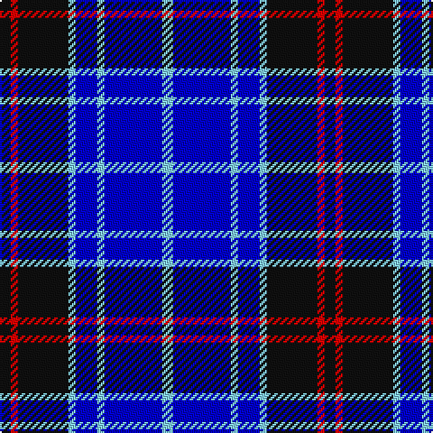

In pattern [KRKWBWBW](/patterns/krkwbwbw/).

This was sourced from register-of-tartans.  It is a [8 stripes tartan](/stripes/stripes8/).

Original link https://www.tartanregister.gov.uk/tartanDetails.aspx?ref=10297

## Thread count
K/6 R4 K28 LB4 B12 LB4 B32 LB/6

## Palette
Each colour and its ΔE from the base-6 reference it is a variant of.

| Colour | Shade | Base | ΔE (OKLab) |
|---|---|---|---|
| B | <code style="background-color:#0000CD;">#0000CD</code> `#0000CD` | B <code style="background-color:#2A418A;">#2A418A</code> | 0.14 |
| K | <code style="background-color:#101010;">#101010</code> `#101010` | K <code style="background-color:#000000;">#000000</code> | 0.17 |
| LB | <code style="background-color:#82CFFD;">#82CFFD</code> `#82CFFD` | W <code style="background-color:#F7F7F7;">#F7F7F7</code> | 0.18 |
| R | <code style="background-color:#FF0000;">#FF0000</code> `#FF0000` | R <code style="background-color:#CC0000;">#CC0000</code> | 0.11 |

# Sample pattern

## Nearest tartans

The nearest existing variants by ΔTartan distance.

1. [Immanuel Presbyterian Church (Corp)](/setts/s11/k3y2b14k14w2k14w2b6w2b16w3~b3850c8-k101010-w98c8e8-yec8048~x2/) — ΔT 1.14
1. [Dickson (Kirkcudbrightshire)](/setts/s7/b6k8b6g12ba29w3ba4~b0000ff-ba000080-g009900-k101010-wffffff~x2/) — ΔT 1.27
1. [Graeme High School Homecoming 2009](/setts/s7/r1k1b10k1ba4k9y1~b0000cd-baaa00ff-k101010-rff0000-yffe600~x4/) — ΔT 1.35
1. [DeCloud-McMasters (Personal)](/setts/s8/r3b2w2b26k22w3b3w3~b00008c-k101010-rc80000-wffffff~x2/) — ΔT 1.37
1. [Lauder Primary School](/setts/s6/y2b9r2ba6y1r1~b003beb-ba000080-rff0000-yffe600~x4/) — ΔT 1.39
1. [Auto Docs](/setts/s8/b30ba2k9w3b6w4k3ba6~b000080-ba2c4084-k101010-wffffff~x2/) — ΔT 1.51
1. [Halesowen #2](/setts/s8/w9b3y3b24ba24y2ba2y2~b1c0070-ba003c64-we0e0e0-ye8c000~x2/) — ΔT 1.54
1. [Int. Police Association (Official)](/setts/s7/b7r3b26ba2b2ba26y4~b1c0070-ba5c8ca8-rc80000-ye8c000~x2/) — ΔT 1.56
1. [Brazell (Personal)](/setts/s5/b7y1b7ba11r2~b000064-ba0596fa-rdc0000-ye8c000~x6/) — ΔT 1.59
1. [Roberts (Welsh Name)](/setts/s12/b4ba20k3ba2k3ba20b24k3b2k3b24r4~b000048-ba5c8ca8-k101010-rc80000/) — ΔT 1.60

## Neighbour map

Every grey dot is one of 15726 variants placed by the first two principal components of the ΔTartan feature space (44% of its variance). Red is this tartan; blue dots are its nearest — click one to open its page.

<svg viewBox="0 0 640 380" role="img" style="max-width:100%;height:auto;border:1px solid #e0e0e0;border-radius:4px;display:block" xmlns="http://www.w3.org/2000/svg"><image href="/nn/cloud.v1.png" width="640" height="380"/><a href="/setts/s11/k3y2b14k14w2k14w2b6w2b16w3~b3850c8-k101010-w98c8e8-yec8048~x2/"><circle cx="212.3" cy="193.8" r="4" fill="#3465a4"><title>Immanuel Presbyterian Church (Corp)</title></circle></a><a href="/setts/s7/b6k8b6g12ba29w3ba4~b0000ff-ba000080-g009900-k101010-wffffff~x2/"><circle cx="187.0" cy="189.2" r="4" fill="#3465a4"><title>Dickson (Kirkcudbrightshire)</title></circle></a><a href="/setts/s7/r1k1b10k1ba4k9y1~b0000cd-baaa00ff-k101010-rff0000-yffe600~x4/"><circle cx="185.3" cy="173.4" r="4" fill="#3465a4"><title>Graeme High School Homecoming 2009</title></circle></a><a href="/setts/s8/r3b2w2b26k22w3b3w3~b00008c-k101010-rc80000-wffffff~x2/"><circle cx="252.7" cy="162.9" r="4" fill="#3465a4"><title>DeCloud-McMasters (Personal)</title></circle></a><a href="/setts/s6/y2b9r2ba6y1r1~b003beb-ba000080-rff0000-yffe600~x4/"><circle cx="174.5" cy="196.7" r="4" fill="#3465a4"><title>Lauder Primary School</title></circle></a><a href="/setts/s8/b30ba2k9w3b6w4k3ba6~b000080-ba2c4084-k101010-wffffff~x2/"><circle cx="297.3" cy="169.6" r="4" fill="#3465a4"><title>Auto Docs</title></circle></a><a href="/setts/s8/w9b3y3b24ba24y2ba2y2~b1c0070-ba003c64-we0e0e0-ye8c000~x2/"><circle cx="198.7" cy="167.6" r="4" fill="#3465a4"><title>Halesowen #2</title></circle></a><a href="/setts/s7/b7r3b26ba2b2ba26y4~b1c0070-ba5c8ca8-rc80000-ye8c000~x2/"><circle cx="285.3" cy="180.8" r="4" fill="#3465a4"><title>Int. Police Association (Official)</title></circle></a><a href="/setts/s5/b7y1b7ba11r2~b000064-ba0596fa-rdc0000-ye8c000~x6/"><circle cx="238.0" cy="231.1" r="4" fill="#3465a4"><title>Brazell (Personal)</title></circle></a><a href="/setts/s12/b4ba20k3ba2k3ba20b24k3b2k3b24r4~b000048-ba5c8ca8-k101010-rc80000/"><circle cx="251.1" cy="169.2" r="4" fill="#3465a4"><title>Roberts (Welsh Name)</title></circle></a><circle cx="205.1" cy="199.5" r="5" fill="#c00000"/></svg>

ID: /setts/s8/k3r2k14w2b6w2b16w3~b0000cd-k101010-rff0000-w82cffd~x2/
