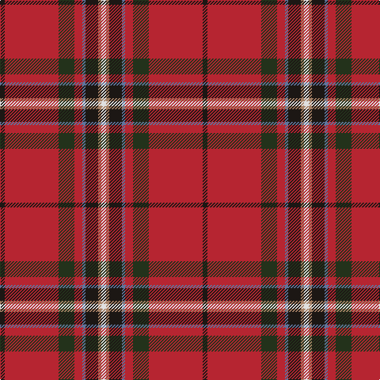

In pattern [KRGRBKRW](/stripes/krgrbkrw/).

This was sourced from register-of-tartans.  It is a [8 stripe tartan](/stripes/stripes8/).

Original link https://www.tartanregister.gov.uk/tartanDetails.aspx?ref=10673

## Attestations

This cloth appears in 2 source records; the oldest owns this page.

- 08/01/2012 — Lambert (Front Royal) Greer (register-of-tartans, [record](https://www.tartanregister.gov.uk/tartanDetails.aspx?ref=10673))
- undated — Lambert (Front Royal) Greer Name Tartan Tartan Number: 10673. Earliest known date: 14 August 2012 Designed by Charles Lambert, using the Scotweb Tartan Designer, for his family, to celebrate their Irish ancestry. Mr Lambert has also designed the Lambert (Front Royal) Kai tartan (STR #10670) using the same geometry. See products available Copyright © Blair Urquhart, Comrie, 2015 (house-of-tartan, [record](http://www.house-of-tartan.scotland.net/house/TartanViewjs.asp?colr=Def&tnam=10673))

## Register references

External register numbers recorded for this tartan.

- Scottish Register of Tartans: [10673](https://www.tartanregister.gov.uk/tartanDetails.aspx?ref=10673)

## Thread count
Ka/6 R68 K20 R10 B4 Ka16 LT4 LN/6

## Palette
Each colour and the base-6 reference it is a variant of.

| Colour | Shade | Base |
|---|---|---|
| B | <code style="background-color:#5F749C;">#5F749C</code> `oklch(55.8% 0.067 262.9)` <small>#5F749C</small> | B <code style="background-color:#2A418A;">#2A418A</code> |
| K | <code style="background-color:#23321B;">#23321B</code> `oklch(29.7% 0.045 135.3)` <small>#23321B</small> | G <code style="background-color:#006100;">#006100</code> |
| Ka | <code style="background-color:#1C1714;">#1C1714</code> `oklch(20.9% 0.010 52.9)` <small>#1C1714</small> | K <code style="background-color:#000000;">#000000</code> |
| LN | <code style="background-color:#E0E0E0;">#E0E0E0</code> `oklch(90.7% 0.000 89.9)` <small>#E0E0E0</small> | W <code style="background-color:#F7F7F7;">#F7F7F7</code> |
| LT | <code style="background-color:#A58065;">#A58065</code> `oklch(62.9% 0.060 57.5)` <small>#A58065</small> | R <code style="background-color:#CC0000;">#CC0000</code> |
| R | <code style="background-color:#B62531;">#B62531</code> `oklch(50.8% 0.180 22.7)` <small>#B62531</small> | R <code style="background-color:#CC0000;">#CC0000</code> |

# Sample pattern

## Nearest tartans

The nearest existing variants by ΔTartan distance.

1. [Lambert Greer (Personal)](/setts/s8/k3r34g10r5b2k8dy2w3~x2/) — ΔT 0.73
1. [Perthshire or Drummond District Tartan Tartan Number: 1670. Earliest known date: c.1819 Perthshire is known as the gateway to the Highlands. The Perthshire tartan is similar to a the Drummond sett, the tartan of a Drummond clan who had extensive lands in the district. The first record of this tartan is in the early nineteenth century account book of Wilson's of Bannockburn where it is referred to as the 'Perthshire Rock and Wheel' being an early type of soft tartan. See products available Copyright © Blair Urquhart, Comrie, 2015](/setts/s9/r41w2dp5ly2g21r9dp5db3w2~x2/) — ΔT 0.79
1. [MacArthur-Fox Dress (Personal)](/setts/s11/t4k2db3r33g9w3r5db10r6g2k2~x2/) — ΔT 0.87
1. [Perthshire, or Drummond](/setts/s9/r41w2p5ly2g21r9p5db3w2~x2/) — ΔT 0.92
1. [MacArthur-Fox Dress](/setts/s11/lb4k2db3r33dg9ly3r5db10r6dg2k2~x2/) — ΔT 0.93
1. [Harding (Florida) (Personal)](/setts/s6/dt13r50ly7m6g4k4~x2/) — ΔT 1.03
1. [Drummond, (Fingask)](/setts/s8/r22db3ly1g12r6db3t3w1~x2/) — ΔT 1.12
1. [MacEdward](/setts/s10/r6ly1r24g6db2k1db2k1db12r1~x2/) — ΔT 1.16
1. [Drummond Ancient](/setts/s9/r19ly1k2t1dg7r2k1t1w1~x4/) — ΔT 1.19
1. [Perth - 1819 (District)](/setts/s9/r30w1dp4ly1dg14r6dp4lt2w1~x4/) — ΔT 1.22

## Neighbour map

Every grey dot is one of 14299 variants placed by the first two principal components of the ΔTartan feature space (44% of its variance). Red is this tartan; blue dots are its nearest — click one to open its page.

<svg viewBox="0 0 640 380" role="img" style="max-width:100%;height:auto;border:1px solid #e0e0e0;border-radius:4px;display:block" xmlns="http://www.w3.org/2000/svg"><image href="/nn/cloud.v1.png" width="640" height="380"/><a href="/setts/s8/k3r34g10r5b2k8dy2w3~x2/"><circle cx="307.6" cy="104.9" r="4" fill="#3465a4"><title>Lambert Greer (Personal)</title></circle></a><a href="/setts/s9/r41w2dp5ly2g21r9dp5db3w2~x2/"><circle cx="316.1" cy="97.2" r="4" fill="#3465a4"><title>Perthshire or Drummond District Tartan Tartan Number: 1670. Earliest known date: c.1819 Perthshire is known as the gateway to the Highlands. The Perthshire tartan is similar to a the Drummond sett, the tartan of a Drummond clan who had extensive lands in the district. The first record of this tartan is in the early nineteenth century account book of Wilson's of Bannockburn where it is referred to as the 'Perthshire Rock and Wheel' being an early type of soft tartan. See products available Copyright © Blair Urquhart, Comrie, 2015</title></circle></a><a href="/setts/s11/t4k2db3r33g9w3r5db10r6g2k2~x2/"><circle cx="287.7" cy="96.9" r="4" fill="#3465a4"><title>MacArthur-Fox Dress (Personal)</title></circle></a><a href="/setts/s9/r41w2p5ly2g21r9p5db3w2~x2/"><circle cx="309.1" cy="94.9" r="4" fill="#3465a4"><title>Perthshire, or Drummond</title></circle></a><a href="/setts/s11/lb4k2db3r33dg9ly3r5db10r6dg2k2~x2/"><circle cx="288.7" cy="94.6" r="4" fill="#3465a4"><title>MacArthur-Fox Dress</title></circle></a><a href="/setts/s6/dt13r50ly7m6g4k4~x2/"><circle cx="319.4" cy="132.5" r="4" fill="#3465a4"><title>Harding (Florida) (Personal)</title></circle></a><a href="/setts/s8/r22db3ly1g12r6db3t3w1~x2/"><circle cx="308.0" cy="115.7" r="4" fill="#3465a4"><title>Drummond, (Fingask)</title></circle></a><a href="/setts/s10/r6ly1r24g6db2k1db2k1db12r1~x2/"><circle cx="343.7" cy="106.6" r="4" fill="#3465a4"><title>MacEdward</title></circle></a><a href="/setts/s9/r19ly1k2t1dg7r2k1t1w1~x4/"><circle cx="339.5" cy="82.3" r="4" fill="#3465a4"><title>Drummond Ancient</title></circle></a><a href="/setts/s9/r30w1dp4ly1dg14r6dp4lt2w1~x4/"><circle cx="326.2" cy="74.5" r="4" fill="#3465a4"><title>Perth - 1819 (District)</title></circle></a><circle cx="326.7" cy="117.0" r="5" fill="#c00000"/></svg>

ID: /setts/s8/k3r34dg10r5t2k8o2w3~x2/
