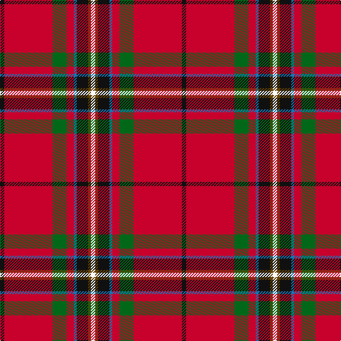

In pattern [KRGRBKGW](/patterns/krgrbkgw/).

This was sourced from tartans-authority.  It is a [8 stripes tartan](/stripes/stripes8/).

Original link http://www.tartansauthority.com/tartan-ferret/display/10673/

## Thread count
K/6 R68 G20 R10 B4 K16 T4 W/6

## Palette
Each colour and its ΔE from the base-6 reference it is a variant of.

| Colour | Shade | Base | ΔE (OKLab) |
|---|---|---|---|
| B | <code style="background-color:#1474B4;">#1474B4</code> `#1474B4` | B <code style="background-color:#2A418A;">#2A418A</code> | 0.15 |
| G | <code style="background-color:#006818;">#006818</code> `#006818` | G <code style="background-color:#006100;">#006100</code> | 0.02 |
| K | <code style="background-color:#101010;">#101010</code> `#101010` | K <code style="background-color:#000000;">#000000</code> | 0.17 |
| R | <code style="background-color:#C8002C;">#C8002C</code> `#C8002C` | R <code style="background-color:#CC0000;">#CC0000</code> | 0.03 |
| T | <code style="background-color:#604000;">#604000</code> `#604000` | G <code style="background-color:#006100;">#006100</code> | 0.14 |
| W | <code style="background-color:#FCFCFC;">#FCFCFC</code> `#FCFCFC` | W <code style="background-color:#F7F7F7;">#F7F7F7</code> | 0.01 |

# Sample pattern

## Nearest tartans

The nearest existing variants by ΔTartan distance.

1. [Lambert (Front Royal) Greer](/setts/s8/k3r34g10r5b2k8ra2w3~b5f749c-g23321b-k1c1714-rb62531-raa58065-we0e0e0~x2/) — ΔT 0.73
1. [Perthshire, or Drummond](/setts/s9/r41w2b5y2g21r9b5ba3w2~b800080-ba000050-g008000-rc00000-we0e0e0-yf0c000~x2/) — ΔT 0.76
1. [Perthshire or Drummond District Tartan Tartan Number: 1670. Earliest known date: c.1819 Perthshire is known as the gateway to the Highlands. The Perthshire tartan is similar to a the Drummond sett, the tartan of a Drummond clan who had extensive lands in the district. The first record of this tartan is in the early nineteenth century account book of Wilson's of Bannockburn where it is referred to as the 'Perthshire Rock and Wheel' being an early type of soft tartan. See products available Copyright © Blair Urquhart, Comrie, 2015](/setts/s9/r41w2b5y2g21r9b5ba3w2~b780078-ba202060-g006818-rc80000-we0e0e0-ye8c000~x2/) — ΔT 0.81
1. [MacArthur-Fox Dress (Personal)](/setts/s11/b4k2ba3r33g9w3r5ba10r6g2k2~b5c8ca8-ba2c2c80-g006818-k101010-rc80000-wfceca0~x2/) — ΔT 0.84
1. [MacArthur-Fox Dress](/setts/s11/w4k2b3r33g9y3r5b10r6g2k2~b2a3c78-g0b5027-k101010-rd60619-wb5b5d5-yf6c42b~x2/) — ΔT 0.85
1. [Drummond Ancient](/setts/s9/r19y1k2b1g7r2k1b1w1~b3c82af-g005020-k101010-rdc0000-we0e0e0-ye8c000~x4/) — ΔT 0.85
1. [Perth - 1819 (District)](/setts/s9/r30w1b4y1g14r6b4wa2w1~b280034-g044028-rc80000-wfcfcfc-wa00fcfc-ydcbc00~x4/) — ΔT 0.92
1. [Drummond, Ancient](/setts/s9/r19y1k2b1g7r2k1b1w1~b5480b0-g008000-k000000-rc00000-we0e0e0-yf0c000~x4/) — ΔT 0.93
1. [Gillespie](/setts/s9/r13g1k3y1ga4r1k2g1w1~g789484-ga003820-k101010-rc80000-wfcfcfc-ye8c000~x4/) — ΔT 0.96
1. [Drummond Old Clan Tartan Tartan Number: 1716. Earliest known date: c.1930 MacGregor-Hasties collection formed the basis of the Scottish Tartans Society collection. Unfortunately many samples were neither dated or sourced. See products available Copyright © Blair Urquhart, Comrie, 2015](/setts/s9/r19y1k2b1g7r2k1b1w1~b5c8ca8-g006818-k101010-rc80000-we0e0e0-ye8c000~x4/) — ΔT 0.96

## Neighbour map

Every grey dot is one of 15726 variants placed by the first two principal components of the ΔTartan feature space (44% of its variance). Red is this tartan; blue dots are its nearest — click one to open its page.

<svg viewBox="0 0 640 380" role="img" style="max-width:100%;height:auto;border:1px solid #e0e0e0;border-radius:4px;display:block" xmlns="http://www.w3.org/2000/svg"><image href="/nn/cloud.v1.png" width="640" height="380"/><a href="/setts/s8/k3r34g10r5b2k8ra2w3~b5f749c-g23321b-k1c1714-rb62531-raa58065-we0e0e0~x2/"><circle cx="326.6" cy="117.8" r="4" fill="#3465a4"><title>Lambert (Front Royal) Greer</title></circle></a><a href="/setts/s9/r41w2b5y2g21r9b5ba3w2~b800080-ba000050-g008000-rc00000-we0e0e0-yf0c000~x2/"><circle cx="309.1" cy="96.6" r="4" fill="#3465a4"><title>Perthshire, or Drummond</title></circle></a><a href="/setts/s9/r41w2b5y2g21r9b5ba3w2~b780078-ba202060-g006818-rc80000-we0e0e0-ye8c000~x2/"><circle cx="316.2" cy="98.5" r="4" fill="#3465a4"><title>Perthshire or Drummond District Tartan Tartan Number: 1670. Earliest known date: c.1819 Perthshire is known as the gateway to the Highlands. The Perthshire tartan is similar to a the Drummond sett, the tartan of a Drummond clan who had extensive lands in the district. The first record of this tartan is in the early nineteenth century account book of Wilson's of Bannockburn where it is referred to as the 'Perthshire Rock and Wheel' being an early type of soft tartan. See products available Copyright © Blair Urquhart, Comrie, 2015</title></circle></a><a href="/setts/s11/b4k2ba3r33g9w3r5ba10r6g2k2~b5c8ca8-ba2c2c80-g006818-k101010-rc80000-wfceca0~x2/"><circle cx="287.4" cy="98.2" r="4" fill="#3465a4"><title>MacArthur-Fox Dress (Personal)</title></circle></a><a href="/setts/s11/w4k2b3r33g9y3r5b10r6g2k2~b2a3c78-g0b5027-k101010-rd60619-wb5b5d5-yf6c42b~x2/"><circle cx="288.6" cy="96.2" r="4" fill="#3465a4"><title>MacArthur-Fox Dress</title></circle></a><a href="/setts/s9/r19y1k2b1g7r2k1b1w1~b3c82af-g005020-k101010-rdc0000-we0e0e0-ye8c000~x4/"><circle cx="339.7" cy="85.8" r="4" fill="#3465a4"><title>Drummond Ancient</title></circle></a><a href="/setts/s9/r30w1b4y1g14r6b4wa2w1~b280034-g044028-rc80000-wfcfcfc-wa00fcfc-ydcbc00~x4/"><circle cx="326.0" cy="77.8" r="4" fill="#3465a4"><title>Perth - 1819 (District)</title></circle></a><a href="/setts/s9/r19y1k2b1g7r2k1b1w1~b5480b0-g008000-k000000-rc00000-we0e0e0-yf0c000~x4/"><circle cx="328.5" cy="85.4" r="4" fill="#3465a4"><title>Drummond, Ancient</title></circle></a><a href="/setts/s9/r13g1k3y1ga4r1k2g1w1~g789484-ga003820-k101010-rc80000-wfcfcfc-ye8c000~x4/"><circle cx="247.0" cy="107.4" r="4" fill="#3465a4"><title>Gillespie</title></circle></a><a href="/setts/s9/r19y1k2b1g7r2k1b1w1~b5c8ca8-g006818-k101010-rc80000-we0e0e0-ye8c000~x4/"><circle cx="345.4" cy="90.3" r="4" fill="#3465a4"><title>Drummond Old Clan Tartan Tartan Number: 1716. Earliest known date: c.1930 MacGregor-Hasties collection formed the basis of the Scottish Tartans Society collection. Unfortunately many samples were neither dated or sourced. See products available Copyright © Blair Urquhart, Comrie, 2015</title></circle></a><circle cx="307.4" cy="108.2" r="5" fill="#c00000"/></svg>

ID: /setts/s8/k3r34g10r5b2k8ga2w3~b1474b4-g006818-ga604000-k101010-rc8002c-wfcfcfc~x2/
