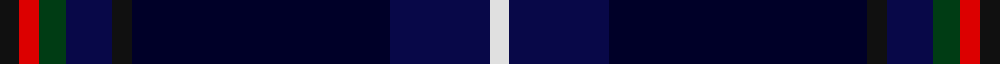

This page is one **sett** — a single exact thread-count. It belongs to the [tartan](/tartans/k3r3dg4db7k3dba39db15ln3/)
(the same proportion at any scale), whose colour order is pattern [KRGBKKBW](/stripes/krgbkkbw/).

Sourced from house-of-tartan.  It is a [8 stripe tartan](/stripes/stripes8/).

Original link http://www.house-of-tartan.scotland.net/house/TartanViewjs.asp?colr=Def&tnam=6882

## Thread count
K/6 R6 DG8 DB14 K6 DBa78 DB30 LN/6

## Palette
Each colour and the base-6 reference it is a variant of.

| Colour | Shade | Base |
|---|---|---|
| DB | <code style="background-color:#080848;">#080848</code> `oklch(20.2% 0.112 270.4)` <small>#080848</small> | B <code style="background-color:#2A418A;">#2A418A</code> |
| DBa | <code style="background-color:#000028;">#000028</code> `oklch(12.5% 0.087 264.1)` <small>#000028</small> | K <code style="background-color:#000000;">#000000</code> |
| DG | <code style="background-color:#003C14;">#003C14</code> `oklch(31.1% 0.089 148.5)` <small>#003C14</small> | G <code style="background-color:#006100;">#006100</code> |
| K | <code style="background-color:#101010;">#101010</code> `oklch(17.3% 0.000 89.9)` <small>#101010</small> | K <code style="background-color:#000000;">#000000</code> |
| LN | <code style="background-color:#E0E0E0;">#E0E0E0</code> `oklch(90.7% 0.000 89.9)` <small>#E0E0E0</small> | W <code style="background-color:#F7F7F7;">#F7F7F7</code> |
| R | <code style="background-color:#DC0000;">#DC0000</code> `oklch(56.2% 0.230 29.2)` <small>#DC0000</small> | R <code style="background-color:#CC0000;">#CC0000</code> |

# Sample pattern

## Nearest tartans

The nearest existing variants by ΔTartan distance, with this tartan at the top so the swatches line up against it.

ΔTartan

Tartan

Sett

—

<a href="/ttd/edit/#slug=k3r3dg4db7k3k39db15w3~x2">American National Fashion Tartan Tartan Number: 6882. Earliest known date: 01/01/2006 Designed by Erica Randall of The House of Edgar for Houston Kilts of Glasgow. Letter of appreciation on Scottish Tartans Authority file from President Bush thanking Ken MacDonald of Houston Kilts for 'the kilt outfit'./Threadcount and colours aren't 100% original. Generated manually./ See products available Copyright © Blair Urquhart, Comrie, 2015</a> <a class="nn-out" href="/setts/s8/k3r3dg4db7k3k39db15w3~x2/" title="open its dictionary page">↗</a>

1.14

<a href="/ttd/edit/#slug=k3r3dg4db7k3dt39db15w3~x2">American National</a> <a class="nn-out" href="/setts/s8/k3r3dg4db7k3dt39db15w3~x2/" title="open its dictionary page">↗</a>

1.27

<a href="/ttd/edit/#slug=k10n4k34db3g3db3g3db26n2lb3~x2">Dugan (Personal)</a> <a class="nn-out" href="/setts/s10/k10n4k34db3g3db3g3db26n2lb3~x2/" title="open its dictionary page">↗</a>

1.34

<a href="/ttd/edit/#slug=k40db8o3db6k3db6r4~x2">Edinburgh and Lothian Tourist Board</a> <a class="nn-out" href="/setts/s7/k40db8o3db6k3db6r4~x2/" title="open its dictionary page">↗</a>

1.34

<a href="/ttd/edit/#slug=db92k14db18db5db5db5db5dg32dp16k5dp7ly8">Bavidge</a> <a class="nn-out" href="/setts/s12/db92k14db18db5db5db5db5dg32dp16k5dp7ly8/" title="open its dictionary page">↗</a>

1.46

<a href="/ttd/edit/#slug=k4w1dg12k3db16r1db1r1~x2">Purves (2014)</a> <a class="nn-out" href="/setts/s8/k4w1dg12k3db16r1db1r1~x2/" title="open its dictionary page">↗</a>

1.49

<a href="/ttd/edit/#slug=m3db24k16k3g2k2g2k28lb3~x2">Thistle of Scotland</a> <a class="nn-out" href="/setts/s9/m3db24k16k3g2k2g2k28lb3~x2/" title="open its dictionary page">↗</a>

1.59

<a href="/setts/s8/dt30lb2k6db3r3~x4/">Edinburgh Crystal Corporate Tartan Tartan Number: 2307. Earliest known date: pre 1997 Designed by Sandra Campbell an employee of Edinburgh Crystal. See products available Copyright © Blair Urquhart, Comrie, 2015</a>

1.59

<a href="/ttd/edit/#slug=k4lo2k34db10lr4db4dp4db23w3~x2">Heirloom Dark Alba (Fashion)</a> <a class="nn-out" href="/setts/s9/k4lo2k34db10lr4db4dp4db23w3~x2/" title="open its dictionary page">↗</a>

1.60

<a href="/ttd/edit/#slug=t3k1lo2k1db10k17db2t1dy1r1~x2">Six Frigates (US)</a> <a class="nn-out" href="/setts/s10/t3k1lo2k1db10k17db2t1dy1r1~x2/" title="open its dictionary page">↗</a>

1.62

<a href="/ttd/edit/#slug=lo3db25db4db4db4db4db25g4dp4o2~x2">Blue Peter</a> <a class="nn-out" href="/setts/s10/lo3db25db4db4db4db4db25g4dp4o2~x2/" title="open its dictionary page">↗</a>

## Neighbour map

Every grey dot is one of 14299 variants placed by the first two principal components of the ΔTartan feature space (44% of its variance). Red is this tartan; blue dots are its nearest — click one to open its page.

<svg viewBox="0 0 640 380" role="img" style="max-width:100%;height:auto;border:1px solid #e0e0e0;border-radius:4px;display:block" xmlns="http://www.w3.org/2000/svg"><image href="/nn/cloud.v1.png" width="640" height="380"/><a href="/setts/s8/k3r3dg4db7k3dt39db15w3~x2/"><circle cx="293.0" cy="162.7" r="4" fill="#3465a4"><title>American National</title></circle></a><a href="/setts/s10/k10n4k34db3g3db3g3db26n2lb3~x2/"><circle cx="301.0" cy="150.8" r="4" fill="#3465a4"><title>Dugan (Personal)</title></circle></a><a href="/setts/s7/k40db8o3db6k3db6r4~x2/"><circle cx="368.6" cy="191.6" r="4" fill="#3465a4"><title>Edinburgh and Lothian Tourist Board</title></circle></a><a href="/setts/s12/db92k14db18db5db5db5db5dg32dp16k5dp7ly8/"><circle cx="324.0" cy="130.9" r="4" fill="#3465a4"><title>Bavidge</title></circle></a><a href="/setts/s8/k4w1dg12k3db16r1db1r1~x2/"><circle cx="263.4" cy="163.6" r="4" fill="#3465a4"><title>Purves (2014)</title></circle></a><a href="/setts/s9/m3db24k16k3g2k2g2k28lb3~x2/"><circle cx="205.0" cy="159.4" r="4" fill="#3465a4"><title>Thistle of Scotland</title></circle></a><a href="/setts/s8/dt30lb2k6db3r3~x4/"><circle cx="330.9" cy="164.7" r="4" fill="#3465a4"><title>Edinburgh Crystal Corporate Tartan Tartan Number: 2307. Earliest known date: pre 1997 Designed by Sandra Campbell an employee of Edinburgh Crystal. See products available Copyright © Blair Urquhart, Comrie, 2015</title></circle></a><a href="/setts/s9/k4lo2k34db10lr4db4dp4db23w3~x2/"><circle cx="258.0" cy="145.9" r="4" fill="#3465a4"><title>Heirloom Dark Alba (Fashion)</title></circle></a><a href="/setts/s10/t3k1lo2k1db10k17db2t1dy1r1~x2/"><circle cx="297.1" cy="137.2" r="4" fill="#3465a4"><title>Six Frigates (US)</title></circle></a><a href="/setts/s10/lo3db25db4db4db4db4db25g4dp4o2~x2/"><circle cx="259.4" cy="170.5" r="4" fill="#3465a4"><title>Blue Peter</title></circle></a><circle cx="292.6" cy="169.8" r="5" fill="#c00000"/></svg>

ID: /setts/s8/k3r3dg4db7k3k39db15w3~x2/
