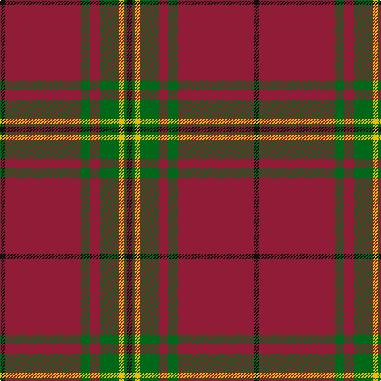

This page is one **sett** — a single exact thread-count. It belongs to the [tartan](/tartans/k3dr48g6dr6g12y3g2k3/)
(the same proportion at any scale), whose colour order is pattern [KGYGRGRK](/stripes/kgygrgrk/).

Sourced from tartans-authority.  It is a [8 stripe tartan](/stripes/stripes8/).

Original link http://www.tartansauthority.com/tartan-ferret/display/6253/

## Thread count
K/6 DR96 G12 DR12 G24 Y6 G4 K/6

## Palette
Each colour and the base-6 reference it is a variant of.

| Colour | Shade | Base |
|---|---|---|
| DR | <code style="background-color:#901C38;">#901C38</code> `oklch(43.2% 0.150 13.1)` <small>#901C38</small> | R <code style="background-color:#CC0000;">#CC0000</code> |
| G | <code style="background-color:#006818;">#006818</code> `oklch(45.0% 0.142 145.0)` <small>#006818</small> | G <code style="background-color:#006100;">#006100</code> |
| K | <code style="background-color:#101010;">#101010</code> `oklch(17.3% 0.000 89.9)` <small>#101010</small> | K <code style="background-color:#000000;">#000000</code> |
| Y | <code style="background-color:#E8C000;">#E8C000</code> `oklch(81.9% 0.168 93.7)` <small>#E8C000</small> | Y <code style="background-color:#F2BF00;">#F2BF00</code> |

# Sample pattern

## Nearest tartans

The nearest existing variants by ΔTartan distance, with this tartan at the top so the swatches line up against it.

ΔTartan

Tartan

Sett

—

<a href="/ttd/edit/#slug=k3r48g6r6g12ly3g2k3~x2">Oakhall (Corporate)</a> <a class="nn-out" href="/setts/s8/k3r48g6r6g12ly3g2k3~x2/" title="open its dictionary page">↗</a>

0.99

<a href="/ttd/edit/#slug=m12dg6k1dg2k1dg1k6m24w2~x2">Stuart/Stewart of Bute Hunting</a> <a class="nn-out" href="/setts/s9/m12dg6k1dg2k1dg1k6m24w2~x2/" title="open its dictionary page">↗</a>

1.03

<a href="/ttd/edit/#slug=dg2r2db1r24b1db6r3dg12r4db1~x2">MacDonell of Keppoch</a> <a class="nn-out" href="/setts/s10/dg2r2db1r24b1db6r3dg12r4db1~x2/" title="open its dictionary page">↗</a>

1.03

<a href="/ttd/edit/#slug=dg2r2db1r24b1db6r3dg12r4db1">MacDonell of Keppoch</a> <a class="nn-out" href="/setts/s10/dg2r2db1r24b1db6r3dg12r4db1/" title="open its dictionary page">↗</a>

1.10

<a href="/ttd/edit/#slug=m96g42m16g17k4lb6">MacGregor Hunting Glengyle Clan Tartan Tartan Number: 1285. Earliest known date: 1960 This is the usual MacGregor sett but with a darker crimson background colour. The story goes that Alasdair MacGregor of Cardney wanted to make tartan from the wool of his own sheep. His initial dyeing attempt produced a shocking pink colour, so he dyed the wool a second time to get this dark crimson colour. He liked the result so much that he had a bolt of cloth woven and the Cardney MacGregors have worn it ever since. The addition of the term 'Hunting' to the name is, apparently a commercial attribution. Notes from the STA, quoting Sir Malcolm MacGregor of MacGregor (2006) See products available Copyright © Blair Urquhart, Comrie, 2015</a> <a class="nn-out" href="/setts/s6/m96g42m16g17k4lb6/" title="open its dictionary page">↗</a>

1.14

<a href="/ttd/edit/#slug=o4y13o3db4o3db3o40db3o2lo4~x2">Galway Irish County Tartan Tartan Number: 2254. Earliest known date: 1995 One of a series of Irish District tartans designed by Polly Wittering of the House of Edgar, with colours reminiscent of the Country with soft warm colours dominating. See products available Copyright © Blair Urquhart, Comrie, 2015</a> <a class="nn-out" href="/setts/s10/o4y13o3db4o3db3o40db3o2lo4~x2/" title="open its dictionary page">↗</a>

1.16

<a href="/ttd/edit/#slug=dg2r2db1r24t1db6r3dg12r4db1~x2">MacDonell of Keppoch</a> <a class="nn-out" href="/setts/s10/dg2r2db1r24t1db6r3dg12r4db1~x2/" title="open its dictionary page">↗</a>

1.17

<a href="/ttd/edit/#slug=r96g42r16g17k4y6">MacGregor, Glengyle</a> <a class="nn-out" href="/setts/s6/r96g42r16g17k4y6/" title="open its dictionary page">↗</a>

1.19

<a href="/ttd/edit/#slug=g2r2db1r24t1db6r3g12r4db1~x2">MacDonell of Keppoch</a> <a class="nn-out" href="/setts/s10/g2r2db1r24t1db6r3g12r4db1~x2/" title="open its dictionary page">↗</a>

1.22

<a href="/ttd/edit/#slug=r48g6r6g12ly3g2k3g2ly3g12r6g6r48k3~x2">Oakhall</a> <a class="nn-out" href="/setts/s14/r48g6r6g12ly3g2k3g2ly3g12r6g6r48k3~x2/" title="open its dictionary page">↗</a>

1.22

<a href="/ttd/edit/#slug=dg4r3k1r28dg14r4dg4lr3dg4r4~x2">Scott</a> <a class="nn-out" href="/setts/s10/dg4r3k1r28dg14r4dg4lr3dg4r4~x2/" title="open its dictionary page">↗</a>

## Neighbour map

Every grey dot is one of 14299 variants placed by the first two principal components of the ΔTartan feature space (44% of its variance). Red is this tartan; blue dots are its nearest — click one to open its page.

<svg viewBox="0 0 640 380" role="img" style="max-width:100%;height:auto;border:1px solid #e0e0e0;border-radius:4px;display:block" xmlns="http://www.w3.org/2000/svg"><image href="/nn/cloud.v1.png" width="640" height="380"/><a href="/setts/s9/m12dg6k1dg2k1dg1k6m24w2~x2/"><circle cx="448.5" cy="156.6" r="4" fill="#3465a4"><title>Stuart/Stewart of Bute Hunting</title></circle></a><a href="/setts/s10/dg2r2db1r24b1db6r3dg12r4db1~x2/"><circle cx="398.2" cy="136.1" r="4" fill="#3465a4"><title>MacDonell of Keppoch</title></circle></a><a href="/setts/s10/dg2r2db1r24b1db6r3dg12r4db1/"><circle cx="398.2" cy="136.1" r="4" fill="#3465a4"><title>MacDonell of Keppoch</title></circle></a><a href="/setts/s6/m96g42m16g17k4lb6/"><circle cx="429.7" cy="167.8" r="4" fill="#3465a4"><title>MacGregor Hunting Glengyle Clan Tartan Tartan Number: 1285. Earliest known date: 1960 This is the usual MacGregor sett but with a darker crimson background colour. The story goes that Alasdair MacGregor of Cardney wanted to make tartan from the wool of his own sheep. His initial dyeing attempt produced a shocking pink colour, so he dyed the wool a second time to get this dark crimson colour. He liked the result so much that he had a bolt of cloth woven and the Cardney MacGregors have worn it ever since. The addition of the term 'Hunting' to the name is, apparently a commercial attribution. Notes from the STA, quoting Sir Malcolm MacGregor of MacGregor (2006) See products available Copyright © Blair Urquhart, Comrie, 2015</title></circle></a><a href="/setts/s10/o4y13o3db4o3db3o40db3o2lo4~x2/"><circle cx="462.8" cy="142.6" r="4" fill="#3465a4"><title>Galway Irish County Tartan Tartan Number: 2254. Earliest known date: 1995 One of a series of Irish District tartans designed by Polly Wittering of the House of Edgar, with colours reminiscent of the Country with soft warm colours dominating. See products available Copyright © Blair Urquhart, Comrie, 2015</title></circle></a><a href="/setts/s10/dg2r2db1r24t1db6r3dg12r4db1~x2/"><circle cx="400.5" cy="130.5" r="4" fill="#3465a4"><title>MacDonell of Keppoch</title></circle></a><a href="/setts/s6/r96g42r16g17k4y6/"><circle cx="422.6" cy="167.4" r="4" fill="#3465a4"><title>MacGregor, Glengyle</title></circle></a><a href="/setts/s10/g2r2db1r24t1db6r3g12r4db1~x2/"><circle cx="395.6" cy="130.2" r="4" fill="#3465a4"><title>MacDonell of Keppoch</title></circle></a><a href="/setts/s14/r48g6r6g12ly3g2k3g2ly3g12r6g6r48k3~x2/"><circle cx="469.4" cy="124.5" r="4" fill="#3465a4"><title>Oakhall</title></circle></a><a href="/setts/s10/dg4r3k1r28dg14r4dg4lr3dg4r4~x2/"><circle cx="408.5" cy="141.2" r="4" fill="#3465a4"><title>Scott</title></circle></a><circle cx="458.8" cy="141.9" r="5" fill="#c00000"/></svg>

ID: /setts/s8/k3r48g6r6g12ly3g2k3~x2/
