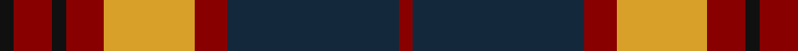
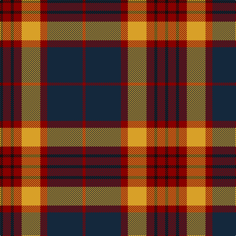

In pattern [KRKRYRBR](/stripes/krkryrbr/).

This was sourced from register-of-tartans.  It is a [8 stripe tartan](/stripes/stripes8/).

Original link https://www.tartanregister.gov.uk/tartanDetails.aspx?ref=3415

## Attestations

This cloth appears in 2 source records; the oldest owns this page.

- 01/06/2004 — Private SA Club (register-of-tartans, [record](https://www.tartanregister.gov.uk/tartanDetails.aspx?ref=3415))
- 2004 June — Private SA Club (Corporate) (tartans-authority, [record](http://www.tartansauthority.com/tartan-ferret/display/6853/))

## Register references

External register numbers recorded for this tartan.

- Scottish Register of Tartans: [3415](https://www.tartanregister.gov.uk/tartanDetails.aspx?ref=3415)
- Scottish Tartans Authority (ITI): 6853

## Thread count
K/6 DR16 K6 DR16 Y38 DR14 DN72 DR/6

## Palette
Each colour and the base-6 reference it is a variant of.

| Colour | Shade | Base |
|---|---|---|
| DN | <code style="background-color:#14283C;">#14283C</code> `oklch(27.1% 0.046 249.9)` <small>#14283C</small> | B <code style="background-color:#2A418A;">#2A418A</code> |
| DR | <code style="background-color:#880000;">#880000</code> `oklch(39.4% 0.162 29.2)` <small>#880000</small> | R <code style="background-color:#CC0000;">#CC0000</code> |
| K | <code style="background-color:#101010;">#101010</code> `oklch(17.3% 0.000 89.9)` <small>#101010</small> | K <code style="background-color:#000000;">#000000</code> |
| Y | <code style="background-color:#D8A028;">#D8A028</code> `oklch(74.0% 0.142 81.1)` <small>#D8A028</small> | Y <code style="background-color:#F2BF00;">#F2BF00</code> |

# Sample pattern

## Nearest tartans

The nearest existing variants by ΔTartan distance, with this tartan at the top so the swatches line up against it.

ΔTartan

Tartan

Sett

—

<a href="/ttd/edit/#slug=k3r8k3r8lo19r7dt36r3~x2">Private SA Club</a> <a class="nn-out" href="/setts/s8/k3r8k3r8lo19r7dt36r3~x2/" title="open its dictionary page">↗</a>

0.76

<a href="/ttd/edit/#slug=dp8r3ly1r3dg14r3ly1~x4">Logan - 1819 (with yellow)</a> <a class="nn-out" href="/setts/s7/dp8r3ly1r3dg14r3ly1~x4/" title="open its dictionary page">↗</a>

0.77

<a href="/ttd/edit/#slug=dg12dg1dg1dg1dg1k5r10k1r2~x2">Lindsay #2</a> <a class="nn-out" href="/setts/s9/dg12dg1dg1dg1dg1k5r10k1r2~x2/" title="open its dictionary page">↗</a>

0.82

<a href="/ttd/edit/#slug=g1r9g3k3g3r1k9w1~x2">Manson Family Tartan Tartan Number: 987. Earliest known date: 1983 The official recording of the sett shows the letter G for the dark green stripe. In heraldic terms this means 'Gules' - red. The designer, Hugh Kirkwood Rankine, clearly intended dark green and this is reproduced here. See products available Copyright © Blair Urquhart, Comrie, 2015</a> <a class="nn-out" href="/setts/s8/g1r9g3k3g3r1k9w1~x2/" title="open its dictionary page">↗</a>

0.83

<a href="/ttd/edit/#slug=r3dr14g8r2g2w2g2r1~x2">Scott Hunting Clan Tartan Tartan Number: 1546. Earliest known date: 1906 Also known as Green Scott, this tartan is generally available today. The Chief of the Scotts is His Grace the 9th Duke of Buccleuch and 10th of Queensberry who lives in Selkirk in the borders region of Scotland. See products available Copyright © Blair Urquhart, Comrie, 2015</a> <a class="nn-out" href="/setts/s8/r3dr14g8r2g2w2g2r1~x2/" title="open its dictionary page">↗</a>

0.85

<a href="/ttd/edit/#slug=k15dg1k3r9dg1r3lo11k1~x4">Island of Innis, The</a> <a class="nn-out" href="/setts/s8/k15dg1k3r9dg1r3lo11k1~x4/" title="open its dictionary page">↗</a>

0.87

<a href="/ttd/edit/#slug=k9lr4k1lr4dg15r4k1~x4">Logan - 1797 (Dark)</a> <a class="nn-out" href="/setts/s7/k9lr4k1lr4dg15r4k1~x4/" title="open its dictionary page">↗</a>

0.88

<a href="/ttd/edit/#slug=g8r2g12k6g3db6r24k4~x2">Dickie</a> <a class="nn-out" href="/setts/s8/g8r2g12k6g3db6r24k4~x2/" title="open its dictionary page">↗</a>

0.90

<a href="/ttd/edit/#slug=do2lr2k6do3k2o14k1o1~x4">Blair Atholl (Fashion)</a> <a class="nn-out" href="/setts/s8/do2lr2k6do3k2o14k1o1~x4/" title="open its dictionary page">↗</a>

0.90

<a href="/ttd/edit/#slug=k1b1r16dg16k12b8r16b1k1~x2">MacNaughten</a> <a class="nn-out" href="/setts/s9/k1b1r16dg16k12b8r16b1k1~x2/" title="open its dictionary page">↗</a>

0.91

<a href="/ttd/edit/#slug=dg12g6dg6r15k1r1k2~x2">Cook (Name)</a> <a class="nn-out" href="/setts/s7/dg12g6dg6r15k1r1k2~x2/" title="open its dictionary page">↗</a>

## Neighbour map

Every grey dot is one of 14299 variants placed by the first two principal components of the ΔTartan feature space (44% of its variance). Red is this tartan; blue dots are its nearest — click one to open its page.

<svg viewBox="0 0 640 380" role="img" style="max-width:100%;height:auto;border:1px solid #e0e0e0;border-radius:4px;display:block" xmlns="http://www.w3.org/2000/svg"><image href="/nn/cloud.v1.png" width="640" height="380"/><a href="/setts/s7/dp8r3ly1r3dg14r3ly1~x4/"><circle cx="248.6" cy="180.2" r="4" fill="#3465a4"><title>Logan - 1819 (with yellow)</title></circle></a><a href="/setts/s9/dg12dg1dg1dg1dg1k5r10k1r2~x2/"><circle cx="247.5" cy="167.1" r="4" fill="#3465a4"><title>Lindsay #2</title></circle></a><a href="/setts/s8/g1r9g3k3g3r1k9w1~x2/"><circle cx="203.3" cy="192.3" r="4" fill="#3465a4"><title>Manson Family Tartan Tartan Number: 987. Earliest known date: 1983 The official recording of the sett shows the letter G for the dark green stripe. In heraldic terms this means 'Gules' - red. The designer, Hugh Kirkwood Rankine, clearly intended dark green and this is reproduced here. See products available Copyright © Blair Urquhart, Comrie, 2015</title></circle></a><a href="/setts/s8/r3dr14g8r2g2w2g2r1~x2/"><circle cx="246.1" cy="171.1" r="4" fill="#3465a4"><title>Scott Hunting Clan Tartan Tartan Number: 1546. Earliest known date: 1906 Also known as Green Scott, this tartan is generally available today. The Chief of the Scotts is His Grace the 9th Duke of Buccleuch and 10th of Queensberry who lives in Selkirk in the borders region of Scotland. See products available Copyright © Blair Urquhart, Comrie, 2015</title></circle></a><a href="/setts/s8/k15dg1k3r9dg1r3lo11k1~x4/"><circle cx="233.6" cy="162.8" r="4" fill="#3465a4"><title>Island of Innis, The</title></circle></a><a href="/setts/s7/k9lr4k1lr4dg15r4k1~x4/"><circle cx="215.3" cy="185.3" r="4" fill="#3465a4"><title>Logan - 1797 (Dark)</title></circle></a><a href="/setts/s8/g8r2g12k6g3db6r24k4~x2/"><circle cx="200.7" cy="180.3" r="4" fill="#3465a4"><title>Dickie</title></circle></a><a href="/setts/s8/do2lr2k6do3k2o14k1o1~x4/"><circle cx="268.1" cy="161.1" r="4" fill="#3465a4"><title>Blair Atholl (Fashion)</title></circle></a><a href="/setts/s9/k1b1r16dg16k12b8r16b1k1~x2/"><circle cx="231.7" cy="167.4" r="4" fill="#3465a4"><title>MacNaughten</title></circle></a><a href="/setts/s7/dg12g6dg6r15k1r1k2~x2/"><circle cx="253.2" cy="191.0" r="4" fill="#3465a4"><title>Cook (Name)</title></circle></a><circle cx="229.6" cy="173.0" r="5" fill="#c00000"/></svg>

ID: /setts/s8/k3r8k3r8lo19r7dt36r3~x2/
