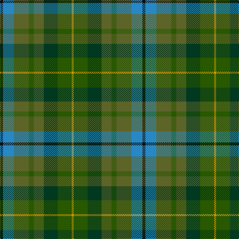

In pattern [KBGGGGGY](/stripes/kbgggggy/).

This was sourced from tartans-authority.  It is a [8 stripe tartan](/stripes/stripes8/).

Original link http://www.tartansauthority.com/tartan-ferret/display/10812/

## Thread count
K/6 B22 G30 Ga10 G20 DG28 Ga28 DY/4

## Palette
Each colour and the base-6 reference it is a variant of.

| Colour | Shade | Base |
|---|---|---|
| B | <code style="background-color:#2888C4;">#2888C4</code> `oklch(60.1% 0.125 241.5)` <small>#2888C4</small> | B <code style="background-color:#2A418A;">#2A418A</code> |
| DG | <code style="background-color:#003820;">#003820</code> `oklch(30.0% 0.070 158.3)` <small>#003820</small> | G <code style="background-color:#006100;">#006100</code> |
| DY | <code style="background-color:#D09800;">#D09800</code> `oklch(71.4% 0.147 82.1)` <small>#D09800</small> | Y <code style="background-color:#F2BF00;">#F2BF00</code> |
| G | <code style="background-color:#5C6428;">#5C6428</code> `oklch(48.3% 0.084 116.0)` <small>#5C6428</small> | G <code style="background-color:#006100;">#006100</code> |
| Ga | <code style="background-color:#285800;">#285800</code> `oklch(41.0% 0.122 135.8)` <small>#285800</small> | G <code style="background-color:#006100;">#006100</code> |
| K | <code style="background-color:#101010;">#101010</code> `oklch(17.3% 0.000 89.9)` <small>#101010</small> | K <code style="background-color:#000000;">#000000</code> |

# Sample pattern

## Nearest tartans

The nearest existing variants by ΔTartan distance.

1. [Devon, Green (District)](/setts/s7/o5y4lr1y4dy4dg4ly1~x4/) — ΔT 1.35
1. [Copar a'Beannichte (Personal)](/setts/s9/g20g6dg15dt5dg2dt15o4dt10r2~x2/) — ΔT 1.41
1. [Carinthian National](/setts/s11/w3dt16do15dg18do3r3do3dg18do15dt16ly3~x2/) — ΔT 1.47
1. [Lawrence's Seven Pillars of Khaki](/setts/s9/r3o23g8g6g8t6g10t12g3~x2/) — ΔT 1.48
1. [Styrian](/setts/s8/o16dg29n19g8n19dg29o16r4~x2/) — ΔT 1.53
1. [Styrian (Fashion)](/setts/s5/g8n19dg29o16r4~x2/) — ΔT 1.58
1. [MacCamley Clan Tartan Tartan Number: 7241. Earliest known date: 2007 For the wedding of Andrew McCamley See products available Copyright © Blair Urquhart, Comrie, 2015](/setts/s12/dg29g16k8r4dg16g16ly4r4k16t4g28dg16/) — ΔT 1.67
1. [McCamley (Personal)](/setts/s12/dg29g16k8r4dg16g16ly4r4k16g4g28dg16/) — ΔT 1.67
1. [Linden](/setts/s8/dt4k9g20dp2dg20k5dt6lb2~x2/) — ΔT 1.74
1. [Waterford, County (District)](/setts/s6/dg24lo2y16db7do16r5~x2/) — ΔT 1.76

## Neighbour map

Every grey dot is one of 14299 variants placed by the first two principal components of the ΔTartan feature space (44% of its variance). Red is this tartan; blue dots are its nearest — click one to open its page.

<svg viewBox="0 0 640 380" role="img" style="max-width:100%;height:auto;border:1px solid #e0e0e0;border-radius:4px;display:block" xmlns="http://www.w3.org/2000/svg"><image href="/nn/cloud.v1.png" width="640" height="380"/><a href="/setts/s7/o5y4lr1y4dy4dg4ly1~x4/"><circle cx="113.2" cy="262.4" r="4" fill="#3465a4"><title>Devon, Green (District)</title></circle></a><a href="/setts/s9/g20g6dg15dt5dg2dt15o4dt10r2~x2/"><circle cx="192.0" cy="219.5" r="4" fill="#3465a4"><title>Copar a'Beannichte (Personal)</title></circle></a><a href="/setts/s11/w3dt16do15dg18do3r3do3dg18do15dt16ly3~x2/"><circle cx="149.6" cy="225.9" r="4" fill="#3465a4"><title>Carinthian National</title></circle></a><a href="/setts/s9/r3o23g8g6g8t6g10t12g3~x2/"><circle cx="198.4" cy="236.6" r="4" fill="#3465a4"><title>Lawrence's Seven Pillars of Khaki</title></circle></a><a href="/setts/s8/o16dg29n19g8n19dg29o16r4~x2/"><circle cx="195.1" cy="266.6" r="4" fill="#3465a4"><title>Styrian</title></circle></a><a href="/setts/s5/g8n19dg29o16r4~x2/"><circle cx="194.8" cy="273.2" r="4" fill="#3465a4"><title>Styrian (Fashion)</title></circle></a><a href="/setts/s12/dg29g16k8r4dg16g16ly4r4k16t4g28dg16/"><circle cx="166.1" cy="216.2" r="4" fill="#3465a4"><title>MacCamley Clan Tartan Tartan Number: 7241. Earliest known date: 2007 For the wedding of Andrew McCamley See products available Copyright © Blair Urquhart, Comrie, 2015</title></circle></a><a href="/setts/s12/dg29g16k8r4dg16g16ly4r4k16g4g28dg16/"><circle cx="166.2" cy="215.9" r="4" fill="#3465a4"><title>McCamley (Personal)</title></circle></a><a href="/setts/s8/dt4k9g20dp2dg20k5dt6lb2~x2/"><circle cx="159.2" cy="208.7" r="4" fill="#3465a4"><title>Linden</title></circle></a><a href="/setts/s6/dg24lo2y16db7do16r5~x2/"><circle cx="181.6" cy="222.8" r="4" fill="#3465a4"><title>Waterford, County (District)</title></circle></a><circle cx="144.7" cy="249.2" r="5" fill="#c00000"/></svg>

ID: /setts/s8/k3t11y15dg5y10dg14dg14lo2~x2/
