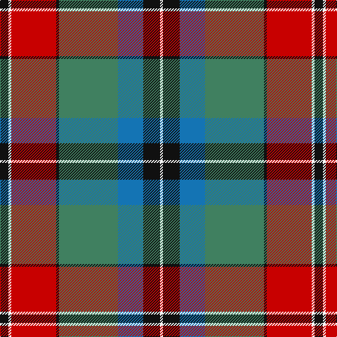

In pattern [KWRKGBKW](/stripes/kwrkgbkw/).

This was sourced from register-of-tartans.  It is a [8 stripe tartan](/stripes/stripes8/).

Original link https://www.tartanregister.gov.uk/tartanDetails.aspx?ref=1227

## Attestations

This cloth appears in 2 source records; the oldest owns this page.

- 01/01/2002 — Ford & Etal (register-of-tartans, [record](https://www.tartanregister.gov.uk/tartanDetails.aspx?ref=1227))
- pre 2004 — Ford & Etal (Corporate) (tartans-authority, [record](http://www.tartansauthority.com/tartan-ferret/display/6193/))

## Register references

External register numbers recorded for this tartan.

- Scottish Register of Tartans: [1227](https://www.tartanregister.gov.uk/tartanDetails.aspx?ref=1227)
- Scottish Tartans Authority (ITI): 6193
- Scottish Tartans World Register: 2903

## Thread count
K/12 W4 R64 K4 G84 B36 K24 W/4

## Palette
Each colour and the base-6 reference it is a variant of.

| Colour | Shade | Base |
|---|---|---|
| B | <code style="background-color:#1474B4;">#1474B4</code> `oklch(54.0% 0.129 245.1)` <small>#1474B4</small> | B <code style="background-color:#2A418A;">#2A418A</code> |
| G | <code style="background-color:#408060;">#408060</code> `oklch(54.8% 0.084 160.1)` <small>#408060</small> | G <code style="background-color:#006100;">#006100</code> |
| K | <code style="background-color:#101010;">#101010</code> `oklch(17.3% 0.000 89.9)` <small>#101010</small> | K <code style="background-color:#000000;">#000000</code> |
| R | <code style="background-color:#C80000;">#C80000</code> `oklch(52.3% 0.215 29.2)` <small>#C80000</small> | R <code style="background-color:#CC0000;">#CC0000</code> |
| W | <code style="background-color:#FCFCFC;">#FCFCFC</code> `oklch(99.1% 0.000 89.9)` <small>#FCFCFC</small> | W <code style="background-color:#F7F7F7;">#F7F7F7</code> |

# Sample pattern

## Nearest tartans

The nearest existing variants by ΔTartan distance.

1. [Golden Wedding (Fashion)](/setts/s8/r8lo44k32w2o52k7o7w3/) — ΔT 0.76
1. [Forrester / Foster](/setts/s9/w4db6w1db15r23g15ly1g6ly4~x2/) — ΔT 0.84
1. [Windsor](/setts/s10/r4n12k18n4y22lb1y2lb2y3lb2~x4/) — ΔT 0.90
1. [Forrester (Clan)](/setts/s9/w3dt4w1dt15r24dg15ly1dg4ly3~x4/) — ΔT 0.93
1. [Clarks No. 1 (Fashion)](/setts/s10/db5t2db11g2db2g6r17lo9db1r1~x2/) — ΔT 0.97
1. [St Lawrence Trade](/setts/s8/dg2dr13dg11ly5dr1o21dg2o1~x2/) — ΔT 0.98
1. [Stuart/Stewart Riding Cloak](/setts/s11/w1db4dy8r4w1r4w1r4dg16db2w1~x2/) — ΔT 0.99
1. [Harding Personal Tartan Tartan Number: 6796. Earliest known date: 2005 The tartan is part of a personal design project bringing together textile, silver and jewelry design and leatherworking, all inspired by the richness of the Scottish design and craft heritage. See products available Copyright © Blair Urquhart, Comrie, 2015](/setts/s8/g30db2o7r14o7r7w1db14~x2/) — ΔT 1.02
1. [Pope (Welsh Name)](/setts/s12/k10y26k2y4k2y26k3r36k3g30k3r2/) — ΔT 1.05
1. [Dinwoodie (Name)](/setts/s10/dy12o2k2o42k13g25o6k2r4k10~x2/) — ΔT 1.12

## Neighbour map

Every grey dot is one of 14299 variants placed by the first two principal components of the ΔTartan feature space (44% of its variance). Red is this tartan; blue dots are its nearest — click one to open its page.

<svg viewBox="0 0 640 380" role="img" style="max-width:100%;height:auto;border:1px solid #e0e0e0;border-radius:4px;display:block" xmlns="http://www.w3.org/2000/svg"><image href="/nn/cloud.v1.png" width="640" height="380"/><a href="/setts/s8/r8lo44k32w2o52k7o7w3/"><circle cx="208.4" cy="123.7" r="4" fill="#3465a4"><title>Golden Wedding (Fashion)</title></circle></a><a href="/setts/s9/w4db6w1db15r23g15ly1g6ly4~x2/"><circle cx="161.5" cy="132.1" r="4" fill="#3465a4"><title>Forrester / Foster</title></circle></a><a href="/setts/s10/r4n12k18n4y22lb1y2lb2y3lb2~x4/"><circle cx="215.0" cy="132.9" r="4" fill="#3465a4"><title>Windsor</title></circle></a><a href="/setts/s9/w3dt4w1dt15r24dg15ly1dg4ly3~x4/"><circle cx="200.1" cy="124.3" r="4" fill="#3465a4"><title>Forrester (Clan)</title></circle></a><a href="/setts/s10/db5t2db11g2db2g6r17lo9db1r1~x2/"><circle cx="183.6" cy="144.1" r="4" fill="#3465a4"><title>Clarks No. 1 (Fashion)</title></circle></a><a href="/setts/s8/dg2dr13dg11ly5dr1o21dg2o1~x2/"><circle cx="208.2" cy="140.5" r="4" fill="#3465a4"><title>St Lawrence Trade</title></circle></a><a href="/setts/s11/w1db4dy8r4w1r4w1r4dg16db2w1~x2/"><circle cx="174.4" cy="131.6" r="4" fill="#3465a4"><title>Stuart/Stewart Riding Cloak</title></circle></a><a href="/setts/s8/g30db2o7r14o7r7w1db14~x2/"><circle cx="217.8" cy="145.1" r="4" fill="#3465a4"><title>Harding Personal Tartan Tartan Number: 6796. Earliest known date: 2005 The tartan is part of a personal design project bringing together textile, silver and jewelry design and leatherworking, all inspired by the richness of the Scottish design and craft heritage. See products available Copyright © Blair Urquhart, Comrie, 2015</title></circle></a><a href="/setts/s12/k10y26k2y4k2y26k3r36k3g30k3r2/"><circle cx="203.2" cy="128.9" r="4" fill="#3465a4"><title>Pope (Welsh Name)</title></circle></a><a href="/setts/s10/dy12o2k2o42k13g25o6k2r4k10~x2/"><circle cx="229.1" cy="135.8" r="4" fill="#3465a4"><title>Dinwoodie (Name)</title></circle></a><circle cx="191.3" cy="135.4" r="5" fill="#c00000"/></svg>

ID: /setts/s8/k3w1r16k1g21b9k6w1~x4/
