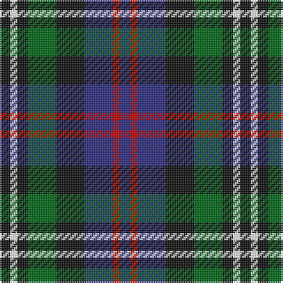

In pattern [BRBKGKWK](/stripes/brbkgkwk/).

This was sourced from register-of-tartans.  It is a [8 stripe tartan](/stripes/stripes8/).

Original link https://www.tartanregister.gov.uk/tartanDetails.aspx?ref=896

## Also known as

This cloth is also recorded under:

- Davidson Double..
- Davidson, Double
- Davidson, Double..

## Attestations

This cloth appears in 4 source records; the oldest owns this page.

- 01/01/1847 — Davidson, Double (register-of-tartans, [record](https://www.tartanregister.gov.uk/tartanDetails.aspx?ref=896))
- 1847 — Davidson 'Double' - 1847 (Clan) (tartans-authority, [record](http://www.tartansauthority.com/tartan-ferret/display/444/))
- undated — Davidson, Double.. (weddslist, [record](http://www.weddslist.com/cgi-bin/tartans/pg.pl?source=sts))
- undated — Davidson Double.. Clan Tartan Tartan Number: 444. Earliest known date: 1847 Wilson's of Bannockburn produced this sett in 1847, calling it 'Double Davidson'. See products available Copyright © Blair Urquhart, Comrie, 2015 (house-of-tartan, [record](http://www.house-of-tartan.scotland.net/house/TartanViewjs.asp?colr=Def&tnam=444))

## Register references

External register numbers recorded for this tartan.

- Scottish Register of Tartans: [896](https://www.tartanregister.gov.uk/tartanDetails.aspx?ref=896)
- Scottish Tartans Authority (ITI): 444
- Scottish Tartans World Register: 444

## Thread count
K/6 W4 K6 G16 K16 DB16 R4 DB/6

## Palette
Each colour and the base-6 reference it is a variant of.

| Colour | Shade | Base |
|---|---|---|
| DB | <code style="background-color:#2C2C80;">#2C2C80</code> `oklch(35.0% 0.138 276.6)` <small>#2C2C80</small> | B <code style="background-color:#2A418A;">#2A418A</code> |
| G | <code style="background-color:#006818;">#006818</code> `oklch(45.0% 0.142 145.0)` <small>#006818</small> | G <code style="background-color:#006100;">#006100</code> |
| K | <code style="background-color:#101010;">#101010</code> `oklch(17.3% 0.000 89.9)` <small>#101010</small> | K <code style="background-color:#000000;">#000000</code> |
| R | <code style="background-color:#C80000;">#C80000</code> `oklch(52.3% 0.215 29.2)` <small>#C80000</small> | R <code style="background-color:#CC0000;">#CC0000</code> |
| W | <code style="background-color:#FCFCFC;">#FCFCFC</code> `oklch(99.1% 0.000 89.9)` <small>#FCFCFC</small> | W <code style="background-color:#F7F7F7;">#F7F7F7</code> |

# Sample pattern

## Nearest tartans

The nearest existing variants by ΔTartan distance.

1. [Vosko](/setts/s9/db8k4lo2k3r2k3lo2k4g8~x4/) — ΔT 0.59
1. [MacKean Dress (Personal)](/setts/s9/r1k2g4k1g1k2db3k1w1~x6/) — ΔT 0.61
1. [Mitchell Family Tartan Tartan Number: 2142. Earliest known date: 1816-20 Named in honour of General Billy Mitchell when it was adopted as the tartan of the United States Air Force pipe band. The sett is also known as Russell, Hunter and Galbraith. The earliest reference to the tartan is in the collection of the Highland Society of London where it is labelled Galbraith. See products available Copyright © Blair Urquhart, Comrie, 2015](/setts/s6/k3g8k8r2db8w2~x2/) — ΔT 0.68
1. [Hinnigan (Personal)](/setts/s8/o8g4db16g4k14o14db4b3~x2/) — ΔT 0.77
1. [Russell (Clan)](/setts/s6/k3g10k10r3db8w3~x2/) — ΔT 0.96
1. [Selkirk (Personal) Original](/setts/s8/dp11y2k10g10lo2~x2/) — ΔT 0.96
1. [Wilson's No.217](/setts/s8/dp11t2k10g10ly3~x2/) — ΔT 1.00
1. [MacKean dress](/setts/s9/r1k2dg4k1dg1k2db3k1w1~x6/) — ΔT 1.02
1. [Dyce #3](/setts/s6/k2ly1dg6k6db6w1~x4/) — ΔT 1.04
1. [Maitland](/setts/s9/dg3db8dg3k4dg9ly2db2ly2r2~x2/) — ΔT 1.04

## Neighbour map

Every grey dot is one of 14299 variants placed by the first two principal components of the ΔTartan feature space (44% of its variance). Red is this tartan; blue dots are its nearest — click one to open its page.

<svg viewBox="0 0 640 380" role="img" style="max-width:100%;height:auto;border:1px solid #e0e0e0;border-radius:4px;display:block" xmlns="http://www.w3.org/2000/svg"><image href="/nn/cloud.v1.png" width="640" height="380"/><a href="/setts/s9/db8k4lo2k3r2k3lo2k4g8~x4/"><circle cx="104.6" cy="241.3" r="4" fill="#3465a4"><title>Vosko</title></circle></a><a href="/setts/s9/r1k2g4k1g1k2db3k1w1~x6/"><circle cx="100.2" cy="236.6" r="4" fill="#3465a4"><title>MacKean Dress (Personal)</title></circle></a><a href="/setts/s6/k3g8k8r2db8w2~x2/"><circle cx="94.8" cy="256.0" r="4" fill="#3465a4"><title>Mitchell Family Tartan Tartan Number: 2142. Earliest known date: 1816-20 Named in honour of General Billy Mitchell when it was adopted as the tartan of the United States Air Force pipe band. The sett is also known as Russell, Hunter and Galbraith. The earliest reference to the tartan is in the collection of the Highland Society of London where it is labelled Galbraith. See products available Copyright © Blair Urquhart, Comrie, 2015</title></circle></a><a href="/setts/s8/o8g4db16g4k14o14db4b3~x2/"><circle cx="84.5" cy="224.1" r="4" fill="#3465a4"><title>Hinnigan (Personal)</title></circle></a><a href="/setts/s6/k3g10k10r3db8w3~x2/"><circle cx="67.4" cy="257.5" r="4" fill="#3465a4"><title>Russell (Clan)</title></circle></a><a href="/setts/s8/dp11y2k10g10lo2~x2/"><circle cx="119.0" cy="236.2" r="4" fill="#3465a4"><title>Selkirk (Personal) Original</title></circle></a><a href="/setts/s8/dp11t2k10g10ly3~x2/"><circle cx="106.5" cy="240.9" r="4" fill="#3465a4"><title>Wilson's No.217</title></circle></a><a href="/setts/s9/r1k2dg4k1dg1k2db3k1w1~x6/"><circle cx="89.3" cy="233.9" r="4" fill="#3465a4"><title>MacKean dress</title></circle></a><a href="/setts/s6/k2ly1dg6k6db6w1~x4/"><circle cx="135.4" cy="239.1" r="4" fill="#3465a4"><title>Dyce #3</title></circle></a><a href="/setts/s9/dg3db8dg3k4dg9ly2db2ly2r2~x2/"><circle cx="134.6" cy="228.7" r="4" fill="#3465a4"><title>Maitland</title></circle></a><circle cx="104.3" cy="242.5" r="5" fill="#c00000"/></svg>

ID: /setts/s8/k3w2k3g8k8db8r2db3~x2/
