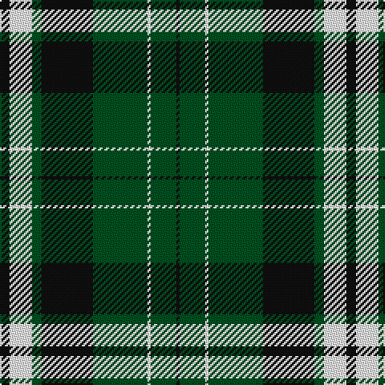

This page is one **sett** — a single exact thread-count. It belongs to the [tartan](/tartans/k3w7dg3k16dg17w1dg8k1/)
(the same proportion at any scale), whose colour order is pattern [KGWGKGWK](/stripes/kgwgkgwk/).

Sourced from register-of-tartans.  It is a [8 stripe tartan](/stripes/stripes8/).

Original link https://www.tartanregister.gov.uk/tartanDetails.aspx?ref=11619

## Register references

External register numbers recorded for this tartan.

- Scottish Register of Tartans: [11619](https://www.tartanregister.gov.uk/tartanDetails.aspx?ref=11619)

## Thread count
K/6 W14 G6 K32 G34 W2 G16 K/2

## Palette

Palette: <strong>Tartan Register</strong>
<table><thead><tr><th>Colour</th><th>Threads</th><th>Shade</th><th>Base</th><th>OKLCh</th></tr></thead><tbody><tr><td>K/</td><td style="text-align:right;font-variant-numeric:tabular-nums">6</td><td><code style="background-color:#101010;">#101010</code> <small style="color:#888">#101010</small></td><td>K <code style="background-color:#000000;">#000000</code></td><td><small style="color:#888">oklch(17.3% 0.000 89.9)</small></td></tr><tr><td>W</td><td style="text-align:right;font-variant-numeric:tabular-nums">14</td><td><code style="background-color:#FFFFFF;">#FFFFFF</code> <small style="color:#888">#FFFFFF</small></td><td>W <code style="background-color:#F7F7F7;">#F7F7F7</code></td><td><small style="color:#888">oklch(100.0% 0.000 89.9)</small></td></tr><tr><td>G</td><td style="text-align:right;font-variant-numeric:tabular-nums">6</td><td><code style="background-color:#005020;">#005020</code> <small style="color:#888">#005020</small></td><td>G <code style="background-color:#006100;">#006100</code></td><td><small style="color:#888">oklch(37.7% 0.105 149.6)</small></td></tr><tr><td>K</td><td style="text-align:right;font-variant-numeric:tabular-nums">32</td><td><code style="background-color:#101010;">#101010</code> <small style="color:#888">#101010</small></td><td>K <code style="background-color:#000000;">#000000</code></td><td><small style="color:#888">oklch(17.3% 0.000 89.9)</small></td></tr><tr><td>G</td><td style="text-align:right;font-variant-numeric:tabular-nums">34</td><td><code style="background-color:#005020;">#005020</code> <small style="color:#888">#005020</small></td><td>G <code style="background-color:#006100;">#006100</code></td><td><small style="color:#888">oklch(37.7% 0.105 149.6)</small></td></tr><tr><td>W</td><td style="text-align:right;font-variant-numeric:tabular-nums">2</td><td><code style="background-color:#FFFFFF;">#FFFFFF</code> <small style="color:#888">#FFFFFF</small></td><td>W <code style="background-color:#F7F7F7;">#F7F7F7</code></td><td><small style="color:#888">oklch(100.0% 0.000 89.9)</small></td></tr><tr><td>G</td><td style="text-align:right;font-variant-numeric:tabular-nums">16</td><td><code style="background-color:#005020;">#005020</code> <small style="color:#888">#005020</small></td><td>G <code style="background-color:#006100;">#006100</code></td><td><small style="color:#888">oklch(37.7% 0.105 149.6)</small></td></tr><tr><td>K/</td><td style="text-align:right;font-variant-numeric:tabular-nums">2</td><td><code style="background-color:#101010;">#101010</code> <small style="color:#888">#101010</small></td><td>K <code style="background-color:#000000;">#000000</code></td><td><small style="color:#888">oklch(17.3% 0.000 89.9)</small></td></tr></tbody></table>

# Sample pattern

## Nearest tartans

The nearest existing variants by ΔTartan distance, with this tartan at the top so the swatches line up against it.

ΔTartan

Tartan

Sett

—

<a href="/ttd/edit/#slug=k3w7dg3k16dg17w1dg8k1~x2">Utah Valley University</a> <a class="nn-out" href="/setts/s8/k3w7dg3k16dg17w1dg8k1~x2/" title="open its dictionary page">↗</a>

1.09

<a href="/setts/s8/k37w9k3g9w3~x2/">Glen Coe #2</a>

1.17

<a href="/ttd/edit/#slug=g14w1g7k7db2k2db2k2db7~x2">Abercrombie</a> <a class="nn-out" href="/setts/s9/g14w1g7k7db2k2db2k2db7~x2/" title="open its dictionary page">↗</a>

1.23

<a href="/ttd/edit/#slug=k2t1g16t1k13t18k2t2~x2">Hebridean Old</a> <a class="nn-out" href="/setts/s8/k2t1g16t1k13t18k2t2~x2/" title="open its dictionary page">↗</a>

1.34

<a href="/ttd/edit/#slug=k4ly2k13ly1y8y13ly2y4~x2">Bannockbane Grey #3</a> <a class="nn-out" href="/setts/s8/k4ly2k13ly1y8y13ly2y4~x2/" title="open its dictionary page">↗</a>

1.38

<a href="/ttd/edit/#slug=g13k3g34k6db16r2db16k3g13~x2">Lockhart</a> <a class="nn-out" href="/setts/s9/g13k3g34k6db16r2db16k3g13~x2/" title="open its dictionary page">↗</a>

1.40

<a href="/ttd/edit/#slug=g8r3g30k8w3k36w8~x2">Cleghorn (Personal)</a> <a class="nn-out" href="/setts/s7/g8r3g30k8w3k36w8~x2/" title="open its dictionary page">↗</a>

1.45

<a href="/ttd/edit/#slug=o14db5dg25db5w2dg11db7w5dg6o5~x2">Kerry County, Crest Range</a> <a class="nn-out" href="/setts/s10/o14db5dg25db5w2dg11db7w5dg6o5~x2/" title="open its dictionary page">↗</a>

1.47

<a href="/ttd/edit/#slug=k5g2k5g2db8g25w4~x2">Keppoch</a> <a class="nn-out" href="/setts/s7/k5g2k5g2db8g25w4~x2/" title="open its dictionary page">↗</a>

1.47

<a href="/ttd/edit/#slug=lr3k24lr6k8w4k8lr35k2~x2">Nowell/Noel 1951 (Name)</a> <a class="nn-out" href="/setts/s8/lr3k24lr6k8w4k8lr35k2~x2/" title="open its dictionary page">↗</a>

1.48

<a href="/ttd/edit/#slug=w6k3g24lg16k6lg6k6lg6k60lg6">Scruffy Wallace</a> <a class="nn-out" href="/setts/s10/w6k3g24lg16k6lg6k6lg6k60lg6/" title="open its dictionary page">↗</a>

## Neighbour map

Every grey dot is one of 14359 variants placed by the first two principal components of the ΔTartan feature space (44% of its variance). Red is this tartan; blue dots are its nearest — click one to open its page.

<svg viewBox="0 0 640 380" role="img" style="max-width:100%;height:auto;border:1px solid #e0e0e0;border-radius:4px;display:block" xmlns="http://www.w3.org/2000/svg"><image href="/nn/cloud.v1.png" width="640" height="380"/><a href="/setts/s8/k37w9k3g9w3~x2/"><circle cx="265.9" cy="175.9" r="4" fill="#3465a4"><title>Glen Coe #2</title></circle></a><a href="/setts/s9/g14w1g7k7db2k2db2k2db7~x2/"><circle cx="224.1" cy="184.1" r="4" fill="#3465a4"><title>Abercrombie</title></circle></a><a href="/setts/s8/k2t1g16t1k13t18k2t2~x2/"><circle cx="231.5" cy="175.4" r="4" fill="#3465a4"><title>Hebridean Old</title></circle></a><a href="/setts/s8/k4ly2k13ly1y8y13ly2y4~x2/"><circle cx="290.1" cy="200.9" r="4" fill="#3465a4"><title>Bannockbane Grey #3</title></circle></a><a href="/setts/s9/g13k3g34k6db16r2db16k3g13~x2/"><circle cx="289.5" cy="185.5" r="4" fill="#3465a4"><title>Lockhart</title></circle></a><a href="/setts/s7/g8r3g30k8w3k36w8~x2/"><circle cx="222.7" cy="185.7" r="4" fill="#3465a4"><title>Cleghorn (Personal)</title></circle></a><a href="/setts/s10/o14db5dg25db5w2dg11db7w5dg6o5~x2/"><circle cx="225.2" cy="185.2" r="4" fill="#3465a4"><title>Kerry County, Crest Range</title></circle></a><a href="/setts/s7/k5g2k5g2db8g25w4~x2/"><circle cx="296.9" cy="187.6" r="4" fill="#3465a4"><title>Keppoch</title></circle></a><a href="/setts/s8/lr3k24lr6k8w4k8lr35k2~x2/"><circle cx="304.3" cy="170.1" r="4" fill="#3465a4"><title>Nowell/Noel 1951 (Name)</title></circle></a><a href="/setts/s10/w6k3g24lg16k6lg6k6lg6k60lg6/"><circle cx="286.0" cy="134.4" r="4" fill="#3465a4"><title>Scruffy Wallace</title></circle></a><circle cx="275.7" cy="190.5" r="5" fill="#c00000"/></svg>

ID: /setts/s8/k3w7dg3k16dg17w1dg8k1~x2/
