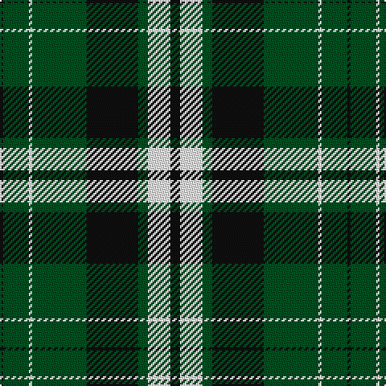

In pattern [KGWGKGWK](/patterns/kgwgkgwk/).

This was sourced from register-of-tartans.  It is a [8 stripes tartan](/stripes/stripes8/).

Original link https://www.tartanregister.gov.uk/tartanDetails.aspx?ref=11619

## Register references

External register numbers recorded for this tartan.

- Scottish Register of Tartans: [11619](https://www.tartanregister.gov.uk/tartanDetails.aspx?ref=11619)

## Thread count
K/2 G16 W2 G34 K32 G6 W14 K/6

## Palette
Each colour and its ΔE from the base-6 reference it is a variant of.

| Colour | Shade | Base | ΔE (OKLab) |
|---|---|---|---|
| G | <code style="background-color:#005020;">#005020</code> `#005020` | G <code style="background-color:#006100;">#006100</code> | 0.07 |
| K | <code style="background-color:#101010;">#101010</code> `#101010` | K <code style="background-color:#000000;">#000000</code> | 0.17 |
| W | <code style="background-color:#FFFFFF;">#FFFFFF</code> `#FFFFFF` | W <code style="background-color:#F7F7F7;">#F7F7F7</code> | 0.02 |

# Sample pattern

## Nearest tartans

The nearest existing variants by ΔTartan distance.

1. [Glen Coe #2](/setts/s8/k37w9k3g9w3g9k3w9~g006818-k101010-wfcfcfc~x2/) — ΔT 1.09
1. [Abercrombie](/setts/s9/g14w1g7k7b2k2b2k2b7~b304080-g008000-k000000-we0e0e0~x2/) — ΔT 1.16
1. [Hebridean Old](/setts/s8/b2k2b18k13b1g16b1k2~b5480b0-g008000-k000000~x2/) — ΔT 1.23
1. [Bannockbane Grey #3](/setts/s8/g4y2g13g8y1k13y2k4~g808080-k101010-ye8c000~x2/) — ΔT 1.34
1. [Lockhart](/setts/s9/g13k3g34k6b16r2b16k3g13~b000050-g008000-k000000-rc00000~x2/) — ΔT 1.37
1. [Cleghorn (Personal)](/setts/s7/g8r3g30k8w3k36w8~g007800-k000000-r8c0000-wf0f0f0~x2/) — ΔT 1.40
1. [Kerry County, Crest Range](/setts/s10/r14b5g25b5w2g11b7w5g6r5~b080848-g005020-rc87814-we0e0e0~x2/) — ΔT 1.45
1. [Nowell/Noel 1951 (Name)](/setts/s8/y3k24y6k8w4k8y35k2~k101010-we0e0e0-ya0a0a0~x2/) — ΔT 1.47
1. [Keppoch](/setts/s7/k5g2k5g2b8g25w4~b2c2c80-g006818-k101010-wf8f8f8~x2/) — ΔT 1.47
1. [Gordon Dress (Variation) Trade Tartan Tartan Number: 1831. Earliest known date: pre 2003 This sample comes from the MacGregor-Hastie collection which forms the basis of the cloth archive of the Scottish Tartans Society. Some of the samples, including this one, were unmarked. One can assume that the sample dates between 1930 and 1950. See products available Copyright © Blair Urquhart, Comrie, 2015](/setts/s9/w4k2w16k4w4k37g12k4y4~g006818-k101010-we0e0e0-ye8c000~x2/) — ΔT 1.47

## Neighbour map

Every grey dot is one of 15726 variants placed by the first two principal components of the ΔTartan feature space (44% of its variance). Red is this tartan; blue dots are its nearest — click one to open its page.

<svg viewBox="0 0 640 380" role="img" style="max-width:100%;height:auto;border:1px solid #e0e0e0;border-radius:4px;display:block" xmlns="http://www.w3.org/2000/svg"><image href="/nn/cloud.v1.png" width="640" height="380"/><a href="/setts/s8/k37w9k3g9w3g9k3w9~g006818-k101010-wfcfcfc~x2/"><circle cx="263.5" cy="180.0" r="4" fill="#3465a4"><title>Glen Coe #2</title></circle></a><a href="/setts/s9/g14w1g7k7b2k2b2k2b7~b304080-g008000-k000000-we0e0e0~x2/"><circle cx="220.7" cy="183.7" r="4" fill="#3465a4"><title>Abercrombie</title></circle></a><a href="/setts/s8/b2k2b18k13b1g16b1k2~b5480b0-g008000-k000000~x2/"><circle cx="227.8" cy="176.0" r="4" fill="#3465a4"><title>Hebridean Old</title></circle></a><a href="/setts/s8/g4y2g13g8y1k13y2k4~g808080-k101010-ye8c000~x2/"><circle cx="288.7" cy="203.8" r="4" fill="#3465a4"><title>Bannockbane Grey #3</title></circle></a><a href="/setts/s9/g13k3g34k6b16r2b16k3g13~b000050-g008000-k000000-rc00000~x2/"><circle cx="286.3" cy="185.5" r="4" fill="#3465a4"><title>Lockhart</title></circle></a><a href="/setts/s7/g8r3g30k8w3k36w8~g007800-k000000-r8c0000-wf0f0f0~x2/"><circle cx="219.5" cy="187.9" r="4" fill="#3465a4"><title>Cleghorn (Personal)</title></circle></a><a href="/setts/s10/r14b5g25b5w2g11b7w5g6r5~b080848-g005020-rc87814-we0e0e0~x2/"><circle cx="223.0" cy="184.7" r="4" fill="#3465a4"><title>Kerry County, Crest Range</title></circle></a><a href="/setts/s8/y3k24y6k8w4k8y35k2~k101010-we0e0e0-ya0a0a0~x2/"><circle cx="302.5" cy="174.2" r="4" fill="#3465a4"><title>Nowell/Noel 1951 (Name)</title></circle></a><a href="/setts/s7/k5g2k5g2b8g25w4~b2c2c80-g006818-k101010-wf8f8f8~x2/"><circle cx="294.3" cy="187.4" r="4" fill="#3465a4"><title>Keppoch</title></circle></a><a href="/setts/s9/w4k2w16k4w4k37g12k4y4~g006818-k101010-we0e0e0-ye8c000~x2/"><circle cx="272.4" cy="139.9" r="4" fill="#3465a4"><title>Gordon Dress (Variation) Trade Tartan Tartan Number: 1831. Earliest known date: pre 2003 This sample comes from the MacGregor-Hastie collection which forms the basis of the cloth archive of the Scottish Tartans Society. Some of the samples, including this one, were unmarked. One can assume that the sample dates between 1930 and 1950. See products available Copyright © Blair Urquhart, Comrie, 2015</title></circle></a><circle cx="273.0" cy="192.4" r="5" fill="#c00000"/></svg>

ID: /setts/s8/k3w7g3k16g17w1g8k1~g005020-k101010-wffffff~x2/
