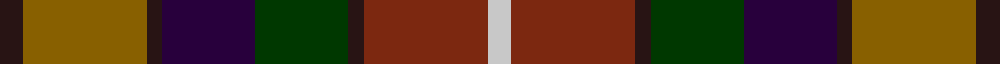

**Bands:** [KGKBGKRW](/stripes/kgkbgkrw/) · **Stripes:** [K Y K DP DG K O LB](/stripes/stripes8/) K Y K DP DG K O LB

This was sourced from register-of-tartans.  It is a [8 band tartan](/bands/bands8/).

Original link https://www.tartanregister.gov.uk/tartanDetails.aspx?ref=4801

## Also known as

This cloth is also recorded under:

- Young Presidents Org. Dress

## Attestations

This cloth appears in 2 source records; the oldest owns this page.

- 01/01/2002 — YPO Dress (register-of-tartans, [record](https://www.tartanregister.gov.uk/tartanDetails.aspx?ref=4801))
- pre 2002 — Young Presidents Org. Dress (Corp.) (tartans-authority, [record](http://www.tartansauthority.com/tartan-ferret/display/4134/))

## Register references

External register numbers recorded for this tartan.

- Scottish Register of Tartans: [4801](https://www.tartanregister.gov.uk/tartanDetails.aspx?ref=4801)
- Scottish Tartans Authority (ITI): 4134

## Thread count
K/6 T32 K4 DP24 G24 K4 Ta32 N/6

## Palette
Each colour and its ΔE from the base-6 reference it is a variant of.

| Colour | Shade | Base | ΔE (OKLab) |
|---|---|---|---|
| DP | <code style="background-color:#28003C;">#28003C</code> `#28003C` | B <code style="background-color:#2A418A;">#2A418A</code> | 0.21 |
| G | <code style="background-color:#003800;">#003800</code> `#003800` | G <code style="background-color:#006100;">#006100</code> | 0.14 |
| K | <code style="background-color:#281414;">#281414</code> `#281414` | K <code style="background-color:#000000;">#000000</code> | 0.22 |
| N | <code style="background-color:#C8C8C8;">#C8C8C8</code> `#C8C8C8` | W <code style="background-color:#F7F7F7;">#F7F7F7</code> | 0.14 |
| T | <code style="background-color:#886000;">#886000</code> `#886000` | G <code style="background-color:#006100;">#006100</code> | 0.16 |
| Ta | <code style="background-color:#7C2810;">#7C2810</code> `#7C2810` | R <code style="background-color:#CC0000;">#CC0000</code> | 0.16 |

# Sample pattern

## Nearest tartans

The nearest existing variants by ΔTartan distance.

1. [Falardeau-Murphy (Canada) (Personal)](/setts/s7/dg21t21ly3r21dt3dp5dt3~x2/) — ΔT 1.17
1. [Bracken (WCWM)](/setts/s11/dy30k6dy6r6lo6o14k4o3n14k6n16~x2/) — ΔT 1.33
1. [Glen Chalmadale](/setts/s9/g13w2g10k5r13k3r5dt15o5~x2/) — ΔT 1.33
1. [Meath, County](/setts/s12/lo5db2r14do9dg8db3r3db3r3db3dg18ly3~x2/) — ΔT 1.33
1. [Falardeau-Murphy (Canada) (Personal)](/setts/s7/g21t21ly3r21n3dp5n3~x2/) — ΔT 1.36
1. [Mekos, The](/setts/s6/do19dg23lo3db15r11w5~x2/) — ΔT 1.40
1. [Caledonian (WCWM)](/setts/s11/r4lb2r6k2r6do16lo2k12o10k2o1~x2/) — ΔT 1.42
1. [Cuthill (Personal)](/setts/s13/db3g4r2g3r3g16dt16r16db3r3db2r4ly3~x2/) — ΔT 1.44
1. [Bonnie Brae](/setts/s11/r6db3y3r26db20dg26o3dg4o3dg4o6/) — ΔT 1.44
1. [Roscommon, County](/setts/s10/r5ly3r19do6ly5do6dg12db5dg12db3~x2/) — ΔT 1.46

## Neighbour map

Every grey dot is one of 14299 variants placed by the first two principal components of the ΔTartan feature space (44% of its variance). Red is this tartan; blue dots are its nearest — click one to open its page.

<svg viewBox="0 0 640 380" role="img" style="max-width:100%;height:auto;border:1px solid #e0e0e0;border-radius:4px;display:block" xmlns="http://www.w3.org/2000/svg"><image href="/nn/cloud.v1.png" width="640" height="380"/><a href="/setts/s7/dg21t21ly3r21dt3dp5dt3~x2/"><circle cx="105.0" cy="191.6" r="4" fill="#3465a4"><title>Falardeau-Murphy (Canada) (Personal)</title></circle></a><a href="/setts/s11/dy30k6dy6r6lo6o14k4o3n14k6n16~x2/"><circle cx="149.6" cy="177.6" r="4" fill="#3465a4"><title>Bracken (WCWM)</title></circle></a><a href="/setts/s9/g13w2g10k5r13k3r5dt15o5~x2/"><circle cx="91.3" cy="197.2" r="4" fill="#3465a4"><title>Glen Chalmadale</title></circle></a><a href="/setts/s12/lo5db2r14do9dg8db3r3db3r3db3dg18ly3~x2/"><circle cx="150.7" cy="170.6" r="4" fill="#3465a4"><title>Meath, County</title></circle></a><a href="/setts/s7/g21t21ly3r21n3dp5n3~x2/"><circle cx="112.3" cy="193.6" r="4" fill="#3465a4"><title>Falardeau-Murphy (Canada) (Personal)</title></circle></a><a href="/setts/s6/do19dg23lo3db15r11w5~x2/"><circle cx="86.6" cy="217.0" r="4" fill="#3465a4"><title>Mekos, The</title></circle></a><a href="/setts/s11/r4lb2r6k2r6do16lo2k12o10k2o1~x2/"><circle cx="125.4" cy="141.2" r="4" fill="#3465a4"><title>Caledonian (WCWM)</title></circle></a><a href="/setts/s13/db3g4r2g3r3g16dt16r16db3r3db2r4ly3~x2/"><circle cx="125.6" cy="158.7" r="4" fill="#3465a4"><title>Cuthill (Personal)</title></circle></a><a href="/setts/s11/r6db3y3r26db20dg26o3dg4o3dg4o6/"><circle cx="154.3" cy="166.5" r="4" fill="#3465a4"><title>Bonnie Brae</title></circle></a><a href="/setts/s10/r5ly3r19do6ly5do6dg12db5dg12db3~x2/"><circle cx="116.9" cy="208.2" r="4" fill="#3465a4"><title>Roscommon, County</title></circle></a><circle cx="91.6" cy="194.7" r="5" fill="#c00000"/></svg>

ID: /setts/s8/k3y16k2dp12dg12k2o16lb3~x2/
