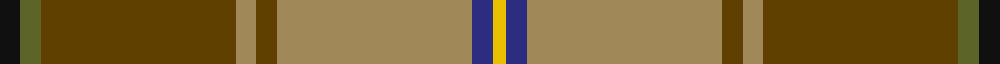

This page is one **sett** — a single exact thread-count. It belongs to the [tartan](/tartans/k3y3dy28lo3dy3lo28db3ly2/)
(the same proportion at any scale), whose colour order is pattern [KGGYGYBY](/stripes/kggygyby/).

Sourced from tartans-authority.  It is a [8 stripe tartan](/stripes/stripes8/).

Original link http://www.tartansauthority.com/tartan-ferret/display/3786/

## Also known as

This cloth is also recorded under:

- California Highway Patrol

2 attestations — the source records this cloth was collapsed from (oldest owns this page)

<ul>
<li>1991 — California Highway Patrol (Corporate (tartans-authority, <a href="http://www.tartansauthority.com/tartan-ferret/display/3786/">record</a>)</li>
<li>01/01/1992 — California Highway Patrol (Corporate) (register-of-tartans, <a href="https://www.tartanregister.gov.uk/tartanDetails.aspx?ref=5330">record</a>)</li>
</ul>

## Register references

External register numbers recorded for this tartan.

- Scottish Register of Tartans: [5330](https://www.tartanregister.gov.uk/tartanDetails.aspx?ref=5330)
- Scottish Tartans Authority (ITI): 3786

## Thread count
K/6 G6 T56 LT6 T6 LT56 DB6 Y/4

## Palette

Palette: <strong>Tartan Register</strong>
<table><thead><tr><th>Colour</th><th>Threads</th><th>Shade</th><th>Base</th><th>OKLCh</th></tr></thead><tbody><tr><td>K/</td><td style="text-align:right;font-variant-numeric:tabular-nums">6</td><td><code style="background-color:#101010;">#101010</code> <small style="color:#888">#101010</small></td><td>K <code style="background-color:#000000;">#000000</code></td><td><small style="color:#888">oklch(17.3% 0.000 89.9)</small></td></tr><tr><td>G</td><td style="text-align:right;font-variant-numeric:tabular-nums">6</td><td><code style="background-color:#5C6428;">#5C6428</code> <small style="color:#888">#5C6428</small></td><td>G <code style="background-color:#006100;">#006100</code></td><td><small style="color:#888">oklch(48.3% 0.084 116.0)</small></td></tr><tr><td>T</td><td style="text-align:right;font-variant-numeric:tabular-nums">56</td><td><code style="background-color:#604000;">#604000</code> <small style="color:#888">#604000</small></td><td>G <code style="background-color:#006100;">#006100</code></td><td><small style="color:#888">oklch(39.8% 0.083 76.8)</small></td></tr><tr><td>LT</td><td style="text-align:right;font-variant-numeric:tabular-nums">6</td><td><code style="background-color:#A08858;">#A08858</code> <small style="color:#888">#A08858</small></td><td>Y <code style="background-color:#F2BF00;">#F2BF00</code></td><td><small style="color:#888">oklch(63.7% 0.071 84.0)</small></td></tr><tr><td>T</td><td style="text-align:right;font-variant-numeric:tabular-nums">6</td><td><code style="background-color:#604000;">#604000</code> <small style="color:#888">#604000</small></td><td>G <code style="background-color:#006100;">#006100</code></td><td><small style="color:#888">oklch(39.8% 0.083 76.8)</small></td></tr><tr><td>LT</td><td style="text-align:right;font-variant-numeric:tabular-nums">56</td><td><code style="background-color:#A08858;">#A08858</code> <small style="color:#888">#A08858</small></td><td>Y <code style="background-color:#F2BF00;">#F2BF00</code></td><td><small style="color:#888">oklch(63.7% 0.071 84.0)</small></td></tr><tr><td>DB</td><td style="text-align:right;font-variant-numeric:tabular-nums">6</td><td><code style="background-color:#2C2C80;">#2C2C80</code> <small style="color:#888">#2C2C80</small></td><td>B <code style="background-color:#2A418A;">#2A418A</code></td><td><small style="color:#888">oklch(35.0% 0.138 276.6)</small></td></tr><tr><td>Y/</td><td style="text-align:right;font-variant-numeric:tabular-nums">4</td><td><code style="background-color:#E8C000;">#E8C000</code> <small style="color:#888">#E8C000</small></td><td>Y <code style="background-color:#F2BF00;">#F2BF00</code></td><td><small style="color:#888">oklch(81.9% 0.168 93.7)</small></td></tr></tbody></table>

# Sample pattern

## Nearest tartans

The nearest existing variants by ΔTartan distance, with this tartan at the top so the swatches line up against it.

ΔTartan

Tartan

Sett

—

<a href="/ttd/edit/#slug=k3y3dy28lo3dy3lo28db3ly2~x2">California Highway Patrol (Corporate</a> <a class="nn-out" href="/setts/s8/k3y3dy28lo3dy3lo28db3ly2~x2/" title="open its dictionary page">↗</a>

0.95

<a href="/ttd/edit/#slug=k2o30g4w2g14m13ly2~x2">Red Rum</a> <a class="nn-out" href="/setts/s7/k2o30g4w2g14m13ly2~x2/" title="open its dictionary page">↗</a>

1.12

<a href="/ttd/edit/#slug=k3r12dy8lo2g36dy10t2~x2">Snelgrove Htg (Name)</a> <a class="nn-out" href="/setts/s7/k3r12dy8lo2g36dy10t2~x2/" title="open its dictionary page">↗</a>

1.36

<a href="/ttd/edit/#slug=dr11g3dr4ly3dr3ly4dr3y13o34g3o4n3~x2">Harmony 1</a> <a class="nn-out" href="/setts/s12/dr11g3dr4ly3dr3ly4dr3y13o34g3o4n3~x2/" title="open its dictionary page">↗</a>

1.44

<a href="/ttd/edit/#slug=ri2dg16r1ri2r12ly1y1~x2">Spragg, Andrew</a> <a class="nn-out" href="/setts/s7/ri2dg16r1ri2r12ly1y1~x2/" title="open its dictionary page">↗</a>

1.45

<a href="/ttd/edit/#slug=ri2g16r1ri2r12ly1t1~x2">Spragg (Name)</a> <a class="nn-out" href="/setts/s7/ri2g16r1ri2r12ly1t1~x2/" title="open its dictionary page">↗</a>

1.46

<a href="/ttd/edit/#slug=y14lo1y1lo1y2k3y3k3doi3do1doi9lo1~x4">Glen Nevis #2 (Personal)</a> <a class="nn-out" href="/setts/s12/y14lo1y1lo1y2k3y3k3doi3do1doi9lo1~x4/" title="open its dictionary page">↗</a>

1.48

<a href="/ttd/edit/#slug=dt8y4r30g30lo3g4~x2">Hutcheson (Name)</a> <a class="nn-out" href="/setts/s6/dt8y4r30g30lo3g4~x2/" title="open its dictionary page">↗</a>

1.48

<a href="/ttd/edit/#slug=r30y4dt8y4r30g30lo3g4lo3g30~x2">Hutcheson</a> <a class="nn-out" href="/setts/s10/r30y4dt8y4r30g30lo3g4lo3g30~x2/" title="open its dictionary page">↗</a>

1.50

<a href="/ttd/edit/#slug=r2t6r1dy14r1dy14r1k6g10lo1g2lo2~x2">Ogg of Tarragann Hunting (Personal)</a> <a class="nn-out" href="/setts/s12/r2t6r1dy14r1dy14r1k6g10lo1g2lo2~x2/" title="open its dictionary page">↗</a>

1.50

<a href="/ttd/edit/#slug=w3o4dg2o22dt5oi16ly3~x2">Pubcrawlers, The</a> <a class="nn-out" href="/setts/s7/w3o4dg2o22dt5oi16ly3~x2/" title="open its dictionary page">↗</a>

## Neighbour map

Every grey dot is one of 14359 variants placed by the first two principal components of the ΔTartan feature space (44% of its variance). Red is this tartan; blue dots are its nearest — click one to open its page.

<svg viewBox="0 0 640 380" role="img" style="max-width:100%;height:auto;border:1px solid #e0e0e0;border-radius:4px;display:block" xmlns="http://www.w3.org/2000/svg"><image href="/nn/cloud.v1.png" width="640" height="380"/><a href="/setts/s7/k2o30g4w2g14m13ly2~x2/"><circle cx="243.9" cy="155.5" r="4" fill="#3465a4"><title>Red Rum</title></circle></a><a href="/setts/s7/k3r12dy8lo2g36dy10t2~x2/"><circle cx="287.0" cy="154.1" r="4" fill="#3465a4"><title>Snelgrove Htg (Name)</title></circle></a><a href="/setts/s12/dr11g3dr4ly3dr3ly4dr3y13o34g3o4n3~x2/"><circle cx="217.6" cy="127.3" r="4" fill="#3465a4"><title>Harmony 1</title></circle></a><a href="/setts/s7/ri2dg16r1ri2r12ly1y1~x2/"><circle cx="301.8" cy="154.6" r="4" fill="#3465a4"><title>Spragg, Andrew</title></circle></a><a href="/setts/s7/ri2g16r1ri2r12ly1t1~x2/"><circle cx="298.4" cy="152.8" r="4" fill="#3465a4"><title>Spragg (Name)</title></circle></a><a href="/setts/s12/y14lo1y1lo1y2k3y3k3doi3do1doi9lo1~x4/"><circle cx="274.8" cy="146.9" r="4" fill="#3465a4"><title>Glen Nevis #2 (Personal)</title></circle></a><a href="/setts/s6/dt8y4r30g30lo3g4~x2/"><circle cx="255.5" cy="200.6" r="4" fill="#3465a4"><title>Hutcheson (Name)</title></circle></a><a href="/setts/s10/r30y4dt8y4r30g30lo3g4lo3g30~x2/"><circle cx="256.3" cy="183.1" r="4" fill="#3465a4"><title>Hutcheson</title></circle></a><a href="/setts/s12/r2t6r1dy14r1dy14r1k6g10lo1g2lo2~x2/"><circle cx="243.3" cy="150.8" r="4" fill="#3465a4"><title>Ogg of Tarragann Hunting (Personal)</title></circle></a><a href="/setts/s7/w3o4dg2o22dt5oi16ly3~x2/"><circle cx="237.4" cy="165.1" r="4" fill="#3465a4"><title>Pubcrawlers, The</title></circle></a><circle cx="276.6" cy="146.3" r="5" fill="#c00000"/></svg>

ID: /setts/s8/k3y3dy28lo3dy3lo28db3ly2~x2/
