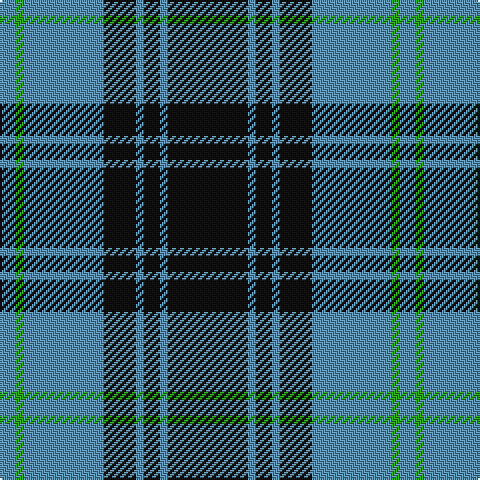

In pattern [BGBKBKBK](/patterns/bgbkbkbk/).

This was sourced from register-of-tartans.  It is a [8 stripes tartan](/stripes/stripes8/).

Original link https://www.tartanregister.gov.uk/tartanDetails.aspx?ref=3433

## Attestations

This cloth appears in 2 source records; the oldest owns this page.

- 01/01/2004 — Martin's Own (register-of-tartans, [record](https://www.tartanregister.gov.uk/tartanDetails.aspx?ref=3433))
- 2004 — Martin's Own (Personal) (tartans-authority, [record](http://www.tartansauthority.com/tartan-ferret/display/6590/))

## Thread count
B/8 G4 B40 K16 B4 K8 B4 K/40

## Palette
Each colour and its ΔE from the base-6 reference it is a variant of.

| Colour | Shade | Base | ΔE (OKLab) |
|---|---|---|---|
| B | <code style="background-color:#5C8CA8;">#5C8CA8</code> `#5C8CA8` | B <code style="background-color:#2C4084;">#2C4084</code> | 0.23 |
| G | <code style="background-color:#289C18;">#289C18</code> `#289C18` | G <code style="background-color:#006400;">#006400</code> | 0.18 |
| K | <code style="background-color:#101010;">#101010</code> `#101010` | K <code style="background-color:#000000;">#000000</code> | 0.17 |

# Sample pattern

## Nearest tartans

The nearest existing variants by ΔTartan distance.

1. [West Point Military Academy (Mil.)](/setts/s8/k40r4k8r4k16r40y4r8-k101010-r888888-yccc018/) — ΔT 0.72
1. [Slanj](/setts/s10/k56b6k6b50k6b50k6b6k56r8-b1474b4-k101010-r9c68a4/) — ΔT 1.02
1. [West Point](/setts/s8/k78r6k6r6k24r60y6r6-k101010-r888888-yccc018/) — ΔT 1.03
1. [West Point Regimental Tartan Tartan Number: 1130. Earliest known date: 1986 Wemyss means cave and probably originates from the caves beneath MacDuff castle. There is a long and interesting article on the family of Wemyss in William Anderson's 'The Scottish Nation' published by A Fullarton in 1874. See products available Copyright © Blair Urquhart, Comrie, 2015](/setts/s8/k78r6k6r6k24r60y6r6-k101010-r888888-ye8c000/) — ΔT 1.04
1. [Slanj (Corporate)](/setts/s6/r8k56b6k6b50k6-b1474b4-k101010-r9c68a4/) — ΔT 1.09
1. [Salem Scottish Dancers (Corporate)](/setts/s8/b10ba10b60w8b8ba36w6b6-b14283c-ba1474b4-wf8f8f8/) — ΔT 1.11
1. [Cadence Design Systems (Corporate)](/setts/s7/k102g10r30g74k34r12g14-g006818-k00003c-rc80000/) — ΔT 1.13
1. [Flynn](/setts/s6/r116k44r16k34ra10k28-k101010-r888888-rac8002c/) — ΔT 1.13
1. [Douglas, Grey (Vestiarium Scoticum)](/setts/s8/k40r4k8r4k16r40k4r8-k101010-r888888/) — ΔT 1.13
1. [MacSween, Black (Personal)](/setts/s6/k8r24k8r24k48ra4-k101010-r888888-rac80000/) — ΔT 1.20

## Neighbour map

Every grey dot is one of 15726 variants placed by the first two principal components of the ΔTartan feature space (44% of its variance). Red is this tartan; blue dots are its nearest — click one to open its page.

<svg viewBox="0 0 640 380" role="img" style="max-width:100%;height:auto;border:1px solid #e0e0e0;border-radius:4px;display:block" xmlns="http://www.w3.org/2000/svg"><image href="/nn/cloud.v1.png" width="640" height="380"/><a href="/setts/s8/k40r4k8r4k16r40y4r8-k101010-r888888-yccc018/"><circle cx="308.0" cy="202.4" r="4" fill="#3465a4"><title>West Point Military Academy (Mil.)</title></circle></a><a href="/setts/s10/k56b6k6b50k6b50k6b6k56r8-b1474b4-k101010-r9c68a4/"><circle cx="314.8" cy="211.3" r="4" fill="#3465a4"><title>Slanj</title></circle></a><a href="/setts/s8/k78r6k6r6k24r60y6r6-k101010-r888888-yccc018/"><circle cx="349.6" cy="182.5" r="4" fill="#3465a4"><title>West Point</title></circle></a><a href="/setts/s8/k78r6k6r6k24r60y6r6-k101010-r888888-ye8c000/"><circle cx="349.2" cy="182.1" r="4" fill="#3465a4"><title>West Point Regimental Tartan Tartan Number: 1130. Earliest known date: 1986 Wemyss means cave and probably originates from the caves beneath MacDuff castle. There is a long and interesting article on the family of Wemyss in William Anderson's 'The Scottish Nation' published by A Fullarton in 1874. See products available Copyright © Blair Urquhart, Comrie, 2015</title></circle></a><a href="/setts/s6/r8k56b6k6b50k6-b1474b4-k101010-r9c68a4/"><circle cx="320.9" cy="225.1" r="4" fill="#3465a4"><title>Slanj (Corporate)</title></circle></a><a href="/setts/s8/b10ba10b60w8b8ba36w6b6-b14283c-ba1474b4-wf8f8f8/"><circle cx="326.4" cy="201.9" r="4" fill="#3465a4"><title>Salem Scottish Dancers (Corporate)</title></circle></a><a href="/setts/s7/k102g10r30g74k34r12g14-g006818-k00003c-rc80000/"><circle cx="276.7" cy="225.1" r="4" fill="#3465a4"><title>Cadence Design Systems (Corporate)</title></circle></a><a href="/setts/s6/r116k44r16k34ra10k28-k101010-r888888-rac8002c/"><circle cx="320.5" cy="215.2" r="4" fill="#3465a4"><title>Flynn</title></circle></a><a href="/setts/s8/k40r4k8r4k16r40k4r8-k101010-r888888/"><circle cx="352.6" cy="221.5" r="4" fill="#3465a4"><title>Douglas, Grey (Vestiarium Scoticum)</title></circle></a><a href="/setts/s6/k8r24k8r24k48ra4-k101010-r888888-rac80000/"><circle cx="327.3" cy="224.1" r="4" fill="#3465a4"><title>MacSween, Black (Personal)</title></circle></a><circle cx="307.8" cy="207.4" r="5" fill="#c00000"/></svg>

ID: /setts/s8/k40b4k8b4k16b40g4b8-b5c8ca8-g289c18-k101010/
