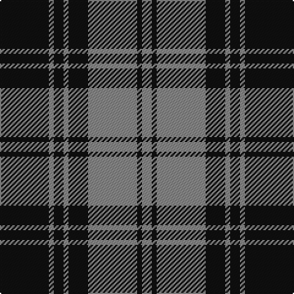

In pattern [KRKRKRKR](/patterns/krkrkrkr/).

This was sourced from register-of-tartans.  It is a [8 stripes tartan](/stripes/stripes8/).

Original link https://www.tartanregister.gov.uk/tartanDetails.aspx?ref=957

## Attestations

This cloth appears in 2 source records; the oldest owns this page.

- 01/01/1842 — Douglas, Grey (Vestiarium Scoticum) (register-of-tartans, [record](https://www.tartanregister.gov.uk/tartanDetails.aspx?ref=957))
- 1842 — Douglas, Grey (Clan) (tartans-authority, [record](http://www.tartansauthority.com/tartan-ferret/display/1127/))

## Thread count
K/40 N4 K8 N4 K16 N40 K4 N/8

## Palette
Each colour and its ΔE from the base-6 reference it is a variant of.

| Colour | Shade | Base | ΔE (OKLab) |
|---|---|---|---|
| K | <code style="background-color:#101010;">#101010</code> `#101010` | K <code style="background-color:#000000;">#000000</code> | 0.17 |
| N | <code style="background-color:#888888;">#888888</code> `#888888` | R <code style="background-color:#CC0000;">#CC0000</code> | 0.24 |

# Sample pattern

## Nearest tartans

The nearest existing variants by ΔTartan distance.

1. [Bute Heather, Black](/setts/s10/k12g40k12g8k8g16g4k16g4k10-g808080-k101010/) — ΔT 0.84
1. [West Point Military Academy (Mil.)](/setts/s8/k40r4k8r4k16r40y4r8-k101010-r888888-yccc018/) — ΔT 0.96
1. [Watertown Library Assoc. (Corporate)](/setts/s8/g8k4g62k16g4k54g4k8-g789484-k101010/) — ΔT 0.98
1. [West Point](/setts/s8/k78r6k6r6k24r60y6r6-k101010-r888888-yccc018/) — ΔT 1.09
1. [West Point Regimental Tartan Tartan Number: 1130. Earliest known date: 1986 Wemyss means cave and probably originates from the caves beneath MacDuff castle. There is a long and interesting article on the family of Wemyss in William Anderson's 'The Scottish Nation' published by A Fullarton in 1874. See products available Copyright © Blair Urquhart, Comrie, 2015](/setts/s8/k78r6k6r6k24r60y6r6-k101010-r888888-ye8c000/) — ΔT 1.09
1. [Douglas, Grey Clan/Family Tartan Tartan Number: 7211. Earliest known date: 01/01/1842 The design comes from the Vestiarium Scoticum (1842). The authors, the Sobieski Stuart brothers, enjoyed a popular following among the Scottish gentry in the early Victorian era, and in the spirit of the times, added mystery, romance and some spurious historical documentation to the subject of tartan. Of the better known tartans, the book offers some minor variation, but in other cases it provides the only recorded version of many tartans in use today. (Estimated threadcount; Original STA ref: 1127) See products available Copyright © Blair Urquhart, Comrie, 2015](/setts/s8/k36y4k8y4k16y36k4y8-k000000-y909090/) — ΔT 1.12
1. [Moffat (1984)](/setts/s7/k78r6k6r6k28r56ra6-k101010-r888888-rac80000/) — ΔT 1.12
1. [Martin's Own](/setts/s8/k40b4k8b4k16b40g4b8-b5c8ca8-g289c18-k101010/) — ΔT 1.13
1. [MacSween, Black (Personal)](/setts/s6/k8r24k8r24k48ra4-k101010-r888888-rac80000/) — ΔT 1.23
1. [Flynn](/setts/s6/r116k44r16k34ra10k28-k101010-r888888-rac8002c/) — ΔT 1.24

## Neighbour map

Every grey dot is one of 15726 variants placed by the first two principal components of the ΔTartan feature space (44% of its variance). Red is this tartan; blue dots are its nearest — click one to open its page.

<svg viewBox="0 0 640 380" role="img" style="max-width:100%;height:auto;border:1px solid #e0e0e0;border-radius:4px;display:block" xmlns="http://www.w3.org/2000/svg"><image href="/nn/cloud.v1.png" width="640" height="380"/><a href="/setts/s10/k12g40k12g8k8g16g4k16g4k10-g808080-k101010/"><circle cx="340.1" cy="228.1" r="4" fill="#3465a4"><title>Bute Heather, Black</title></circle></a><a href="/setts/s8/k40r4k8r4k16r40y4r8-k101010-r888888-yccc018/"><circle cx="308.0" cy="202.4" r="4" fill="#3465a4"><title>West Point Military Academy (Mil.)</title></circle></a><a href="/setts/s8/g8k4g62k16g4k54g4k8-g789484-k101010/"><circle cx="360.0" cy="193.0" r="4" fill="#3465a4"><title>Watertown Library Assoc. (Corporate)</title></circle></a><a href="/setts/s8/k78r6k6r6k24r60y6r6-k101010-r888888-yccc018/"><circle cx="349.6" cy="182.5" r="4" fill="#3465a4"><title>West Point</title></circle></a><a href="/setts/s8/k78r6k6r6k24r60y6r6-k101010-r888888-ye8c000/"><circle cx="349.2" cy="182.1" r="4" fill="#3465a4"><title>West Point Regimental Tartan Tartan Number: 1130. Earliest known date: 1986 Wemyss means cave and probably originates from the caves beneath MacDuff castle. There is a long and interesting article on the family of Wemyss in William Anderson's 'The Scottish Nation' published by A Fullarton in 1874. See products available Copyright © Blair Urquhart, Comrie, 2015</title></circle></a><a href="/setts/s8/k36y4k8y4k16y36k4y8-k000000-y909090/"><circle cx="326.1" cy="224.6" r="4" fill="#3465a4"><title>Douglas, Grey Clan/Family Tartan Tartan Number: 7211. Earliest known date: 01/01/1842 The design comes from the Vestiarium Scoticum (1842). The authors, the Sobieski Stuart brothers, enjoyed a popular following among the Scottish gentry in the early Victorian era, and in the spirit of the times, added mystery, romance and some spurious historical documentation to the subject of tartan. Of the better known tartans, the book offers some minor variation, but in other cases it provides the only recorded version of many tartans in use today. (Estimated threadcount; Original STA ref: 1127) See products available Copyright © Blair Urquhart, Comrie, 2015</title></circle></a><a href="/setts/s7/k78r6k6r6k28r56ra6-k101010-r888888-rac80000/"><circle cx="371.5" cy="197.8" r="4" fill="#3465a4"><title>Moffat (1984)</title></circle></a><a href="/setts/s8/k40b4k8b4k16b40g4b8-b5c8ca8-g289c18-k101010/"><circle cx="307.8" cy="207.4" r="4" fill="#3465a4"><title>Martin's Own</title></circle></a><a href="/setts/s6/k8r24k8r24k48ra4-k101010-r888888-rac80000/"><circle cx="327.3" cy="224.1" r="4" fill="#3465a4"><title>MacSween, Black (Personal)</title></circle></a><a href="/setts/s6/r116k44r16k34ra10k28-k101010-r888888-rac8002c/"><circle cx="320.5" cy="215.2" r="4" fill="#3465a4"><title>Flynn</title></circle></a><circle cx="352.6" cy="221.5" r="5" fill="#c00000"/></svg>

ID: /setts/s8/k40r4k8r4k16r40k4r8-k101010-r888888/
