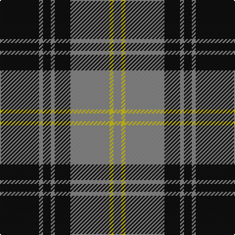

In pattern [KRKRKRYR](/patterns/krkrkryr/).

This was sourced from tartans-authority.  It is a [8 stripes tartan](/stripes/stripes8/).

Original link http://www.tartansauthority.com/tartan-ferret/display/1130/

## Thread count
K/40 N4 K8 N4 K16 N40 Y4 N/8

## Palette
Each colour and its ΔE from the base-6 reference it is a variant of.

| Colour | Shade | Base | ΔE (OKLab) |
|---|---|---|---|
| K | <code style="background-color:#101010;">#101010</code> `#101010` | K <code style="background-color:#000000;">#000000</code> | 0.17 |
| N | <code style="background-color:#888888;">#888888</code> `#888888` | R <code style="background-color:#C80000;">#C80000</code> | 0.24 |
| Y | <code style="background-color:#CCC018;">#CCC018</code> `#CCC018` | Y <code style="background-color:#E8C000;">#E8C000</code> | 0.04 |

# Sample pattern

## Nearest tartans

The nearest existing variants by ΔTartan distance.

1. [Martin's Own](/setts/s8/k40b4k8b4k16b40g4b8-b5c8ca8-g289c18-k101010/) — ΔT 0.72
1. [West Point Regimental Tartan Tartan Number: 1130. Earliest known date: 1986 Wemyss means cave and probably originates from the caves beneath MacDuff castle. There is a long and interesting article on the family of Wemyss in William Anderson's 'The Scottish Nation' published by A Fullarton in 1874. See products available Copyright © Blair Urquhart, Comrie, 2015](/setts/s8/k78r6k6r6k24r60y6r6-k101010-r888888-ye8c000/) — ΔT 0.76
1. [West Point](/setts/s8/k78r6k6r6k24r60y6r6-k101010-r888888-yccc018/) — ΔT 0.76
1. [Flynn](/setts/s6/r116k44r16k34ra10k28-k101010-r888888-rac8002c/) — ΔT 0.79
1. [MacSween, Black (Personal)](/setts/s6/k8r24k8r24k48ra4-k101010-r888888-rac80000/) — ΔT 0.94
1. [Douglas, Grey (Vestiarium Scoticum)](/setts/s8/k40r4k8r4k16r40k4r8-k101010-r888888/) — ΔT 0.96
1. [Korner-Macpherson (Personal)](/setts/s7/g10r6g70k56g8k22g4-g808080-k101010-rc80000/) — ΔT 0.96
1. [Moffat (1984)](/setts/s7/k78r6k6r6k28r56ra6-k101010-r888888-rac80000/) — ΔT 1.01
1. [Bannockbane Grey #3](/setts/s8/g8y4g26g16y2k26y4k8-g808080-k101010-ye8c000/) — ΔT 1.04
1. [Nowell/Noel 1951 (Name)](/setts/s8/y6k48y12k16w8k16y70k4-k101010-we0e0e0-ya0a0a0/) — ΔT 1.13

## Neighbour map

Every grey dot is one of 15726 variants placed by the first two principal components of the ΔTartan feature space (44% of its variance). Red is this tartan; blue dots are its nearest — click one to open its page.

<svg viewBox="0 0 640 380" role="img" style="max-width:100%;height:auto;border:1px solid #e0e0e0;border-radius:4px;display:block" xmlns="http://www.w3.org/2000/svg"><image href="/nn/cloud.v1.png" width="640" height="380"/><a href="/setts/s8/k40b4k8b4k16b40g4b8-b5c8ca8-g289c18-k101010/"><circle cx="307.8" cy="207.4" r="4" fill="#3465a4"><title>Martin's Own</title></circle></a><a href="/setts/s8/k78r6k6r6k24r60y6r6-k101010-r888888-ye8c000/"><circle cx="349.2" cy="182.1" r="4" fill="#3465a4"><title>West Point Regimental Tartan Tartan Number: 1130. Earliest known date: 1986 Wemyss means cave and probably originates from the caves beneath MacDuff castle. There is a long and interesting article on the family of Wemyss in William Anderson's 'The Scottish Nation' published by A Fullarton in 1874. See products available Copyright © Blair Urquhart, Comrie, 2015</title></circle></a><a href="/setts/s8/k78r6k6r6k24r60y6r6-k101010-r888888-yccc018/"><circle cx="349.6" cy="182.5" r="4" fill="#3465a4"><title>West Point</title></circle></a><a href="/setts/s6/r116k44r16k34ra10k28-k101010-r888888-rac8002c/"><circle cx="320.5" cy="215.2" r="4" fill="#3465a4"><title>Flynn</title></circle></a><a href="/setts/s6/k8r24k8r24k48ra4-k101010-r888888-rac80000/"><circle cx="327.3" cy="224.1" r="4" fill="#3465a4"><title>MacSween, Black (Personal)</title></circle></a><a href="/setts/s8/k40r4k8r4k16r40k4r8-k101010-r888888/"><circle cx="352.6" cy="221.5" r="4" fill="#3465a4"><title>Douglas, Grey (Vestiarium Scoticum)</title></circle></a><a href="/setts/s7/g10r6g70k56g8k22g4-g808080-k101010-rc80000/"><circle cx="345.8" cy="187.5" r="4" fill="#3465a4"><title>Korner-Macpherson (Personal)</title></circle></a><a href="/setts/s7/k78r6k6r6k28r56ra6-k101010-r888888-rac80000/"><circle cx="371.5" cy="197.8" r="4" fill="#3465a4"><title>Moffat (1984)</title></circle></a><a href="/setts/s8/g8y4g26g16y2k26y4k8-g808080-k101010-ye8c000/"><circle cx="289.7" cy="200.6" r="4" fill="#3465a4"><title>Bannockbane Grey #3</title></circle></a><a href="/setts/s8/y6k48y12k16w8k16y70k4-k101010-we0e0e0-ya0a0a0/"><circle cx="303.0" cy="170.4" r="4" fill="#3465a4"><title>Nowell/Noel 1951 (Name)</title></circle></a><circle cx="308.0" cy="202.4" r="5" fill="#c00000"/></svg>

ID: /setts/s8/k40r4k8r4k16r40y4r8-k101010-r888888-yccc018/
