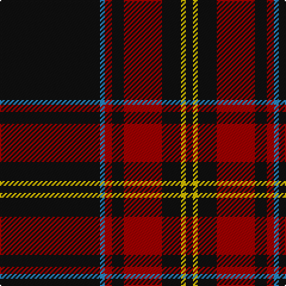

In pattern [KBRKRKYK](/patterns/kbrkrkyk/).

This was sourced from tartans-authority.  It is a [8 stripes tartan](/stripes/stripes8/).

Original link http://www.tartansauthority.com/tartan-ferret/display/10939/

## Thread count
K/84 B4 DR6 K10 DR32 K16 Y4 K/6

## Palette
Each colour and its ΔE from the base-6 reference it is a variant of.

| Colour | Shade | Base | ΔE (OKLab) |
|---|---|---|---|
| B | <code style="background-color:#2888C4;">#2888C4</code> `#2888C4` | B <code style="background-color:#2A418A;">#2A418A</code> | 0.21 |
| DR | <code style="background-color:#A00000;">#A00000</code> `#A00000` | R <code style="background-color:#CC0000;">#CC0000</code> | 0.09 |
| K | <code style="background-color:#101010;">#101010</code> `#101010` | K <code style="background-color:#000000;">#000000</code> | 0.17 |
| Y | <code style="background-color:#E8C000;">#E8C000</code> `#E8C000` | Y <code style="background-color:#F2BF00;">#F2BF00</code> | 0.02 |

# Sample pattern

## Nearest tartans

The nearest existing variants by ΔTartan distance.

1. [Harley Davidson](/setts/s10/k49r8k4b6ra4b6k4r8k49ra2~b5c5c5c-k101010-rb84c00-ra888888/) — ΔT 0.87
1. [Harley Davidson (Corporate)](/setts/s6/r4b6k4ra8k49r2~b5c5c5c-k101010-r888888-rab84c00/) — ΔT 0.88
1. [Valdres Kvam and Vang District Tartan Tartan Number: 2124. Earliest known date: 1850's One of the many designs produced in this secluded valley in the middle of Norway. Unlike Gudbrandsdalen, no connection with Scottish tartans can be found, but further research is planned. See products available Copyright © Blair Urquhart, Comrie, 2015](/setts/s11/k4w1r4k2g2r3k2k20r2k2r2~g006818-k101010-rc80000-we0e0e0/) — ΔT 1.04
1. [Valdres, Kvam & Vang #3](/setts/s10/k4w1r4k2g2r3g2k20r2k2x2~g006818-k101010-rc80000-we0e0e0/) — ΔT 1.10
1. [Laird Abdullah (Personal)](/setts/s8/k10b2k2b8k40r4k5ra2x2~b5c5c5c-k101010-rc80000-rae87878/) — ΔT 1.10
1. [Brockton (Corporate)](/setts/s8/k2w1k2r6k6r3k28w2x2~k101010-r880000-we0e0e0/) — ΔT 1.20
1. [Bunnahabhain](/setts/s9/y8k7r3k7r3k38w2k3y6x2~k101010-rc80000-wf8f8f8-ybc8c00/) — ΔT 1.29
1. [Springbank](/setts/s11/k14b2k2b5k25w1b9r3k3w1k14x2~b505050-k101010-r9c68a4-wffffff/) — ΔT 1.30
1. [King Robert the Bruce Memorial, The](/setts/s10/r8k79b4k4w4k6b22k6r16k6~b666666-k101010-rbe273d-wdeded5/) — ΔT 1.30
1. [Royal Army PTC Assoc. (Military)](/setts/s8/k59r3k6r3k8r15k2y3x2~k101010-rc80000-ye8c000/) — ΔT 1.31

## Neighbour map

Every grey dot is one of 15726 variants placed by the first two principal components of the ΔTartan feature space (44% of its variance). Red is this tartan; blue dots are its nearest — click one to open its page.

<svg viewBox="0 0 640 380" role="img" style="max-width:100%;height:auto;border:1px solid #e0e0e0;border-radius:4px;display:block" xmlns="http://www.w3.org/2000/svg"><image href="/nn/cloud.v1.png" width="640" height="380"/><a href="/setts/s10/k49r8k4b6ra4b6k4r8k49ra2~b5c5c5c-k101010-rb84c00-ra888888/"><circle cx="506.7" cy="156.2" r="4" fill="#3465a4"><title>Harley Davidson</title></circle></a><a href="/setts/s6/r4b6k4ra8k49r2~b5c5c5c-k101010-r888888-rab84c00/"><circle cx="488.0" cy="166.8" r="4" fill="#3465a4"><title>Harley Davidson (Corporate)</title></circle></a><a href="/setts/s11/k4w1r4k2g2r3k2k20r2k2r2~g006818-k101010-rc80000-we0e0e0/"><circle cx="429.5" cy="140.2" r="4" fill="#3465a4"><title>Valdres Kvam and Vang District Tartan Tartan Number: 2124. Earliest known date: 1850's One of the many designs produced in this secluded valley in the middle of Norway. Unlike Gudbrandsdalen, no connection with Scottish tartans can be found, but further research is planned. See products available Copyright © Blair Urquhart, Comrie, 2015</title></circle></a><a href="/setts/s10/k4w1r4k2g2r3g2k20r2k2x2~g006818-k101010-rc80000-we0e0e0/"><circle cx="413.6" cy="145.0" r="4" fill="#3465a4"><title>Valdres, Kvam &amp; Vang #3</title></circle></a><a href="/setts/s8/k10b2k2b8k40r4k5ra2x2~b5c5c5c-k101010-rc80000-rae87878/"><circle cx="537.1" cy="175.4" r="4" fill="#3465a4"><title>Laird Abdullah (Personal)</title></circle></a><a href="/setts/s8/k2w1k2r6k6r3k28w2x2~k101010-r880000-we0e0e0/"><circle cx="529.9" cy="165.5" r="4" fill="#3465a4"><title>Brockton (Corporate)</title></circle></a><a href="/setts/s9/y8k7r3k7r3k38w2k3y6x2~k101010-rc80000-wf8f8f8-ybc8c00/"><circle cx="428.7" cy="149.8" r="4" fill="#3465a4"><title>Bunnahabhain</title></circle></a><a href="/setts/s11/k14b2k2b5k25w1b9r3k3w1k14x2~b505050-k101010-r9c68a4-wffffff/"><circle cx="474.2" cy="166.6" r="4" fill="#3465a4"><title>Springbank</title></circle></a><a href="/setts/s10/r8k79b4k4w4k6b22k6r16k6~b666666-k101010-rbe273d-wdeded5/"><circle cx="409.6" cy="138.9" r="4" fill="#3465a4"><title>King Robert the Bruce Memorial, The</title></circle></a><a href="/setts/s8/k59r3k6r3k8r15k2y3x2~k101010-rc80000-ye8c000/"><circle cx="538.8" cy="154.8" r="4" fill="#3465a4"><title>Royal Army PTC Assoc. (Military)</title></circle></a><circle cx="480.2" cy="164.2" r="5" fill="#c00000"/></svg>

ID: /setts/s8/k42b2r3k5r16k8y2k3x2~b2888c4-k101010-ra00000-ye8c000/
