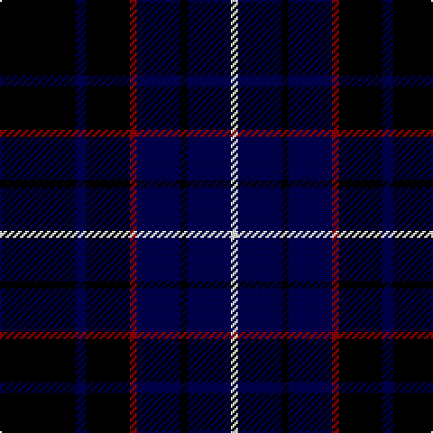

In pattern [KBKRBKBW](/patterns/kbkrbkbw/).

This was sourced from register-of-tartans.  It is a [8 stripes tartan](/stripes/stripes8/).

Original link https://www.tartanregister.gov.uk/tartanDetails.aspx?ref=1843

## Attestations

This cloth appears in 2 source records; the oldest owns this page.

- 01/01/1996 — Inverness Caledonian Thistle Football Club (register-of-tartans, [record](https://www.tartanregister.gov.uk/tartanDetails.aspx?ref=1843))
- undated — Inverness Caledonian Thistle F.C Corporate Weavers Tartan Tartan Number: 5272. Earliest known date: 1996 Designed by Polly Wittering of the House of Edgar C.1996 See products available Copyright © Blair Urquhart, Comrie, 2015 (house-of-tartan, [record](http://www.house-of-tartan.scotland.net/house/TartanViewjs.asp?colr=Def&tnam=5272))

## Thread count
K/42 DB6 K24 DR4 DB24 K4 DB24 W/4

## Palette
Each colour and its ΔE from the base-6 reference it is a variant of.

| Colour | Shade | Base | ΔE (OKLab) |
|---|---|---|---|
| DB | <code style="background-color:#000050;">#000050</code> `#000050` | B <code style="background-color:#2A418A;">#2A418A</code> | 0.21 |
| DR | <code style="background-color:#8C0000;">#8C0000</code> `#8C0000` | R <code style="background-color:#CC0000;">#CC0000</code> | 0.14 |
| K | <code style="background-color:#000000;">#000000</code> `#000000` | K <code style="background-color:#000000;">#000000</code> | 0.00 |
| W | <code style="background-color:#FCFCFC;">#FCFCFC</code> `#FCFCFC` | W <code style="background-color:#F7F7F7;">#F7F7F7</code> | 0.01 |

# Sample pattern

## Nearest tartans

The nearest existing variants by ΔTartan distance.

1. [Marchmont](/setts/s7/k4b48k48g4k48b48w4-b304080-g407050-k000000-we0e0e0/) — ΔT 1.13
1. [Scottish Express International](/setts/s6/b6k29ba6k29b50ka6-b304080-ba8080d0-k000000-ka000030/) — ΔT 1.29
1. [Carrick High School](/setts/s7/k12y4k32b12k6ba36k4-b788cb4-ba00008c-k000000-yc88c00/) — ΔT 1.33
1. [Printing Industries of America](/setts/s8/k28r8k8ka24y4ka4y4ka16-k000000-ka000034-r8c0000-yc88c00/) — ΔT 1.34
1. [Laois Irish County Tartan Tartan Number: 2252. Earliest known date: 1996 One of a series of Irish District tartans designed by Polly Wittering of the House of Edgar, with colours reminiscent of the Country with soft warm colours dominating. See products available Copyright © Blair Urquhart, Comrie, 2015](/setts/s9/k30b4k10b10k36g10k10g4k30-b5c6c8c-g6c841c-k000000/) — ΔT 1.48
1. [Inverness Caledonian Thistle F.C. (C](/setts/s8/k42b6k24r4b24k4b24w4-b000050-k101010-rc80000-wfcfcfc/) — ΔT 1.56
1. [St. Georges, Edgbaston](/setts/s7/r8k42w4k40b42k4b4-b304080-k000030-rc00000-we0e0e0/) — ΔT 1.56
1. [Wcwm 1106-2](/setts/s5/k8g6b36k36w4-b4c1864-g004c00-k000000-wc8c8c8/) — ΔT 1.59
1. [Mowat](/setts/s7/b36k2b4k36y4g32k32-b000052-g11450d-k000000-yaaaa00/) — ΔT 1.60
1. [Mowat](/setts/s7/b18k1b2k18y2g16k16-b000052-g11450d-k000000-yaaaa00/) — ΔT 1.60

## Neighbour map

Every grey dot is one of 15726 variants placed by the first two principal components of the ΔTartan feature space (44% of its variance). Red is this tartan; blue dots are its nearest — click one to open its page.

<svg viewBox="0 0 640 380" role="img" style="max-width:100%;height:auto;border:1px solid #e0e0e0;border-radius:4px;display:block" xmlns="http://www.w3.org/2000/svg"><image href="/nn/cloud.v1.png" width="640" height="380"/><a href="/setts/s7/k4b48k48g4k48b48w4-b304080-g407050-k000000-we0e0e0/"><circle cx="281.7" cy="216.1" r="4" fill="#3465a4"><title>Marchmont</title></circle></a><a href="/setts/s6/b6k29ba6k29b50ka6-b304080-ba8080d0-k000000-ka000030/"><circle cx="252.6" cy="232.3" r="4" fill="#3465a4"><title>Scottish Express International</title></circle></a><a href="/setts/s7/k12y4k32b12k6ba36k4-b788cb4-ba00008c-k000000-yc88c00/"><circle cx="246.1" cy="215.9" r="4" fill="#3465a4"><title>Carrick High School</title></circle></a><a href="/setts/s8/k28r8k8ka24y4ka4y4ka16-k000000-ka000034-r8c0000-yc88c00/"><circle cx="228.0" cy="233.4" r="4" fill="#3465a4"><title>Printing Industries of America</title></circle></a><a href="/setts/s9/k30b4k10b10k36g10k10g4k30-b5c6c8c-g6c841c-k000000/"><circle cx="275.4" cy="227.5" r="4" fill="#3465a4"><title>Laois Irish County Tartan Tartan Number: 2252. Earliest known date: 1996 One of a series of Irish District tartans designed by Polly Wittering of the House of Edgar, with colours reminiscent of the Country with soft warm colours dominating. See products available Copyright © Blair Urquhart, Comrie, 2015</title></circle></a><a href="/setts/s8/k42b6k24r4b24k4b24w4-b000050-k101010-rc80000-wfcfcfc/"><circle cx="336.2" cy="234.1" r="4" fill="#3465a4"><title>Inverness Caledonian Thistle F.C. (C</title></circle></a><a href="/setts/s7/r8k42w4k40b42k4b4-b304080-k000030-rc00000-we0e0e0/"><circle cx="344.7" cy="218.4" r="4" fill="#3465a4"><title>St. Georges, Edgbaston</title></circle></a><a href="/setts/s5/k8g6b36k36w4-b4c1864-g004c00-k000000-wc8c8c8/"><circle cx="269.4" cy="229.9" r="4" fill="#3465a4"><title>Wcwm 1106-2</title></circle></a><a href="/setts/s7/b36k2b4k36y4g32k32-b000052-g11450d-k000000-yaaaa00/"><circle cx="274.2" cy="215.1" r="4" fill="#3465a4"><title>Mowat</title></circle></a><a href="/setts/s7/b18k1b2k18y2g16k16-b000052-g11450d-k000000-yaaaa00/"><circle cx="274.2" cy="215.1" r="4" fill="#3465a4"><title>Mowat</title></circle></a><circle cx="307.1" cy="223.4" r="5" fill="#c00000"/></svg>

ID: /setts/s8/k42b6k24r4b24k4b24w4-b000050-k000000-r8c0000-wfcfcfc/
