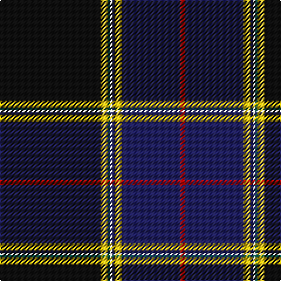

In pattern [KYGWBYBR](/patterns/kygwbybr/).

This was sourced from register-of-tartans.  It is a [8 stripes tartan](/stripes/stripes8/).

Original link https://www.tartanregister.gov.uk/tartanDetails.aspx?ref=3616

## Attestations

This cloth appears in 2 source records; the oldest owns this page.

- 01/12/1998 — Royal Yacht Britannia (register-of-tartans, [record](https://www.tartanregister.gov.uk/tartanDetails.aspx?ref=3616))
- December 1998 — Royal Yacht Britannia (Corporate) (tartans-authority, [record](http://www.tartansauthority.com/tartan-ferret/display/2529/))

## Thread count
K/86 Y6 G2 W2 DB2 Y6 DB50 R/4

## Palette
Each colour and its ΔE from the base-6 reference it is a variant of.

| Colour | Shade | Base | ΔE (OKLab) |
|---|---|---|---|
| DB | <code style="background-color:#202060;">#202060</code> `#202060` | B <code style="background-color:#2A418A;">#2A418A</code> | 0.11 |
| G | <code style="background-color:#005448;">#005448</code> `#005448` | G <code style="background-color:#006100;">#006100</code> | 0.10 |
| K | <code style="background-color:#101010;">#101010</code> `#101010` | K <code style="background-color:#000000;">#000000</code> | 0.17 |
| R | <code style="background-color:#C80000;">#C80000</code> `#C80000` | R <code style="background-color:#CC0000;">#CC0000</code> | 0.01 |
| W | <code style="background-color:#FCFCFC;">#FCFCFC</code> `#FCFCFC` | W <code style="background-color:#F7F7F7;">#F7F7F7</code> | 0.01 |
| Y | <code style="background-color:#E8C000;">#E8C000</code> `#E8C000` | Y <code style="background-color:#F2BF00;">#F2BF00</code> | 0.02 |

# Sample pattern

## Nearest tartans

The nearest existing variants by ΔTartan distance.

1. [Montgomerie, Colin](/setts/s9/y2k1r5b3ra12b4y1k40ba1~b5c5c5c-ba5c4494-k101010-rc80000-ra888888-ya0a0a0~x2/) — ΔT 0.97
1. [Victorian Highland Pipe Band Assoc](/setts/s8/b46y1ya3g13y1r7ga3y1~b202060-g003820-ga006818-r880000-yfccc00-yae8c000~x2/) — ΔT 0.97
1. [Italian American](/setts/s9/r4k2w6k2b40k80g10w6r3~b0d3b6d-g004b11-k101010-r92130d-wffffff/) — ΔT 1.07
1. [Melrose Newbigging Grey](/setts/s10/b1k6ba35k6k2bb3b1k6k2w1~b385064-ba686468-bb481478-k000000-wece8d0~x2/) — ΔT 1.11
1. [Voluntary Service Aberdeen](/setts/s10/r4w1k35b1ba2ra4w1ba14ra8w1~b5c5c5c-ba003c64-k101010-r888888-ra984c90-we0e0e0~x2/) — ΔT 1.15
1. [Wells (2014)](/setts/s7/b50g25y3r8ra1w1ra1~b141e46-g285800-r888888-ra960028-wf8f8f8-yd87c00~x2/) — ΔT 1.18
1. [Scottish Heritage Society (Corporate](/setts/s12/b76ba6k6b24g17k4r10k4g17b4k2w6~b1c1c50-baa400a4-g006818-k101010-rc80000-we0e0e0/) — ΔT 1.19
1. [Earthrise](/setts/s12/k4b6k4r4b29r6k64ba10k4ba6bb4w2~b5c5c5c-ba202060-bb5c8ca8-k101010-r888888-wfcfcfc/) — ΔT 1.20
1. [Victorian Highland Pipe Band Association (Australia)](/setts/s8/b46w1y3g13w1r7ga3w1~b14283c-g004028-ga649848-r89051b-wf0e0c8-yd87c00~x2/) — ΔT 1.23
1. [Brighton Mac Dermott (Fashion)](/setts/s9/b47y1k27r4g5y1r8ba1k1~b5c5c5c-ba1474b4-g003820-k00002c-r888888-ydc943c~x2/) — ΔT 1.25

## Neighbour map

Every grey dot is one of 15726 variants placed by the first two principal components of the ΔTartan feature space (44% of its variance). Red is this tartan; blue dots are its nearest — click one to open its page.

<svg viewBox="0 0 640 380" role="img" style="max-width:100%;height:auto;border:1px solid #e0e0e0;border-radius:4px;display:block" xmlns="http://www.w3.org/2000/svg"><image href="/nn/cloud.v1.png" width="640" height="380"/><a href="/setts/s9/y2k1r5b3ra12b4y1k40ba1~b5c5c5c-ba5c4494-k101010-rc80000-ra888888-ya0a0a0~x2/"><circle cx="354.5" cy="74.8" r="4" fill="#3465a4"><title>Montgomerie, Colin</title></circle></a><a href="/setts/s8/b46y1ya3g13y1r7ga3y1~b202060-g003820-ga006818-r880000-yfccc00-yae8c000~x2/"><circle cx="388.9" cy="85.7" r="4" fill="#3465a4"><title>Victorian Highland Pipe Band Assoc</title></circle></a><a href="/setts/s9/r4k2w6k2b40k80g10w6r3~b0d3b6d-g004b11-k101010-r92130d-wffffff/"><circle cx="338.5" cy="96.4" r="4" fill="#3465a4"><title>Italian American</title></circle></a><a href="/setts/s10/b1k6ba35k6k2bb3b1k6k2w1~b385064-ba686468-bb481478-k000000-wece8d0~x2/"><circle cx="316.6" cy="70.1" r="4" fill="#3465a4"><title>Melrose Newbigging Grey</title></circle></a><a href="/setts/s10/r4w1k35b1ba2ra4w1ba14ra8w1~b5c5c5c-ba003c64-k101010-r888888-ra984c90-we0e0e0~x2/"><circle cx="286.0" cy="81.1" r="4" fill="#3465a4"><title>Voluntary Service Aberdeen</title></circle></a><a href="/setts/s7/b50g25y3r8ra1w1ra1~b141e46-g285800-r888888-ra960028-wf8f8f8-yd87c00~x2/"><circle cx="369.2" cy="100.2" r="4" fill="#3465a4"><title>Wells (2014)</title></circle></a><a href="/setts/s12/b76ba6k6b24g17k4r10k4g17b4k2w6~b1c1c50-baa400a4-g006818-k101010-rc80000-we0e0e0/"><circle cx="349.7" cy="83.9" r="4" fill="#3465a4"><title>Scottish Heritage Society (Corporate</title></circle></a><a href="/setts/s12/k4b6k4r4b29r6k64ba10k4ba6bb4w2~b5c5c5c-ba202060-bb5c8ca8-k101010-r888888-wfcfcfc/"><circle cx="317.5" cy="84.5" r="4" fill="#3465a4"><title>Earthrise</title></circle></a><a href="/setts/s8/b46w1y3g13w1r7ga3w1~b14283c-g004028-ga649848-r89051b-wf0e0c8-yd87c00~x2/"><circle cx="400.5" cy="91.7" r="4" fill="#3465a4"><title>Victorian Highland Pipe Band Association (Australia)</title></circle></a><a href="/setts/s9/b47y1k27r4g5y1r8ba1k1~b5c5c5c-ba1474b4-g003820-k00002c-r888888-ydc943c~x2/"><circle cx="313.2" cy="77.9" r="4" fill="#3465a4"><title>Brighton Mac Dermott (Fashion)</title></circle></a><circle cx="351.6" cy="88.6" r="5" fill="#c00000"/></svg>

ID: /setts/s8/k43y3g1w1b1y3b25r2~b202060-g005448-k101010-rc80000-wfcfcfc-ye8c000~x2/
