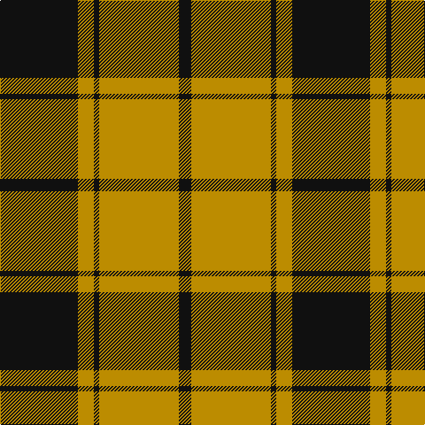

In pattern [KYKYYYYK](/patterns/kykyyyyk/).

This was sourced from tartans-authority.  It is a [8 stripes tartan](/stripes/stripes8/).

Original link http://www.tartansauthority.com/tartan-ferret/display/7408/

## Thread count
K/88 DYa18 Ka6 DYa16 DYa32 DY30 DYa12 Ka/14

## Palette
Each colour and its ΔE from the base-6 reference it is a variant of.

| Colour | Shade | Base | ΔE (OKLab) |
|---|---|---|---|
| DY | <code style="background-color:#BC8C00;">#BC8C00</code> `#BC8C00` | Y <code style="background-color:#F2BF00;">#F2BF00</code> | 0.16 |
| DYa | <code style="background-color:#BC8C00;">#BC8C00</code> `#BC8C00` | Y <code style="background-color:#F2BF00;">#F2BF00</code> | 0.16 |
| K | <code style="background-color:#101010;">#101010</code> `#101010` | K <code style="background-color:#000000;">#000000</code> | 0.17 |
| Ka | <code style="background-color:#101010;">#101010</code> `#101010` | K <code style="background-color:#000000;">#000000</code> | 0.17 |

# Sample pattern

## Nearest tartans

The nearest existing variants by ΔTartan distance.

1. [Logan, Dark](/setts/s7/k9r4k1r4g15ra4k1x2~g008000-k000000-rd03030-rac00000/) — ΔT 0.67
1. [Dickie](/setts/s8/g8r2g12k6g3b6r24k4x2~b00008c-g146400-k000000-rc82800/) — ΔT 0.68
1. [Prince Edward Island District Tartan Tartan Number: 1815. Earliest known date: 1960-70 The warmth and glow of the fertile soil, The green field and tree, The yellow and the brown of Autumn, The white of surf or a summer snow, Rust, green, yellow and white, Yes! That's our Island Tartan. See products available Copyright © Blair Urquhart, Comrie, 2015](/setts/s7/w2k1g16k12r12k1w2x2~g006818-k101010-rc80000-we0e0e0/) — ΔT 0.72
1. [Lindsay](/setts/s9/g12ga1g1ga1g1k5r10k1r2x2~g008000-ga003000-k000000-rc00000/) — ΔT 0.74
1. [Unidentified 12](/setts/s6/k6r2g17r16k1b2x2~b5480b0-g008000-k000000-rc00000/) — ΔT 0.77
1. [Prince Edward Island #2](/setts/s7/w2k1g16k12r12k1w2x2~g005020-k101010-rdc0000-we0e0e0/) — ΔT 0.84
1. [Island of Innis, The](/setts/s8/k15g1k3r9g1r3y11k1x4~g285800-k101010-ra00000-yd09800/) — ΔT 0.89
1. [Prince Edward Island](/setts/s7/w2k1g16k12r12k1w2x2~g008000-k000000-rc00000-we0e0e0/) — ΔT 0.89
1. [Blackstock Hunting](/setts/s7/k2r7k6g12y1g1k2x4~g006818-k101010-rc80000-ye8c000/) — ΔT 0.90
1. [Scott Hunting Clan Tartan Tartan Number: 1546. Earliest known date: 1906 Also known as Green Scott, this tartan is generally available today. The Chief of the Scotts is His Grace the 9th Duke of Buccleuch and 10th of Queensberry who lives in Selkirk in the borders region of Scotland. See products available Copyright © Blair Urquhart, Comrie, 2015](/setts/s8/r3b14g8r2g2w2g2r1x2~b480800-g006818-rc80000-we0e0e0/) — ΔT 0.93

## Neighbour map

Every grey dot is one of 15726 variants placed by the first two principal components of the ΔTartan feature space (44% of its variance). Red is this tartan; blue dots are its nearest — click one to open its page.

<svg viewBox="0 0 640 380" role="img" style="max-width:100%;height:auto;border:1px solid #e0e0e0;border-radius:4px;display:block" xmlns="http://www.w3.org/2000/svg"><image href="/nn/cloud.v1.png" width="640" height="380"/><a href="/setts/s7/k9r4k1r4g15ra4k1x2~g008000-k000000-rd03030-rac00000/"><circle cx="187.2" cy="175.2" r="4" fill="#3465a4"><title>Logan, Dark</title></circle></a><a href="/setts/s8/g8r2g12k6g3b6r24k4x2~b00008c-g146400-k000000-rc82800/"><circle cx="198.6" cy="182.2" r="4" fill="#3465a4"><title>Dickie</title></circle></a><a href="/setts/s7/w2k1g16k12r12k1w2x2~g006818-k101010-rc80000-we0e0e0/"><circle cx="187.9" cy="169.2" r="4" fill="#3465a4"><title>Prince Edward Island District Tartan Tartan Number: 1815. Earliest known date: 1960-70 The warmth and glow of the fertile soil, The green field and tree, The yellow and the brown of Autumn, The white of surf or a summer snow, Rust, green, yellow and white, Yes! That's our Island Tartan. See products available Copyright © Blair Urquhart, Comrie, 2015</title></circle></a><a href="/setts/s9/g12ga1g1ga1g1k5r10k1r2x2~g008000-ga003000-k000000-rc00000/"><circle cx="217.0" cy="158.5" r="4" fill="#3465a4"><title>Lindsay</title></circle></a><a href="/setts/s6/k6r2g17r16k1b2x2~b5480b0-g008000-k000000-rc00000/"><circle cx="233.6" cy="173.6" r="4" fill="#3465a4"><title>Unidentified 12</title></circle></a><a href="/setts/s7/w2k1g16k12r12k1w2x2~g005020-k101010-rdc0000-we0e0e0/"><circle cx="189.1" cy="168.7" r="4" fill="#3465a4"><title>Prince Edward Island #2</title></circle></a><a href="/setts/s8/k15g1k3r9g1r3y11k1x4~g285800-k101010-ra00000-yd09800/"><circle cx="232.0" cy="165.4" r="4" fill="#3465a4"><title>Island of Innis, The</title></circle></a><a href="/setts/s7/w2k1g16k12r12k1w2x2~g008000-k000000-rc00000-we0e0e0/"><circle cx="169.0" cy="164.5" r="4" fill="#3465a4"><title>Prince Edward Island</title></circle></a><a href="/setts/s7/k2r7k6g12y1g1k2x4~g006818-k101010-rc80000-ye8c000/"><circle cx="227.2" cy="195.1" r="4" fill="#3465a4"><title>Blackstock Hunting</title></circle></a><a href="/setts/s8/r3b14g8r2g2w2g2r1x2~b480800-g006818-rc80000-we0e0e0/"><circle cx="244.4" cy="171.1" r="4" fill="#3465a4"><title>Scott Hunting Clan Tartan Tartan Number: 1546. Earliest known date: 1906 Also known as Green Scott, this tartan is generally available today. The Chief of the Scotts is His Grace the 9th Duke of Buccleuch and 10th of Queensberry who lives in Selkirk in the borders region of Scotland. See products available Copyright © Blair Urquhart, Comrie, 2015</title></circle></a><circle cx="210.5" cy="167.9" r="5" fill="#c00000"/></svg>

ID: /setts/s8/k44y9k3y8y16y15y6k7x2~k101010-ybc8c00/
