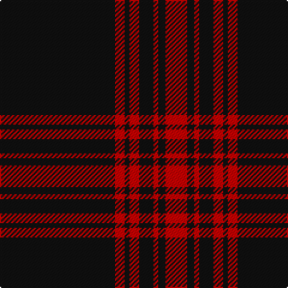

In pattern [KRKRKRKR](/patterns/krkrkrkr/).

This was sourced from register-of-tartans.  It is a [8 stripes tartan](/stripes/stripes8/).

Original link https://www.tartanregister.gov.uk/tartanDetails.aspx?ref=2929

## Attestations

This cloth appears in 3 source records; the oldest owns this page.

- 01/01/1906 — Menzies Hunting (register-of-tartans, [record](https://www.tartanregister.gov.uk/tartanDetails.aspx?ref=2929))
- pre 1906 — Menzies Htg (Clan) (tartans-authority, [record](http://www.tartansauthority.com/tartan-ferret/display/1184/))
- undated — Menzies Black & Red Clan Tartan Tartan Number: 1184. Earliest known date: 1906 The red and white Menzies tartan appears in the Cockburn Collection (c.1815) under the name, MacFarlane, but this is taken to be an error on the part of General Cockburn at a time when the establishment of clan names for tartan was in its infancy. The same sett was certified as Menzies, by the clan chief, in the collection of the Highland Society of London (c.1816). The tartan is woven in various colours, green, black, red and white to the same design. See products available Copyright © Blair Urquhart, Comrie, 2015 (house-of-tartan, [record](http://www.house-of-tartan.scotland.net/house/TartanViewjs.asp?colr=Def&tnam=1184))

## Register references

External register numbers recorded for this tartan.

- Scottish Register of Tartans: [2929](https://www.tartanregister.gov.uk/tartanDetails.aspx?ref=2929)
- Scottish Tartans Authority (ITI): 1184
- Scottish Tartans World Register: 1184

## Thread count
K/96 R8 K4 R8 K12 R4 K6 R/18

## Palette
Each colour and its ΔE from the base-6 reference it is a variant of.

| Colour | Shade | Base | ΔE (OKLab) |
|---|---|---|---|
| K | <code style="background-color:#101010;">#101010</code> `#101010` | K <code style="background-color:#000000;">#000000</code> | 0.17 |
| R | <code style="background-color:#C80000;">#C80000</code> `#C80000` | R <code style="background-color:#CC0000;">#CC0000</code> | 0.01 |

# Sample pattern

## Nearest tartans

The nearest existing variants by ΔTartan distance.

1. [Royal Army PTC Assoc. (Military)](/setts/s8/k59r3k6r3k8r15k2y3~k101010-rc80000-ye8c000~x2/) — ΔT 0.99
1. [Brockton (Corporate)](/setts/s8/k2w1k2r6k6r3k28w2~k101010-r880000-we0e0e0~x2/) — ΔT 1.12
1. [Maier (Personal)](/setts/s10/r7k3r3k22r3k3r3k37y2k4~k101010-rc80000-ye8c000~x2/) — ΔT 1.24
1. [Brockton](/setts/s8/k2w1k2r6k6r3k28w2~k101010-r880000-wffffff~x2/) — ΔT 1.25
1. [Menzies, Black & Red](/setts/s8/k48r4k2r4k6r2k3r9~k000000-rc00000~x2/) — ΔT 1.50
1. [Menzies Hunting Clan Tartan Tartan Number: 894. Earliest known date: 1893 This sett is woven in various colours with the same basic design. The certified version is red and black. The hunting Menzies was recorded by D.W. Stewart in his book, 'Old and Rare Scottish Tartans' (1893), which contained a selection of forty five setts, woven in silk, of special interest or antiquity. See products available Copyright © Blair Urquhart, Comrie, 2015](/setts/s8/g48r4g2r4g6r2g3r9~g003820-rc80000~x2/) — ΔT 1.59
1. [Stewart Mourning (Clan)](/setts/s11/k40b3k5b2k2b2k2b6k4w2k4~b5c5c5c-k101010-wfcfcfc~x2/) — ΔT 1.64
1. [Harvie Family Tartan Tartan Number: 1177. Earliest known date: 1985 LT = Grey-Brown See products available Copyright © Blair Urquhart, Comrie, 2015](/setts/s5/k4r11k32y1k4~k101010-rc80000-ye8c000~x2/) — ΔT 1.64
1. [Brand Ambassador (Corporate)](/setts/s9/r2k8w2k8r2k21r10k42r1~k101010-rc80000-we0e0e0~x2/) — ΔT 1.68
1. [Harvie](/setts/s5/k4r11k32y1k4~k101010-rdc0000-ye8c000~x2/) — ΔT 1.70

## Neighbour map

Every grey dot is one of 15726 variants placed by the first two principal components of the ΔTartan feature space (44% of its variance). Red is this tartan; blue dots are its nearest — click one to open its page.

<svg viewBox="0 0 640 380" role="img" style="max-width:100%;height:auto;border:1px solid #e0e0e0;border-radius:4px;display:block" xmlns="http://www.w3.org/2000/svg"><image href="/nn/cloud.v1.png" width="640" height="380"/><a href="/setts/s8/k59r3k6r3k8r15k2y3~k101010-rc80000-ye8c000~x2/"><circle cx="538.8" cy="154.8" r="4" fill="#3465a4"><title>Royal Army PTC Assoc. (Military)</title></circle></a><a href="/setts/s8/k2w1k2r6k6r3k28w2~k101010-r880000-we0e0e0~x2/"><circle cx="529.9" cy="165.5" r="4" fill="#3465a4"><title>Brockton (Corporate)</title></circle></a><a href="/setts/s10/r7k3r3k22r3k3r3k37y2k4~k101010-rc80000-ye8c000~x2/"><circle cx="541.6" cy="177.4" r="4" fill="#3465a4"><title>Maier (Personal)</title></circle></a><a href="/setts/s8/k2w1k2r6k6r3k28w2~k101010-r880000-wffffff~x2/"><circle cx="520.4" cy="161.7" r="4" fill="#3465a4"><title>Brockton</title></circle></a><a href="/setts/s8/k48r4k2r4k6r2k3r9~k000000-rc00000~x2/"><circle cx="542.8" cy="178.2" r="4" fill="#3465a4"><title>Menzies, Black &amp; Red</title></circle></a><a href="/setts/s8/g48r4g2r4g6r2g3r9~g003820-rc80000~x2/"><circle cx="577.9" cy="187.7" r="4" fill="#3465a4"><title>Menzies Hunting Clan Tartan Tartan Number: 894. Earliest known date: 1893 This sett is woven in various colours with the same basic design. The certified version is red and black. The hunting Menzies was recorded by D.W. Stewart in his book, 'Old and Rare Scottish Tartans' (1893), which contained a selection of forty five setts, woven in silk, of special interest or antiquity. See products available Copyright © Blair Urquhart, Comrie, 2015</title></circle></a><a href="/setts/s11/k40b3k5b2k2b2k2b6k4w2k4~b5c5c5c-k101010-wfcfcfc~x2/"><circle cx="561.6" cy="161.4" r="4" fill="#3465a4"><title>Stewart Mourning (Clan)</title></circle></a><a href="/setts/s5/k4r11k32y1k4~k101010-rc80000-ye8c000~x2/"><circle cx="546.8" cy="195.8" r="4" fill="#3465a4"><title>Harvie Family Tartan Tartan Number: 1177. Earliest known date: 1985 LT = Grey-Brown See products available Copyright © Blair Urquhart, Comrie, 2015</title></circle></a><a href="/setts/s9/r2k8w2k8r2k21r10k42r1~k101010-rc80000-we0e0e0~x2/"><circle cx="595.2" cy="162.1" r="4" fill="#3465a4"><title>Brand Ambassador (Corporate)</title></circle></a><a href="/setts/s5/k4r11k32y1k4~k101010-rdc0000-ye8c000~x2/"><circle cx="538.7" cy="192.0" r="4" fill="#3465a4"><title>Harvie</title></circle></a><circle cx="566.1" cy="180.4" r="5" fill="#c00000"/></svg>

ID: /setts/s8/k48r4k2r4k6r2k3r9~k101010-rc80000~x2/
