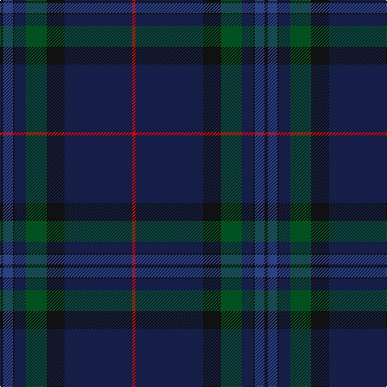

In pattern [KBKBGKBR](/patterns/kbkbgkbr/).

This was sourced from register-of-tartans.  It is a [8 stripes tartan](/stripes/stripes8/).

Original link https://www.tartanregister.gov.uk/tartanDetails.aspx?ref=5103

## Thread count
K/4 B12 K2 DB14 G26 K22 DB84 R/4

## Palette
Each colour and its ΔE from the base-6 reference it is a variant of.

| Colour | Shade | Base | ΔE (OKLab) |
|---|---|---|---|
| B | <code style="background-color:#2C4084;">#2C4084</code> `#2C4084` | B <code style="background-color:#2C4084;">#2C4084</code> | 0.00 |
| DB | <code style="background-color:#141E46;">#141E46</code> `#141E46` | B <code style="background-color:#2C4084;">#2C4084</code> | 0.15 |
| G | <code style="background-color:#005020;">#005020</code> `#005020` | G <code style="background-color:#006400;">#006400</code> | 0.08 |
| K | <code style="background-color:#101010;">#101010</code> `#101010` | K <code style="background-color:#000000;">#000000</code> | 0.17 |
| R | <code style="background-color:#DC0000;">#DC0000</code> `#DC0000` | R <code style="background-color:#C80000;">#C80000</code> | 0.04 |

# Sample pattern

## Nearest tartans

The nearest existing variants by ΔTartan distance.

1. [Scottish Thistle](/setts/s10/b4k6b66ka22k6b6ba30b8y2b4-b003c64-ba181034-k080020-ka101010-y8c90b0/) — ΔT 0.98
1. [Finnie (Personal)](/setts/s8/b8g8b74k40g2ba10g2k8-b141e46-ba280032-g808080-k101010/) — ΔT 1.10
1. [Ata?, H.M. & I.C. (Personal)](/setts/s8/k18g10w2g30ka4g2ka88r2-g003820-k00002c-ka101010-rc80000-we0e0e0/) — ΔT 1.18
1. [Spirit of Scotland](/setts/s11/b114k24b24ba6b6ba6b6g30bb18k6bb24-b102040-ba304080-bb300030-g004010-k000000/) — ΔT 1.44
1. [Comme Ça Il Principe](/setts/s10/b3k53b4k4b4k4b24ba10b1r1-b003c64-ba141e46-k101010-rb03000/) — ΔT 1.45
1. [Java St Andrew Society hunting](/setts/s7/b100g52k18g8w4r4g20-b141e46-g003c14-k101010-rdc0000-we0e0e0/) — ΔT 1.54
1. [Little of Morton Rigg Red (Personal)](/setts/s8/k6b2k64ba12k8ba32k6r4-b5c8ca8-ba1c1c50-k101010-rc80000/) — ΔT 1.61
1. [Potts (Personal)](/setts/s6/g2b72ba56b6g6k2-b202060-ba441800-g74846c-k000000/) — ΔT 1.64
1. [Grenauld](/setts/s10/g72k104y4k16g16ga16y4ga12g72r2-g003820-ga603800-k101010-r880000-yd09800/) — ΔT 1.66
1. [Round Table (1997)](/setts/s6/b94g28ba10bb4r6g14-b202060-ba440044-bb4c3428-g285800-r880000/) — ΔT 1.70

## Neighbour map

Every grey dot is one of 15726 variants placed by the first two principal components of the ΔTartan feature space (44% of its variance). Red is this tartan; blue dots are its nearest — click one to open its page.

<svg viewBox="0 0 640 380" role="img" style="max-width:100%;height:auto;border:1px solid #e0e0e0;border-radius:4px;display:block" xmlns="http://www.w3.org/2000/svg"><image href="/nn/cloud.v1.png" width="640" height="380"/><a href="/setts/s10/b4k6b66ka22k6b6ba30b8y2b4-b003c64-ba181034-k080020-ka101010-y8c90b0/"><circle cx="451.9" cy="172.0" r="4" fill="#3465a4"><title>Scottish Thistle</title></circle></a><a href="/setts/s8/b8g8b74k40g2ba10g2k8-b141e46-ba280032-g808080-k101010/"><circle cx="461.1" cy="185.0" r="4" fill="#3465a4"><title>Finnie (Personal)</title></circle></a><a href="/setts/s8/k18g10w2g30ka4g2ka88r2-g003820-k00002c-ka101010-rc80000-we0e0e0/"><circle cx="482.9" cy="157.4" r="4" fill="#3465a4"><title>Ata?, H.M. &amp; I.C. (Personal)</title></circle></a><a href="/setts/s11/b114k24b24ba6b6ba6b6g30bb18k6bb24-b102040-ba304080-bb300030-g004010-k000000/"><circle cx="412.9" cy="179.3" r="4" fill="#3465a4"><title>Spirit of Scotland</title></circle></a><a href="/setts/s10/b3k53b4k4b4k4b24ba10b1r1-b003c64-ba141e46-k101010-rb03000/"><circle cx="520.5" cy="167.2" r="4" fill="#3465a4"><title>Comme Ça Il Principe</title></circle></a><a href="/setts/s7/b100g52k18g8w4r4g20-b141e46-g003c14-k101010-rdc0000-we0e0e0/"><circle cx="376.3" cy="185.8" r="4" fill="#3465a4"><title>Java St Andrew Society hunting</title></circle></a><a href="/setts/s8/k6b2k64ba12k8ba32k6r4-b5c8ca8-ba1c1c50-k101010-rc80000/"><circle cx="535.2" cy="202.9" r="4" fill="#3465a4"><title>Little of Morton Rigg Red (Personal)</title></circle></a><a href="/setts/s6/g2b72ba56b6g6k2-b202060-ba441800-g74846c-k000000/"><circle cx="468.8" cy="187.9" r="4" fill="#3465a4"><title>Potts (Personal)</title></circle></a><a href="/setts/s10/g72k104y4k16g16ga16y4ga12g72r2-g003820-ga603800-k101010-r880000-yd09800/"><circle cx="426.5" cy="158.2" r="4" fill="#3465a4"><title>Grenauld</title></circle></a><a href="/setts/s6/b94g28ba10bb4r6g14-b202060-ba440044-bb4c3428-g285800-r880000/"><circle cx="438.1" cy="183.1" r="4" fill="#3465a4"><title>Round Table (1997)</title></circle></a><circle cx="455.9" cy="166.4" r="5" fill="#c00000"/></svg>

ID: /setts/s8/k4b12k2ba14g26k22ba84r4-b2c4084-ba141e46-g005020-k101010-rdc0000/
