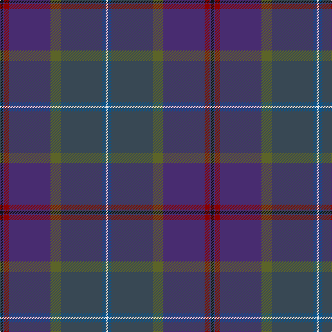

In pattern [KBRBGBBW](/patterns/kbrbgbbw/).

This was sourced from tartans-authority.  It is a [8 stripes tartan](/stripes/stripes8/).

Original link http://www.tartansauthority.com/tartan-ferret/display/7799/

## Thread count
K/4 DB2 DR7 DB60 G15 N60 B5 LN/3

## Palette
Each colour and its ΔE from the base-6 reference it is a variant of.

| Colour | Shade | Base | ΔE (OKLab) |
|---|---|---|---|
| B | <code style="background-color:#0C5488;">#0C5488</code> `#0C5488` | B <code style="background-color:#2A418A;">#2A418A</code> | 0.06 |
| DB | <code style="background-color:#482C70;">#482C70</code> `#482C70` | B <code style="background-color:#2A418A;">#2A418A</code> | 0.08 |
| DR | <code style="background-color:#880000;">#880000</code> `#880000` | R <code style="background-color:#CC0000;">#CC0000</code> | 0.15 |
| G | <code style="background-color:#5C6428;">#5C6428</code> `#5C6428` | G <code style="background-color:#006100;">#006100</code> | 0.10 |
| K | <code style="background-color:#101010;">#101010</code> `#101010` | K <code style="background-color:#000000;">#000000</code> | 0.17 |
| LN | <code style="background-color:#E0E0E0;">#E0E0E0</code> `#E0E0E0` | W <code style="background-color:#F7F7F7;">#F7F7F7</code> | 0.07 |
| N | <code style="background-color:#384854;">#384854</code> `#384854` | B <code style="background-color:#2A418A;">#2A418A</code> | 0.10 |

# Sample pattern

## Nearest tartans

The nearest existing variants by ΔTartan distance.

1. [Castellari of Lochaber Lairds (Pers](/setts/s8/b2k2ba1bb30bc1k12g25y1~b2c2c80-ba780078-bb1c1c50-bc2888c4-g003820-k101010-ybc8c00~x2/) — ΔT 1.31
1. [Little-Dowse Wedding](/setts/s8/g31ga6r3b31g8gb60ga7ba7~b202060-ba1870a4-g643424-ga8c7038-gb406054-r888888~x2/) — ΔT 1.67
1. [Timmins (Personal)](/setts/s10/g4b2ba14b12ba32y1b12bb14b2r4~b003c64-ba2c2c80-bb780078-g289c18-r880000-ye8c000~x2/) — ΔT 1.81
1. [Robb Hunting (Personal)](/setts/s9/b2r1g26y1k18b26ga1r1b2~b202060-g003820-ga789484-k101010-rc80000-yd8b000~x2/) — ΔT 1.82
1. [Newlands, Charlie (Personal)](/setts/s11/b6k2ba9w1ba9k2bb4k6bb24wa1b6~b202060-ba440044-bb14283c-k101010-w98c8e8-wae0e0e0~x2/) — ΔT 1.84
1. [Robb (Personal) Personal Tartan Tartan Number: 3157. Earliest known date: 1994 Designed by Peter MacDonald for Martin Robb of Carroglen, Comrie, Perthshire. Can be worn by anyone of the name but Martin Robb would appreciate being advised. See products available Copyright © Blair Urquhart, Comrie, 2015](/setts/s9/b2r1g26y1k18b26ga1r1b2~b202060-g003820-ga789484-k101010-rc80000-ye8c000~x2/) — ΔT 1.88
1. [Scottish Parliament (Official)](/setts/s12/g45ga3b7ba2b7ga3g4w2bb36w2g11b4~b272844-ba592237-bb362841-g3e5e5d-ga33625c-wffffff/) — ΔT 1.89
1. [Dalgliesh, Ewen (Personal)](/setts/s10/b45ba6r6ba30g6ba6g30k4ra4k3~b1c1c50-ba440044-g003820-k101010-r888888-ra901c38/) — ΔT 1.93
1. [Faulkner (Personal)](/setts/s11/b8k2r26y1r6k3g10ya1k3b22ya1~b584458-g003820-k101010-r681014-yf09400-ya94a494~x2/) — ΔT 1.95
1. [McFarland-Collins](/setts/s6/b40ba16k5bb16w2bc6~b172d60-ba576982-bb14465c-bc3d2e60-k120a01-wf7f1e8~x2/) — ΔT 2.03

## Neighbour map

Every grey dot is one of 15726 variants placed by the first two principal components of the ΔTartan feature space (44% of its variance). Red is this tartan; blue dots are its nearest — click one to open its page.

<svg viewBox="0 0 640 380" role="img" style="max-width:100%;height:auto;border:1px solid #e0e0e0;border-radius:4px;display:block" xmlns="http://www.w3.org/2000/svg"><image href="/nn/cloud.v1.png" width="640" height="380"/><a href="/setts/s8/b2k2ba1bb30bc1k12g25y1~b2c2c80-ba780078-bb1c1c50-bc2888c4-g003820-k101010-ybc8c00~x2/"><circle cx="338.3" cy="146.5" r="4" fill="#3465a4"><title>Castellari of Lochaber Lairds (Pers</title></circle></a><a href="/setts/s8/g31ga6r3b31g8gb60ga7ba7~b202060-ba1870a4-g643424-ga8c7038-gb406054-r888888~x2/"><circle cx="284.1" cy="170.1" r="4" fill="#3465a4"><title>Little-Dowse Wedding</title></circle></a><a href="/setts/s10/g4b2ba14b12ba32y1b12bb14b2r4~b003c64-ba2c2c80-bb780078-g289c18-r880000-ye8c000~x2/"><circle cx="340.3" cy="153.8" r="4" fill="#3465a4"><title>Timmins (Personal)</title></circle></a><a href="/setts/s9/b2r1g26y1k18b26ga1r1b2~b202060-g003820-ga789484-k101010-rc80000-yd8b000~x2/"><circle cx="308.3" cy="146.0" r="4" fill="#3465a4"><title>Robb Hunting (Personal)</title></circle></a><a href="/setts/s11/b6k2ba9w1ba9k2bb4k6bb24wa1b6~b202060-ba440044-bb14283c-k101010-w98c8e8-wae0e0e0~x2/"><circle cx="306.9" cy="165.2" r="4" fill="#3465a4"><title>Newlands, Charlie (Personal)</title></circle></a><a href="/setts/s9/b2r1g26y1k18b26ga1r1b2~b202060-g003820-ga789484-k101010-rc80000-ye8c000~x2/"><circle cx="305.1" cy="144.7" r="4" fill="#3465a4"><title>Robb (Personal) Personal Tartan Tartan Number: 3157. Earliest known date: 1994 Designed by Peter MacDonald for Martin Robb of Carroglen, Comrie, Perthshire. Can be worn by anyone of the name but Martin Robb would appreciate being advised. See products available Copyright © Blair Urquhart, Comrie, 2015</title></circle></a><a href="/setts/s12/g45ga3b7ba2b7ga3g4w2bb36w2g11b4~b272844-ba592237-bb362841-g3e5e5d-ga33625c-wffffff/"><circle cx="328.6" cy="126.4" r="4" fill="#3465a4"><title>Scottish Parliament (Official)</title></circle></a><a href="/setts/s10/b45ba6r6ba30g6ba6g30k4ra4k3~b1c1c50-ba440044-g003820-k101010-r888888-ra901c38/"><circle cx="257.4" cy="174.9" r="4" fill="#3465a4"><title>Dalgliesh, Ewen (Personal)</title></circle></a><a href="/setts/s11/b8k2r26y1r6k3g10ya1k3b22ya1~b584458-g003820-k101010-r681014-yf09400-ya94a494~x2/"><circle cx="309.6" cy="136.0" r="4" fill="#3465a4"><title>Faulkner (Personal)</title></circle></a><a href="/setts/s6/b40ba16k5bb16w2bc6~b172d60-ba576982-bb14465c-bc3d2e60-k120a01-wf7f1e8~x2/"><circle cx="300.7" cy="189.7" r="4" fill="#3465a4"><title>McFarland-Collins</title></circle></a><circle cx="328.7" cy="132.7" r="5" fill="#c00000"/></svg>

ID: /setts/s8/k4b2r7b60g15ba60bb5w3~b482c70-ba384854-bb0c5488-g5c6428-k101010-r880000-we0e0e0/
