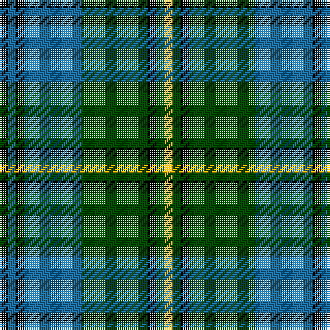

In pattern [KBKBGKGY](/patterns/kbkbgkgy/).

This was sourced from tartans-authority.  It is a [8 stripes tartan](/stripes/stripes8/).

Original link http://www.tartansauthority.com/tartan-ferret/display/3648/

## Thread count
K/4 B4 K4 B28 G32 K4 G4 Y/4

## Palette
Each colour and its ΔE from the base-6 reference it is a variant of.

| Colour | Shade | Base | ΔE (OKLab) |
|---|---|---|---|
| B | <code style="background-color:#1870A4;">#1870A4</code> `#1870A4` | B <code style="background-color:#2C4084;">#2C4084</code> | 0.14 |
| G | <code style="background-color:#004C00;">#004C00</code> `#004C00` | G <code style="background-color:#006400;">#006400</code> | 0.08 |
| K | <code style="background-color:#000000;">#000000</code> `#000000` | K <code style="background-color:#000000;">#000000</code> | 0.00 |
| Y | <code style="background-color:#FCB000;">#FCB000</code> `#FCB000` | Y <code style="background-color:#E8C000;">#E8C000</code> | 0.05 |

# Sample pattern

ID: /setts/s8/k4b4k4b28g32k4g4y4-b1870a4-g004c00-k000000-yfcb000/
