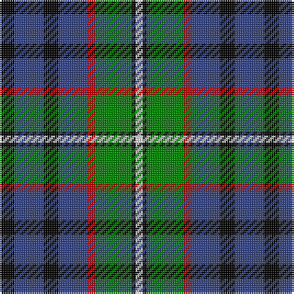

In pattern [KBKBRGKW](/patterns/kbkbrgkw/).

This was sourced from weddslist.  It is a [8 stripes tartan](/stripes/stripes8/).

Original link http://www.weddslist.com/cgi-bin/tartans/pg.pl?source=sts

## Thread count
K/8 B16 K8 B16 R4 G20 K2 LN/4

## Palette
Each colour and its ΔE from the base-6 reference it is a variant of.

| Colour | Shade | Base | ΔE (OKLab) |
|---|---|---|---|
| B | <code style="background-color:#304080;">#304080</code> `#304080` | B <code style="background-color:#2A418A;">#2A418A</code> | 0.02 |
| G | <code style="background-color:#008000;">#008000</code> `#008000` | G <code style="background-color:#006100;">#006100</code> | 0.10 |
| K | <code style="background-color:#000000;">#000000</code> `#000000` | K <code style="background-color:#000000;">#000000</code> | 0.00 |
| LN | <code style="background-color:#E0E0E0;">#E0E0E0</code> `#E0E0E0` | W <code style="background-color:#F7F7F7;">#F7F7F7</code> | 0.07 |
| R | <code style="background-color:#C00000;">#C00000</code> `#C00000` | R <code style="background-color:#CC0000;">#CC0000</code> | 0.03 |

# Sample pattern

## Nearest tartans

The nearest existing variants by ΔTartan distance.

1. [Robertson, hunting](/setts/s10/b18k10g9k2r2k2g9k10b9w2~b304080-g008000-k000000-rc00000-we0e0e0~x2/) — ΔT 0.77
1. [Midlothian](/setts/s6/b31ba4b5k19g20y4~b304080-ba8080d0-g008000-k000000-yf0c000~x2/) — ΔT 0.85
1. [MacDonald, (Flora.. )](/setts/s7/g17y2k14r2b9r2b10~b304080-g008000-k000000-rc00000-yf0c000~x2/) — ΔT 0.87
1. [Patterson (blue)](/setts/s6/b22w2k10g11r3g4~b304080-g008000-k000000-rc00000-we0e0e0~x2/) — ΔT 0.87
1. [MacLeod of Assynt](/setts/s6/r3k2g15k10b20y2~b304080-g008000-k000000-rc00000-yf0c000~x2/) — ΔT 0.92
1. [MacCallum, of Berwick](/setts/s9/b10r7b31k25g23k8b7k8y5~b304080-g008000-k000000-rc00000-yf0c000~x2/) — ΔT 0.95
1. [Scotsburn Croft](/setts/s9/w16k3w16k26b4k26ba20wa3ba8~b780078-ba646464-k101010-w82cffd-waffffff/) — ΔT 1.01
1. [Soutar (Name)](/setts/s9/k20w3b20k3r3g20r10w3k20~b2888c4-g285800-k101010-rc80000-we0e0e0~x2/) — ΔT 1.01
1. [MacTaggert](/setts/s7/g9b2g1k6ba6r1ba1~b5480b0-ba304080-g008000-k000000-rc00000~x2/) — ΔT 1.01
1. [MacPhail, hunting](/setts/s6/r2b23k14g16k2w2~b304080-g008000-k000000-rc00000-we0e0e0~x2/) — ΔT 1.02

## Neighbour map

Every grey dot is one of 15726 variants placed by the first two principal components of the ΔTartan feature space (44% of its variance). Red is this tartan; blue dots are its nearest — click one to open its page.

<svg viewBox="0 0 640 380" role="img" style="max-width:100%;height:auto;border:1px solid #e0e0e0;border-radius:4px;display:block" xmlns="http://www.w3.org/2000/svg"><image href="/nn/cloud.v1.png" width="640" height="380"/><a href="/setts/s10/b18k10g9k2r2k2g9k10b9w2~b304080-g008000-k000000-rc00000-we0e0e0~x2/"><circle cx="126.2" cy="188.4" r="4" fill="#3465a4"><title>Robertson, hunting</title></circle></a><a href="/setts/s6/b31ba4b5k19g20y4~b304080-ba8080d0-g008000-k000000-yf0c000~x2/"><circle cx="155.2" cy="208.7" r="4" fill="#3465a4"><title>Midlothian</title></circle></a><a href="/setts/s7/g17y2k14r2b9r2b10~b304080-g008000-k000000-rc00000-yf0c000~x2/"><circle cx="112.9" cy="198.4" r="4" fill="#3465a4"><title>MacDonald, (Flora.. )</title></circle></a><a href="/setts/s6/b22w2k10g11r3g4~b304080-g008000-k000000-rc00000-we0e0e0~x2/"><circle cx="171.8" cy="191.3" r="4" fill="#3465a4"><title>Patterson (blue)</title></circle></a><a href="/setts/s6/r3k2g15k10b20y2~b304080-g008000-k000000-rc00000-yf0c000~x2/"><circle cx="150.5" cy="192.8" r="4" fill="#3465a4"><title>MacLeod of Assynt</title></circle></a><a href="/setts/s9/b10r7b31k25g23k8b7k8y5~b304080-g008000-k000000-rc00000-yf0c000~x2/"><circle cx="116.4" cy="206.0" r="4" fill="#3465a4"><title>MacCallum, of Berwick</title></circle></a><a href="/setts/s9/w16k3w16k26b4k26ba20wa3ba8~b780078-ba646464-k101010-w82cffd-waffffff/"><circle cx="147.5" cy="186.5" r="4" fill="#3465a4"><title>Scotsburn Croft</title></circle></a><a href="/setts/s9/k20w3b20k3r3g20r10w3k20~b2888c4-g285800-k101010-rc80000-we0e0e0~x2/"><circle cx="131.9" cy="195.1" r="4" fill="#3465a4"><title>Soutar (Name)</title></circle></a><a href="/setts/s7/g9b2g1k6ba6r1ba1~b5480b0-ba304080-g008000-k000000-rc00000~x2/"><circle cx="141.0" cy="191.4" r="4" fill="#3465a4"><title>MacTaggert</title></circle></a><a href="/setts/s6/r2b23k14g16k2w2~b304080-g008000-k000000-rc00000-we0e0e0~x2/"><circle cx="163.3" cy="186.0" r="4" fill="#3465a4"><title>MacPhail, hunting</title></circle></a><circle cx="136.6" cy="194.7" r="5" fill="#c00000"/></svg>

ID: /setts/s8/k4b8k4b8r2g10k1w2~b304080-g008000-k000000-rc00000-we0e0e0~x2/
