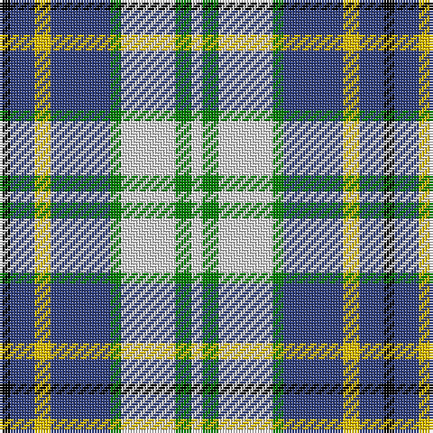

In pattern [KBYBGWGW](/patterns/kbybgwgw/).

This was sourced from weddslist.  It is a [8 stripes tartan](/stripes/stripes8/).

Original link http://www.weddslist.com/cgi-bin/tartans/pg.pl?source=sts

## Thread count
K/4 B9 Y6 B22 G4 LN20 G6 LN/4

## Palette
Each colour and its ΔE from the base-6 reference it is a variant of.

| Colour | Shade | Base | ΔE (OKLab) |
|---|---|---|---|
| B | <code style="background-color:#304080;">#304080</code> `#304080` | B <code style="background-color:#2C4084;">#2C4084</code> | 0.01 |
| G | <code style="background-color:#008000;">#008000</code> `#008000` | G <code style="background-color:#006400;">#006400</code> | 0.09 |
| K | <code style="background-color:#000000;">#000000</code> `#000000` | K <code style="background-color:#000000;">#000000</code> | 0.00 |
| LN | <code style="background-color:#E0E0E0;">#E0E0E0</code> `#E0E0E0` | W <code style="background-color:#F4F4F0;">#F4F4F0</code> | 0.06 |
| Y | <code style="background-color:#F0C000;">#F0C000</code> `#F0C000` | Y <code style="background-color:#E8C000;">#E8C000</code> | 0.01 |

# Sample pattern

## Nearest tartans

The nearest existing variants by ΔTartan distance.

1. [Ship Hector, The (Commemorative)](/setts/s8/k6b20y10b32g6w32g10w6-b2c2c80-g006818-k101010-wfcfcfc-yfccc00/) — ΔT 0.50
1. [Idaho, Centennial](/setts/s8/b24r4b4r4b4g20w24ra6-b304080-g008000-rc00000-ra806050-we0e0e0/) — ΔT 0.88
1. [Unidentified (Winterbottom)](/setts/s6/b26w26b8y4g16r6-b2c2c80-g006818-rc80000-we0e0e0-yd4c028/) — ΔT 0.88
1. [Mitsukoshi (Corporate)](/setts/s8/w24k6wa6k6w26b12k34r6-b5c8ca8-k101010-rc80000-wc0c0c0-wae8ccb8/) — ΔT 0.89
1. [Vermont Dress](/setts/s8/g4w4g24b20w24r4g4y4-b202060-g006818-rc80000-we0e0e0-yd09800/) — ΔT 0.92
1. [Strakan](/setts/s9/b36r10b36y28k6w6k6y28r6-b000064-k000000-r8c8c8c-wfcfcfc-yfccc00/) — ΔT 1.01
1. [Fitzpatrick](/setts/s11/w12y4w4y6w22g22b4k24b6k12w4-b1474b4-g207c58-k101010-we0e0e0-ye8c000/) — ΔT 1.09
1. [MacTavish Dress Family Tartan Tartan Number: 1383. Earliest known date: 1958 Designed for Lord Thomson of Fleet in 1958 based on a sample in the Moy Hall collection dating from the mid 19th century. Designed by John Bain & Alfred Bottomley of MacArthurs of Hamilton (now at Biggar 2002). Alfred was owner of MacArthurs and John was a director and one of the leading designers in Scotland. The design work on this and the Thomson Htg was for Lord Thomson of Fleet - via Kinloch Anderson of Edinburgh. The tartan is also suitable for MacTavishs and Thomsons, who claim descent from the Clan MacIntosh, regardless of spelling. John Bain 10 Oct 2002, remembers Lord Thomson visiting the mill to discuss the designs. See products available Copyright © Blair Urquhart, Comrie, 2015](/setts/s6/r8b56k12w24k24y6-b5c8ca8-k101010-rc80000-we0e0e0-ye8c000/) — ΔT 1.11
1. [Kile (Red line) (Personal)](/setts/s8/b36w6b6w6r6w6k10y24-b1c0070-k101010-r880000-wfcfcfc-yd8b000/) — ΔT 1.12
1. [Alexander Brothers - 2007? (Corp.)](/setts/s8/g10y4b40w4k40w40k4w10-b5c8ca8-g289c18-k101010-we0e0e0-ye8c000/) — ΔT 1.16

## Neighbour map

Every grey dot is one of 15726 variants placed by the first two principal components of the ΔTartan feature space (44% of its variance). Red is this tartan; blue dots are its nearest — click one to open its page.

<svg viewBox="0 0 640 380" role="img" style="max-width:100%;height:auto;border:1px solid #e0e0e0;border-radius:4px;display:block" xmlns="http://www.w3.org/2000/svg"><image href="/nn/cloud.v1.png" width="640" height="380"/><a href="/setts/s8/k6b20y10b32g6w32g10w6-b2c2c80-g006818-k101010-wfcfcfc-yfccc00/"><circle cx="107.3" cy="191.1" r="4" fill="#3465a4"><title>Ship Hector, The (Commemorative)</title></circle></a><a href="/setts/s8/b24r4b4r4b4g20w24ra6-b304080-g008000-rc00000-ra806050-we0e0e0/"><circle cx="102.9" cy="185.6" r="4" fill="#3465a4"><title>Idaho, Centennial</title></circle></a><a href="/setts/s6/b26w26b8y4g16r6-b2c2c80-g006818-rc80000-we0e0e0-yd4c028/"><circle cx="111.2" cy="207.1" r="4" fill="#3465a4"><title>Unidentified (Winterbottom)</title></circle></a><a href="/setts/s8/w24k6wa6k6w26b12k34r6-b5c8ca8-k101010-rc80000-wc0c0c0-wae8ccb8/"><circle cx="129.4" cy="191.8" r="4" fill="#3465a4"><title>Mitsukoshi (Corporate)</title></circle></a><a href="/setts/s8/g4w4g24b20w24r4g4y4-b202060-g006818-rc80000-we0e0e0-yd09800/"><circle cx="107.8" cy="180.9" r="4" fill="#3465a4"><title>Vermont Dress</title></circle></a><a href="/setts/s9/b36r10b36y28k6w6k6y28r6-b000064-k000000-r8c8c8c-wfcfcfc-yfccc00/"><circle cx="127.9" cy="184.3" r="4" fill="#3465a4"><title>Strakan</title></circle></a><a href="/setts/s11/w12y4w4y6w22g22b4k24b6k12w4-b1474b4-g207c58-k101010-we0e0e0-ye8c000/"><circle cx="66.6" cy="172.5" r="4" fill="#3465a4"><title>Fitzpatrick</title></circle></a><a href="/setts/s6/r8b56k12w24k24y6-b5c8ca8-k101010-rc80000-we0e0e0-ye8c000/"><circle cx="155.4" cy="181.3" r="4" fill="#3465a4"><title>MacTavish Dress Family Tartan Tartan Number: 1383. Earliest known date: 1958 Designed for Lord Thomson of Fleet in 1958 based on a sample in the Moy Hall collection dating from the mid 19th century. Designed by John Bain &amp; Alfred Bottomley of MacArthurs of Hamilton (now at Biggar 2002). Alfred was owner of MacArthurs and John was a director and one of the leading designers in Scotland. The design work on this and the Thomson Htg was for Lord Thomson of Fleet - via Kinloch Anderson of Edinburgh. The tartan is also suitable for MacTavishs and Thomsons, who claim descent from the Clan MacIntosh, regardless of spelling. John Bain 10 Oct 2002, remembers Lord Thomson visiting the mill to discuss the designs. See products available Copyright © Blair Urquhart, Comrie, 2015</title></circle></a><a href="/setts/s8/b36w6b6w6r6w6k10y24-b1c0070-k101010-r880000-wfcfcfc-yd8b000/"><circle cx="118.5" cy="173.0" r="4" fill="#3465a4"><title>Kile (Red line) (Personal)</title></circle></a><a href="/setts/s8/g10y4b40w4k40w40k4w10-b5c8ca8-g289c18-k101010-we0e0e0-ye8c000/"><circle cx="117.1" cy="154.8" r="4" fill="#3465a4"><title>Alexander Brothers - 2007? (Corp.)</title></circle></a><circle cx="112.4" cy="189.5" r="5" fill="#c00000"/></svg>

ID: /setts/s8/k4b9y6b22g4w20g6w4-b304080-g008000-k000000-we0e0e0-yf0c000/
