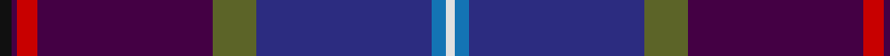
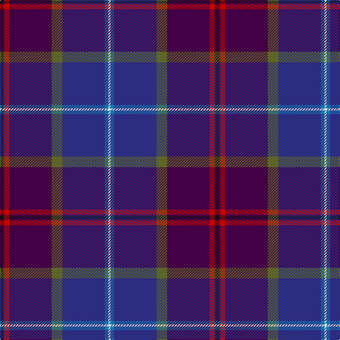

**Bands:** [KBRBGBBW](/stripes/kbrbgbbw/) · **Stripes:** [K DP R DP Y DB B W](/stripes/stripes8/) K DP R DP Y DB B W

This was sourced from register-of-tartans.  It is a [8 band tartan](/bands/bands8/).

Original link https://www.tartanregister.gov.uk/tartanDetails.aspx?ref=5762

## Register references

External register numbers recorded for this tartan.

- Scottish Register of Tartans: [5762](https://www.tartanregister.gov.uk/tartanDetails.aspx?ref=5762)
- Scottish Tartans Authority (ITI): 7799

## Thread count
K/4 DP2 R7 DP60 G15 DB60 B5 LN/3

## Palette
Each colour and its ΔE from the base-6 reference it is a variant of.

| Colour | Shade | Base | ΔE (OKLab) |
|---|---|---|---|
| B | <code style="background-color:#1474B4;">#1474B4</code> `#1474B4` | B <code style="background-color:#2A418A;">#2A418A</code> | 0.15 |
| DB | <code style="background-color:#2C2C80;">#2C2C80</code> `#2C2C80` | B <code style="background-color:#2A418A;">#2A418A</code> | 0.06 |
| DP | <code style="background-color:#440044;">#440044</code> `#440044` | B <code style="background-color:#2A418A;">#2A418A</code> | 0.18 |
| G | <code style="background-color:#5C6428;">#5C6428</code> `#5C6428` | G <code style="background-color:#006100;">#006100</code> | 0.10 |
| K | <code style="background-color:#101010;">#101010</code> `#101010` | K <code style="background-color:#000000;">#000000</code> | 0.17 |
| LN | <code style="background-color:#E0E0E0;">#E0E0E0</code> `#E0E0E0` | W <code style="background-color:#F7F7F7;">#F7F7F7</code> | 0.07 |
| R | <code style="background-color:#C80000;">#C80000</code> `#C80000` | R <code style="background-color:#CC0000;">#CC0000</code> | 0.01 |

# Sample pattern

## Nearest tartans

The nearest existing variants by ΔTartan distance.

1. [University of Dundee](/setts/s10/db5o4r6lo1r9db35db5lo1db12w1~x2/) — ΔT 1.43
1. [Western Isles (Fashion)](/setts/s12/dg9m2dp2dg3dp18dg2k2dg1k19r1db33w2~x2/) — ΔT 1.46
1. [Cumnock Hunting (District)](/setts/s10/dp23w1dp2db16k3db2k30lo1k2r3~x2/) — ΔT 1.48
1. [Custer (Personal)](/setts/s10/db20w1dp8t1r2k3r2t1dp20db8~x2/) — ΔT 1.60
1. [Scottish Pride (Fashion)](/setts/s11/g6dp2dp2g2dp15g3k2g1k15db43w2~x2/) — ΔT 1.62
1. [Alba](/setts/s8/dp24dt2g3m2g3k11dt29w2~x2/) — ΔT 1.63
1. [Pride of Scotland General Tartan Tartan Number: 2469. Earliest known date: 1997 The Pride of Scotland tartan was designed by Kenneth Dalgleish of D C Dalgleish, Selkirk and promoted by McCalls of Aberdeen who own copyright and patent. See products available Copyright © Blair Urquhart, Comrie, 2015](/setts/s11/dg8dp2dp2dg3dp16dg2k2dg1k16db30w2~x2/) — ΔT 1.69
1. [Pride of Glencoe](/setts/s6/k3g2m3db30dp32w3~x2/) — ΔT 1.73
1. [Ellan Vannin (1958)](/setts/s7/dp2dg8r1lo1db4db16lb1~x4/) — ΔT 1.74
1. [Anne Arundel County](/setts/s8/g4dt7db33k9o2k9o10r4~x2/) — ΔT 1.84

## Neighbour map

Every grey dot is one of 14313 variants placed by the first two principal components of the ΔTartan feature space (44% of its variance). Red is this tartan; blue dots are its nearest — click one to open its page.

<svg viewBox="0 0 640 380" role="img" style="max-width:100%;height:auto;border:1px solid #e0e0e0;border-radius:4px;display:block" xmlns="http://www.w3.org/2000/svg"><image href="/nn/cloud.v1.png" width="640" height="380"/><a href="/setts/s10/db5o4r6lo1r9db35db5lo1db12w1~x2/"><circle cx="282.6" cy="100.6" r="4" fill="#3465a4"><title>University of Dundee</title></circle></a><a href="/setts/s12/dg9m2dp2dg3dp18dg2k2dg1k19r1db33w2~x2/"><circle cx="217.5" cy="87.5" r="4" fill="#3465a4"><title>Western Isles (Fashion)</title></circle></a><a href="/setts/s10/dp23w1dp2db16k3db2k30lo1k2r3~x2/"><circle cx="276.4" cy="108.6" r="4" fill="#3465a4"><title>Cumnock Hunting (District)</title></circle></a><a href="/setts/s10/db20w1dp8t1r2k3r2t1dp20db8~x2/"><circle cx="304.3" cy="144.1" r="4" fill="#3465a4"><title>Custer (Personal)</title></circle></a><a href="/setts/s11/g6dp2dp2g2dp15g3k2g1k15db43w2~x2/"><circle cx="314.0" cy="95.6" r="4" fill="#3465a4"><title>Scottish Pride (Fashion)</title></circle></a><a href="/setts/s8/dp24dt2g3m2g3k11dt29w2~x2/"><circle cx="237.1" cy="153.8" r="4" fill="#3465a4"><title>Alba</title></circle></a><a href="/setts/s11/dg8dp2dp2dg3dp16dg2k2dg1k16db30w2~x2/"><circle cx="244.0" cy="127.6" r="4" fill="#3465a4"><title>Pride of Scotland General Tartan Tartan Number: 2469. Earliest known date: 1997 The Pride of Scotland tartan was designed by Kenneth Dalgleish of D C Dalgleish, Selkirk and promoted by McCalls of Aberdeen who own copyright and patent. See products available Copyright © Blair Urquhart, Comrie, 2015</title></circle></a><a href="/setts/s6/k3g2m3db30dp32w3~x2/"><circle cx="302.1" cy="169.7" r="4" fill="#3465a4"><title>Pride of Glencoe</title></circle></a><a href="/setts/s7/dp2dg8r1lo1db4db16lb1~x4/"><circle cx="248.2" cy="140.7" r="4" fill="#3465a4"><title>Ellan Vannin (1958)</title></circle></a><a href="/setts/s8/g4dt7db33k9o2k9o10r4~x2/"><circle cx="196.3" cy="143.0" r="4" fill="#3465a4"><title>Anne Arundel County</title></circle></a><circle cx="278.7" cy="116.2" r="5" fill="#c00000"/></svg>

ID: /setts/s8/k4dp2r7dp60y15db60b5w3/
