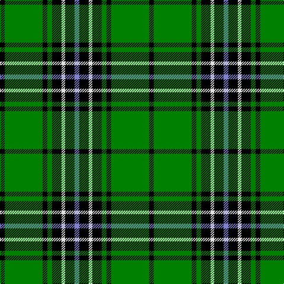

This page is one **sett** — a single exact thread-count. It belongs to the [tartan](/tartans/k4g32k4g4k8w3k8b4/)
(the same proportion at any scale), whose colour order is pattern [BKWKGKGK](/stripes/bkwkgkgk/).

Sourced from weddslist.  It is a [8 stripe tartan](/stripes/stripes8/).

Original link http://www.weddslist.com/cgi-bin/tartans/pg.pl?source=sts

## Thread count
K/8 G64 K8 G8 K16 LN6 K16 B/8

## Palette

Palette: <strong>Tartan Register</strong> <small style="color:#888">(2 of 4 colours)</small>
<table><thead><tr><th>Colour</th><th>Threads</th><th>Shade</th><th>Base</th><th>OKLCh</th></tr></thead><tbody><tr><td>K/</td><td style="text-align:right;font-variant-numeric:tabular-nums">8</td><td><code style="background-color:#000000;">#000000</code> <small style="color:#888">#000000</small></td><td>K <code style="background-color:#000000;">#000000</code></td><td><small style="color:#888">oklch(0.0% 0.000 0.0)</small></td></tr><tr><td>G</td><td style="text-align:right;font-variant-numeric:tabular-nums">64</td><td><code style="background-color:#008000;">#008000</code> <small style="color:#888">#008000</small></td><td>G <code style="background-color:#006100;">#006100</code></td><td><small style="color:#888">oklch(52.0% 0.177 142.5)</small></td></tr><tr><td>K</td><td style="text-align:right;font-variant-numeric:tabular-nums">8</td><td><code style="background-color:#000000;">#000000</code> <small style="color:#888">#000000</small></td><td>K <code style="background-color:#000000;">#000000</code></td><td><small style="color:#888">oklch(0.0% 0.000 0.0)</small></td></tr><tr><td>G</td><td style="text-align:right;font-variant-numeric:tabular-nums">8</td><td><code style="background-color:#008000;">#008000</code> <small style="color:#888">#008000</small></td><td>G <code style="background-color:#006100;">#006100</code></td><td><small style="color:#888">oklch(52.0% 0.177 142.5)</small></td></tr><tr><td>K</td><td style="text-align:right;font-variant-numeric:tabular-nums">16</td><td><code style="background-color:#000000;">#000000</code> <small style="color:#888">#000000</small></td><td>K <code style="background-color:#000000;">#000000</code></td><td><small style="color:#888">oklch(0.0% 0.000 0.0)</small></td></tr><tr><td>LN</td><td style="text-align:right;font-variant-numeric:tabular-nums">6</td><td><code style="background-color:#E0E0E0;">#E0E0E0</code> <small style="color:#888">#E0E0E0</small></td><td>W <code style="background-color:#F7F7F7;">#F7F7F7</code></td><td><small style="color:#888">oklch(90.7% 0.000 89.9)</small></td></tr><tr><td>K</td><td style="text-align:right;font-variant-numeric:tabular-nums">16</td><td><code style="background-color:#000000;">#000000</code> <small style="color:#888">#000000</small></td><td>K <code style="background-color:#000000;">#000000</code></td><td><small style="color:#888">oklch(0.0% 0.000 0.0)</small></td></tr><tr><td>B/</td><td style="text-align:right;font-variant-numeric:tabular-nums">8</td><td><code style="background-color:#8080D0;">#8080D0</code> <small style="color:#888">#8080D0</small></td><td>B <code style="background-color:#2A418A;">#2A418A</code></td><td><small style="color:#888">oklch(63.4% 0.119 282.5)</small></td></tr></tbody></table>

# Sample pattern

## Nearest tartans

The nearest existing variants by ΔTartan distance, with this tartan at the top so the swatches line up against it.

ΔTartan

Tartan

Sett

—

<a href="/ttd/edit/#slug=k4g32k4g4k8w3k8b4~x2">Hartmann</a> <a class="nn-out" href="/setts/s8/k4g32k4g4k8w3k8b4~x2/" title="open its dictionary page">↗</a>

0.80

<a href="/ttd/edit/#slug=w3g27k5g5k32g5k5g27ly3~x2">MacIver hunting</a> <a class="nn-out" href="/setts/s9/w3g27k5g5k32g5k5g27ly3~x2/" title="open its dictionary page">↗</a>

0.86

<a href="/ttd/edit/#slug=r3g24k28g19ly3g3ly3~x2">Paton</a> <a class="nn-out" href="/setts/s7/r3g24k28g19ly3g3ly3~x2/" title="open its dictionary page">↗</a>

0.91

<a href="/ttd/edit/#slug=g17t2g2t2k21t2k3g30k2t2k4~x2">Fort William</a> <a class="nn-out" href="/setts/s11/g17t2g2t2k21t2k3g30k2t2k4~x2/" title="open its dictionary page">↗</a>

0.95

<a href="/ttd/edit/#slug=k60g64g5g8g5g64k60ly8k8ly8">Sin-Cos</a> <a class="nn-out" href="/setts/s10/k60g64g5g8g5g64k60ly8k8ly8/" title="open its dictionary page">↗</a>

1.17

<a href="/ttd/edit/#slug=g8r3g30k8w3k36w8~x2">Cleghorn (Personal)</a> <a class="nn-out" href="/setts/s7/g8r3g30k8w3k36w8~x2/" title="open its dictionary page">↗</a>

1.21

<a href="/ttd/edit/#slug=r4k2g7k15g3k3g3k7g28k7g6k2">Walker, hunting</a> <a class="nn-out" href="/setts/s12/r4k2g7k15g3k3g3k7g28k7g6k2/" title="open its dictionary page">↗</a>

1.24

<a href="/ttd/edit/#slug=r1g16k8g4k4ly1~x2">Forbes</a> <a class="nn-out" href="/setts/s6/r1g16k8g4k4ly1~x2/" title="open its dictionary page">↗</a>

1.25

<a href="/ttd/edit/#slug=g22k4g4k21ly2k4ly2k21g4k2db2g22~x2">Hopetoun</a> <a class="nn-out" href="/setts/s12/g22k4g4k21ly2k4ly2k21g4k2db2g22~x2/" title="open its dictionary page">↗</a>

1.26

<a href="/ttd/edit/#slug=k4g32k4g4k8w3k8t4~x2">Hartmann (Personal)</a> <a class="nn-out" href="/setts/s8/k4g32k4g4k8w3k8t4~x2/" title="open its dictionary page">↗</a>

1.31

<a href="/ttd/edit/#slug=g3k6w1k6g2k2g16k1~x2">MacLean of Duart, hunting</a> <a class="nn-out" href="/setts/s8/g3k6w1k6g2k2g16k1~x2/" title="open its dictionary page">↗</a>

## Neighbour map

Every grey dot is one of 14299 variants placed by the first two principal components of the ΔTartan feature space (44% of its variance). Red is this tartan; blue dots are its nearest — click one to open its page.

<svg viewBox="0 0 640 380" role="img" style="max-width:100%;height:auto;border:1px solid #e0e0e0;border-radius:4px;display:block" xmlns="http://www.w3.org/2000/svg"><image href="/nn/cloud.v1.png" width="640" height="380"/><a href="/setts/s9/w3g27k5g5k32g5k5g27ly3~x2/"><circle cx="286.7" cy="184.6" r="4" fill="#3465a4"><title>MacIver hunting</title></circle></a><a href="/setts/s7/r3g24k28g19ly3g3ly3~x2/"><circle cx="263.1" cy="198.7" r="4" fill="#3465a4"><title>Paton</title></circle></a><a href="/setts/s11/g17t2g2t2k21t2k3g30k2t2k4~x2/"><circle cx="288.2" cy="147.3" r="4" fill="#3465a4"><title>Fort William</title></circle></a><a href="/setts/s10/k60g64g5g8g5g64k60ly8k8ly8/"><circle cx="238.8" cy="170.3" r="4" fill="#3465a4"><title>Sin-Cos</title></circle></a><a href="/setts/s7/g8r3g30k8w3k36w8~x2/"><circle cx="223.2" cy="184.7" r="4" fill="#3465a4"><title>Cleghorn (Personal)</title></circle></a><a href="/setts/s12/r4k2g7k15g3k3g3k7g28k7g6k2/"><circle cx="274.1" cy="164.0" r="4" fill="#3465a4"><title>Walker, hunting</title></circle></a><a href="/setts/s6/r1g16k8g4k4ly1~x2/"><circle cx="318.7" cy="189.2" r="4" fill="#3465a4"><title>Forbes</title></circle></a><a href="/setts/s12/g22k4g4k21ly2k4ly2k21g4k2db2g22~x2/"><circle cx="249.6" cy="171.8" r="4" fill="#3465a4"><title>Hopetoun</title></circle></a><a href="/setts/s8/k4g32k4g4k8w3k8t4~x2/"><circle cx="305.3" cy="190.7" r="4" fill="#3465a4"><title>Hartmann (Personal)</title></circle></a><a href="/setts/s8/g3k6w1k6g2k2g16k1~x2/"><circle cx="334.8" cy="187.4" r="4" fill="#3465a4"><title>MacLean of Duart, hunting</title></circle></a><circle cx="270.6" cy="175.3" r="5" fill="#c00000"/></svg>

ID: /setts/s8/k4g32k4g4k8w3k8b4~x2/
