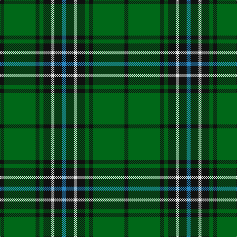

In pattern [BKWKGKGK](/stripes/bkwkgkgk/).

This was sourced from tartans-authority.  It is a [8 stripe tartan](/stripes/stripes8/).

Original link http://www.tartansauthority.com/tartan-ferret/display/2622/

## Thread count
K/8 G64 K8 G8 K16 LN6 K16 B/8

## Palette
Each colour and its ΔE from the base-6 reference it is a variant of.

| Colour | Shade | Base | ΔE (OKLab) |
|---|---|---|---|
| B | <code style="background-color:#2888C4;">#2888C4</code> `#2888C4` | B <code style="background-color:#2A418A;">#2A418A</code> | 0.21 |
| G | <code style="background-color:#006818;">#006818</code> `#006818` | G <code style="background-color:#006100;">#006100</code> | 0.02 |
| K | <code style="background-color:#101010;">#101010</code> `#101010` | K <code style="background-color:#000000;">#000000</code> | 0.17 |
| LN | <code style="background-color:#E0E0E0;">#E0E0E0</code> `#E0E0E0` | W <code style="background-color:#F7F7F7;">#F7F7F7</code> | 0.07 |

# Sample pattern

## Nearest tartans

The nearest existing variants by ΔTartan distance.

1. [Keppoch](/setts/s7/k5g2k5g2db8g25w4~x2/) — ΔT 0.76
1. [Brunton (Personal)](/setts/s8/k7r3k27g27ly3g3ly3g3~x2/) — ΔT 0.98
1. [Sin-Cos (Corporate)](/setts/s10/k60g64dg5g8dg5g64k60ly8k8ly8/) — ΔT 0.99
1. [MacArthur-Fox Green](/setts/s10/r4g4k2g31k10ly3g5k11g6k3~x2/) — ΔT 1.02
1. [MacHardy (Clans Originaux)](/setts/s8/g4r4k12w2k12g32r4k3~x2/) — ΔT 1.05
1. [Daks, Muted Loden](/setts/s8/o5g12dg4r4dg27g3dg4o5/) — ΔT 1.07
1. [Harley (Leslie), Robert](/setts/s8/g2k3ly1k3g2db8g16k1~x4/) — ΔT 1.08
1. [Hopetoun](/setts/s11/g13k2g2k11ly1k2ly1k11g2b1g11~x4/) — ΔT 1.08
1. [Childers](/setts/s10/k4g13k4g8k44g8k4g13k4w3~x2/) — ΔT 1.08
1. [MacIntyre Hunting (VS)](/setts/s6/g4db12r3db12g32w4~x2/) — ΔT 1.13

## Neighbour map

Every grey dot is one of 14299 variants placed by the first two principal components of the ΔTartan feature space (44% of its variance). Red is this tartan; blue dots are its nearest — click one to open its page.

<svg viewBox="0 0 640 380" role="img" style="max-width:100%;height:auto;border:1px solid #e0e0e0;border-radius:4px;display:block" xmlns="http://www.w3.org/2000/svg"><image href="/nn/cloud.v1.png" width="640" height="380"/><a href="/setts/s7/k5g2k5g2db8g25w4~x2/"><circle cx="297.4" cy="186.8" r="4" fill="#3465a4"><title>Keppoch</title></circle></a><a href="/setts/s8/k7r3k27g27ly3g3ly3g3~x2/"><circle cx="252.2" cy="188.7" r="4" fill="#3465a4"><title>Brunton (Personal)</title></circle></a><a href="/setts/s10/k60g64dg5g8dg5g64k60ly8k8ly8/"><circle cx="282.4" cy="189.9" r="4" fill="#3465a4"><title>Sin-Cos (Corporate)</title></circle></a><a href="/setts/s10/r4g4k2g31k10ly3g5k11g6k3~x2/"><circle cx="349.8" cy="176.0" r="4" fill="#3465a4"><title>MacArthur-Fox Green</title></circle></a><a href="/setts/s8/g4r4k12w2k12g32r4k3~x2/"><circle cx="296.8" cy="176.4" r="4" fill="#3465a4"><title>MacHardy (Clans Originaux)</title></circle></a><a href="/setts/s8/o5g12dg4r4dg27g3dg4o5/"><circle cx="292.3" cy="207.5" r="4" fill="#3465a4"><title>Daks, Muted Loden</title></circle></a><a href="/setts/s8/g2k3ly1k3g2db8g16k1~x4/"><circle cx="338.0" cy="188.9" r="4" fill="#3465a4"><title>Harley (Leslie), Robert</title></circle></a><a href="/setts/s11/g13k2g2k11ly1k2ly1k11g2b1g11~x4/"><circle cx="303.5" cy="188.7" r="4" fill="#3465a4"><title>Hopetoun</title></circle></a><a href="/setts/s10/k4g13k4g8k44g8k4g13k4w3~x2/"><circle cx="329.5" cy="171.1" r="4" fill="#3465a4"><title>Childers</title></circle></a><a href="/setts/s6/g4db12r3db12g32w4~x2/"><circle cx="295.2" cy="210.9" r="4" fill="#3465a4"><title>MacIntyre Hunting (VS)</title></circle></a><circle cx="305.3" cy="190.7" r="5" fill="#c00000"/></svg>

ID: /setts/s8/k4g32k4g4k8w3k8t4~x2/
