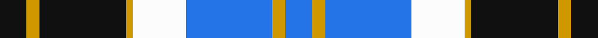
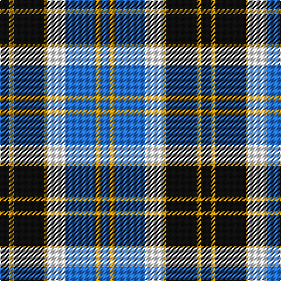

In pattern [BYBWYKYK](/stripes/bybwykyk/).

This was sourced from register-of-tartans.  It is a [8 stripe tartan](/stripes/stripes8/).

Original link https://www.tartanregister.gov.uk/tartanDetails.aspx?ref=195

## Register references

External register numbers recorded for this tartan.

- Scottish Register of Tartans: [195](https://www.tartanregister.gov.uk/tartanDetails.aspx?ref=195)
- Scottish Tartans Authority (ITI): 665
- Scottish Tartans World Register: 665

## Thread count
K/8 DY4 K26 DY2 W16 B26 DY4 B/8

## Palette
Each colour and the base-6 reference it is a variant of.

| Colour | Shade | Base |
|---|---|---|
| B | <code style="background-color:#2474E8;">#2474E8</code> `oklch(57.8% 0.192 258.7)` <small>#2474E8</small> | B <code style="background-color:#2A418A;">#2A418A</code> |
| DY | <code style="background-color:#D09800;">#D09800</code> `oklch(71.4% 0.147 82.1)` <small>#D09800</small> | Y <code style="background-color:#F2BF00;">#F2BF00</code> |
| K | <code style="background-color:#101010;">#101010</code> `oklch(17.3% 0.000 89.9)` <small>#101010</small> | K <code style="background-color:#000000;">#000000</code> |
| W | <code style="background-color:#FCFCFC;">#FCFCFC</code> `oklch(99.1% 0.000 89.9)` <small>#FCFCFC</small> | W <code style="background-color:#F7F7F7;">#F7F7F7</code> |

# Sample pattern

## Nearest tartans

The nearest existing variants by ΔTartan distance.

1. [(1) Abercrombie](/setts/s9/b27w2b14k14lg4k4lg4k4lg27/) — ΔT 0.74
1. [Strathclyde](/setts/s7/k2b16w2k16w15k2w2~x2/) — ΔT 0.94
1. [Bannockbane, Blue](/setts/s8/k4ly2k13ly1w8t13ly2t4~x2/) — ΔT 1.00
1. [Ferguson Dress #2](/setts/s7/db68k42w32r5w32dg4w6/) — ΔT 1.08
1. [Trillard (Personal)](/setts/s12/b4r3k3r6k8b10w8k12w8b24k2b2~x2/) — ΔT 1.10
1. [Bannockbane Silver](/setts/s8/db3dr2db18dr1w10o18dr2o3~x2/) — ΔT 1.16
1. [Keela (Corporate)](/setts/s7/dt7w3dt2w6dt16t26r4~x2/) — ΔT 1.18
1. [Thom(p)son, Navy](/setts/s7/r3db15w13o6db2o2r2~x2/) — ΔT 1.18
1. [Sneddon, Jonathan Taylor (Personal)](/setts/s8/b15k2w2k2w2k16lr22ly2~x4/) — ΔT 1.19
1. [Blue Boy, The (Fashion)](/setts/s7/db1g7db7db2w6db1w1~x4/) — ΔT 1.24

## Neighbour map

Every grey dot is one of 14299 variants placed by the first two principal components of the ΔTartan feature space (44% of its variance). Red is this tartan; blue dots are its nearest — click one to open its page.

<svg viewBox="0 0 640 380" role="img" style="max-width:100%;height:auto;border:1px solid #e0e0e0;border-radius:4px;display:block" xmlns="http://www.w3.org/2000/svg"><image href="/nn/cloud.v1.png" width="640" height="380"/><a href="/setts/s9/b27w2b14k14lg4k4lg4k4lg27/"><circle cx="184.6" cy="159.4" r="4" fill="#3465a4"><title>(1) Abercrombie</title></circle></a><a href="/setts/s7/k2b16w2k16w15k2w2~x2/"><circle cx="129.1" cy="187.9" r="4" fill="#3465a4"><title>Strathclyde</title></circle></a><a href="/setts/s8/k4ly2k13ly1w8t13ly2t4~x2/"><circle cx="146.5" cy="171.4" r="4" fill="#3465a4"><title>Bannockbane, Blue</title></circle></a><a href="/setts/s7/db68k42w32r5w32dg4w6/"><circle cx="160.2" cy="148.1" r="4" fill="#3465a4"><title>Ferguson Dress #2</title></circle></a><a href="/setts/s12/b4r3k3r6k8b10w8k12w8b24k2b2~x2/"><circle cx="176.5" cy="159.2" r="4" fill="#3465a4"><title>Trillard (Personal)</title></circle></a><a href="/setts/s8/db3dr2db18dr1w10o18dr2o3~x2/"><circle cx="202.0" cy="152.3" r="4" fill="#3465a4"><title>Bannockbane Silver</title></circle></a><a href="/setts/s7/dt7w3dt2w6dt16t26r4~x2/"><circle cx="213.5" cy="181.9" r="4" fill="#3465a4"><title>Keela (Corporate)</title></circle></a><a href="/setts/s7/r3db15w13o6db2o2r2~x2/"><circle cx="151.7" cy="188.8" r="4" fill="#3465a4"><title>Thom(p)son, Navy</title></circle></a><a href="/setts/s8/b15k2w2k2w2k16lr22ly2~x4/"><circle cx="134.8" cy="147.2" r="4" fill="#3465a4"><title>Sneddon, Jonathan Taylor (Personal)</title></circle></a><a href="/setts/s7/db1g7db7db2w6db1w1~x4/"><circle cx="116.2" cy="202.4" r="4" fill="#3465a4"><title>Blue Boy, The (Fashion)</title></circle></a><circle cx="149.3" cy="172.1" r="5" fill="#c00000"/></svg>

ID: /setts/s8/k4lo2k13lo1w8b13lo2b4~x2/
