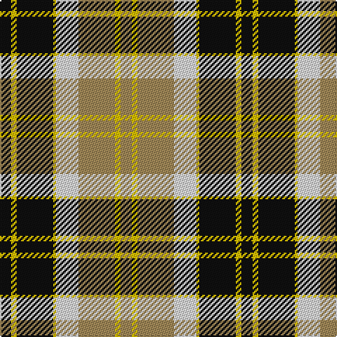

This page is one **sett** — a single exact thread-count. It belongs to the [tartan](/tartans/k4ly2k13ly1w8lo13ly2lo4/)
(the same proportion at any scale), whose colour order is pattern [KYKYWYYY](/stripes/kykywyyy/).

Sourced from register-of-tartans.  It is a [8 stripe tartan](/stripes/stripes8/).

Original link https://www.tartanregister.gov.uk/tartanDetails.aspx?ref=203

## Register references

External register numbers recorded for this tartan.

- Scottish Register of Tartans: [203](https://www.tartanregister.gov.uk/tartanDetails.aspx?ref=203)
- Scottish Tartans Authority (ITI): 1273
- Scottish Tartans World Register: 1273

## Thread count
K/8 Y4 K26 Y2 LN16 LT26 Y4 LT/8

## Palette

Palette: <strong>Tartan Register</strong>
<table><thead><tr><th>Colour</th><th>Threads</th><th>Shade</th><th>Base</th><th>OKLCh</th></tr></thead><tbody><tr><td>K/</td><td style="text-align:right;font-variant-numeric:tabular-nums">8</td><td><code style="background-color:#101010;">#101010</code> <small style="color:#888">#101010</small></td><td>K <code style="background-color:#000000;">#000000</code></td><td><small style="color:#888">oklch(17.3% 0.000 89.9)</small></td></tr><tr><td>Y</td><td style="text-align:right;font-variant-numeric:tabular-nums">4</td><td><code style="background-color:#E8C000;">#E8C000</code> <small style="color:#888">#E8C000</small></td><td>Y <code style="background-color:#F2BF00;">#F2BF00</code></td><td><small style="color:#888">oklch(81.9% 0.168 93.7)</small></td></tr><tr><td>K</td><td style="text-align:right;font-variant-numeric:tabular-nums">26</td><td><code style="background-color:#101010;">#101010</code> <small style="color:#888">#101010</small></td><td>K <code style="background-color:#000000;">#000000</code></td><td><small style="color:#888">oklch(17.3% 0.000 89.9)</small></td></tr><tr><td>Y</td><td style="text-align:right;font-variant-numeric:tabular-nums">2</td><td><code style="background-color:#E8C000;">#E8C000</code> <small style="color:#888">#E8C000</small></td><td>Y <code style="background-color:#F2BF00;">#F2BF00</code></td><td><small style="color:#888">oklch(81.9% 0.168 93.7)</small></td></tr><tr><td>LN</td><td style="text-align:right;font-variant-numeric:tabular-nums">16</td><td><code style="background-color:#E0E0E0;">#E0E0E0</code> <small style="color:#888">#E0E0E0</small></td><td>W <code style="background-color:#F7F7F7;">#F7F7F7</code></td><td><small style="color:#888">oklch(90.7% 0.000 89.9)</small></td></tr><tr><td>LT</td><td style="text-align:right;font-variant-numeric:tabular-nums">26</td><td><code style="background-color:#A08858;">#A08858</code> <small style="color:#888">#A08858</small></td><td>Y <code style="background-color:#F2BF00;">#F2BF00</code></td><td><small style="color:#888">oklch(63.7% 0.071 84.0)</small></td></tr><tr><td>Y</td><td style="text-align:right;font-variant-numeric:tabular-nums">4</td><td><code style="background-color:#E8C000;">#E8C000</code> <small style="color:#888">#E8C000</small></td><td>Y <code style="background-color:#F2BF00;">#F2BF00</code></td><td><small style="color:#888">oklch(81.9% 0.168 93.7)</small></td></tr><tr><td>LT/</td><td style="text-align:right;font-variant-numeric:tabular-nums">8</td><td><code style="background-color:#A08858;">#A08858</code> <small style="color:#888">#A08858</small></td><td>Y <code style="background-color:#F2BF00;">#F2BF00</code></td><td><small style="color:#888">oklch(63.7% 0.071 84.0)</small></td></tr></tbody></table>

# Sample pattern

## Nearest tartans

The nearest existing variants by ΔTartan distance, with this tartan at the top so the swatches line up against it.

ΔTartan

Tartan

Sett

—

<a href="/ttd/edit/#slug=k4ly2k13ly1w8lo13ly2lo4~x2">Bannockbane Light Tan</a> <a class="nn-out" href="/setts/s8/k4ly2k13ly1w8lo13ly2lo4~x2/" title="open its dictionary page">↗</a>

0.50

<a href="/ttd/edit/#slug=dg2dr8dg8o3dr1w12dg2dr1~x2">National Trust</a> <a class="nn-out" href="/setts/s8/dg2dr8dg8o3dr1w12dg2dr1~x2/" title="open its dictionary page">↗</a>

0.55

<a href="/ttd/edit/#slug=k4ly2k13ly1w8o13ly2o4~x2">Bannockbane Grey #1</a> <a class="nn-out" href="/setts/s8/k4ly2k13ly1w8o13ly2o4~x2/" title="open its dictionary page">↗</a>

0.75

<a href="/ttd/edit/#slug=g2do8g8lo3do1w12g2do1~x2">National Trust</a> <a class="nn-out" href="/setts/s8/g2do8g8lo3do1w12g2do1~x2/" title="open its dictionary page">↗</a>

0.80

<a href="/ttd/edit/#slug=ly6k6y30k8lb18k6ly3~x2">Cape Breton (yellow stripes)</a> <a class="nn-out" href="/setts/s7/ly6k6y30k8lb18k6ly3~x2/" title="open its dictionary page">↗</a>

0.80

<a href="/ttd/edit/#slug=dg3o2dg14o1w10y14o2y3~x2">Bannockbane Hunting (MacBean and Bishop)</a> <a class="nn-out" href="/setts/s8/dg3o2dg14o1w10y14o2y3~x2/" title="open its dictionary page">↗</a>

0.84

<a href="/ttd/edit/#slug=k3g2k10w11g1dy10g2dy3~x6">Dalveen (1981)</a> <a class="nn-out" href="/setts/s8/k3g2k10w11g1dy10g2dy3~x6/" title="open its dictionary page">↗</a>

0.84

<a href="/ttd/edit/#slug=dr4ly2dr13ly1w8t13ly2t4~x2">Bannockbane, Dark Tan</a> <a class="nn-out" href="/setts/s8/dr4ly2dr13ly1w8t13ly2t4~x2/" title="open its dictionary page">↗</a>

0.88

<a href="/ttd/edit/#slug=lo9k32g6lb20lo3lb9k5~x2">Black &amp; White Golf (Corporate)</a> <a class="nn-out" href="/setts/s7/lo9k32g6lb20lo3lb9k5~x2/" title="open its dictionary page">↗</a>

0.89

<a href="/ttd/edit/#slug=r2lo20k5w10k10w2~x2">Thompson Camel Clan Tartan Tartan Number: 2421. Earliest known date: 1967 Designed by Scotty Thompson. It it a simple colour variation on the usual blue Thompson, but is often confused with the Burberry Check. See products available Copyright © Blair Urquhart, Comrie, 2015</a> <a class="nn-out" href="/setts/s6/r2lo20k5w10k10w2~x2/" title="open its dictionary page">↗</a>

0.97

<a href="/ttd/edit/#slug=db4dy3db21dy2w14o22dy3o4~x2">Bannock Bane M.407</a> <a class="nn-out" href="/setts/s8/db4dy3db21dy2w14o22dy3o4~x2/" title="open its dictionary page">↗</a>

## Neighbour map

Every grey dot is one of 14359 variants placed by the first two principal components of the ΔTartan feature space (44% of its variance). Red is this tartan; blue dots are its nearest — click one to open its page.

<svg viewBox="0 0 640 380" role="img" style="max-width:100%;height:auto;border:1px solid #e0e0e0;border-radius:4px;display:block" xmlns="http://www.w3.org/2000/svg"><image href="/nn/cloud.v1.png" width="640" height="380"/><a href="/setts/s8/dg2dr8dg8o3dr1w12dg2dr1~x2/"><circle cx="143.4" cy="169.9" r="4" fill="#3465a4"><title>National Trust</title></circle></a><a href="/setts/s8/k4ly2k13ly1w8o13ly2o4~x2/"><circle cx="151.5" cy="168.0" r="4" fill="#3465a4"><title>Bannockbane Grey #1</title></circle></a><a href="/setts/s8/g2do8g8lo3do1w12g2do1~x2/"><circle cx="144.5" cy="170.5" r="4" fill="#3465a4"><title>National Trust</title></circle></a><a href="/setts/s7/ly6k6y30k8lb18k6ly3~x2/"><circle cx="147.5" cy="180.6" r="4" fill="#3465a4"><title>Cape Breton (yellow stripes)</title></circle></a><a href="/setts/s8/dg3o2dg14o1w10y14o2y3~x2/"><circle cx="167.2" cy="168.1" r="4" fill="#3465a4"><title>Bannockbane Hunting (MacBean and Bishop)</title></circle></a><a href="/setts/s8/k3g2k10w11g1dy10g2dy3~x6/"><circle cx="125.8" cy="182.7" r="4" fill="#3465a4"><title>Dalveen (1981)</title></circle></a><a href="/setts/s8/dr4ly2dr13ly1w8t13ly2t4~x2/"><circle cx="163.3" cy="171.8" r="4" fill="#3465a4"><title>Bannockbane, Dark Tan</title></circle></a><a href="/setts/s7/lo9k32g6lb20lo3lb9k5~x2/"><circle cx="189.5" cy="180.8" r="4" fill="#3465a4"><title>Black &amp; White Golf (Corporate)</title></circle></a><a href="/setts/s6/r2lo20k5w10k10w2~x2/"><circle cx="175.6" cy="191.1" r="4" fill="#3465a4"><title>Thompson Camel Clan Tartan Tartan Number: 2421. Earliest known date: 1967 Designed by Scotty Thompson. It it a simple colour variation on the usual blue Thompson, but is often confused with the Burberry Check. See products available Copyright © Blair Urquhart, Comrie, 2015</title></circle></a><a href="/setts/s8/db4dy3db21dy2w14o22dy3o4~x2/"><circle cx="158.8" cy="167.9" r="4" fill="#3465a4"><title>Bannock Bane M.407</title></circle></a><circle cx="156.6" cy="169.1" r="5" fill="#c00000"/></svg>

ID: /setts/s8/k4ly2k13ly1w8lo13ly2lo4~x2/
