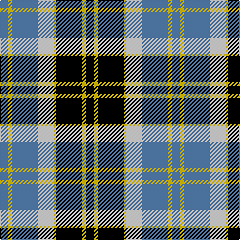

In pattern [BYBWYKYK](/stripes/bybwykyk/).

This was sourced from weddslist.  It is a [8 stripe tartan](/stripes/stripes8/).

Original link http://www.weddslist.com/cgi-bin/tartans/pg.pl?source=sts

## Also known as

This cloth is also recorded under:

- Bannockbane, Blue

## Attestations

This cloth appears in 2 source records; the oldest owns this page.

- undated — Bannockbane, Blue (weddslist, [record](http://www.weddslist.com/cgi-bin/tartans/pg.pl?source=sts))
- undated — Bannockbane Blue Trade Tartan Tartan Number: 665. Earliest known date: c.1984 A fashion pattern from the early 1970s. Other variants of the design appeared up to 1984. No place or family of the name is known and the pattern has no association with Bannockburn, or famous battle of 1314. Donald Broun may have been a designer with Edinburgh Woollen Mills. See products available Copyright © Blair Urquhart, Comrie, 2015 (house-of-tartan, [record](http://www.house-of-tartan.scotland.net/house/TartanViewjs.asp?colr=Def&tnam=665))

## Thread count
K/8 Y4 K26 Y2 LN16 B26 Y4 B/8

## Palette
Each colour and the base-6 reference it is a variant of.

| Colour | Shade | Base |
|---|---|---|
| B | <code style="background-color:#5480B0;">#5480B0</code> `oklch(58.8% 0.089 251.5)` <small>#5480B0</small> | B <code style="background-color:#2A418A;">#2A418A</code> |
| K | <code style="background-color:#000000;">#000000</code> `oklch(0.0% 0.000 0.0)` <small>#000000</small> | K <code style="background-color:#000000;">#000000</code> |
| LN | <code style="background-color:#E0E0E0;">#E0E0E0</code> `oklch(90.7% 0.000 89.9)` <small>#E0E0E0</small> | W <code style="background-color:#F7F7F7;">#F7F7F7</code> |
| Y | <code style="background-color:#F0C000;">#F0C000</code> `oklch(82.7% 0.169 90.5)` <small>#F0C000</small> | Y <code style="background-color:#F2BF00;">#F2BF00</code> |

# Sample pattern

## Nearest tartans

The nearest existing variants by ΔTartan distance.

1. [Unidentified (ex Tony Murray)](/setts/s8/dt8w22dt5w4k24r6k2r6~x2/) — ΔT 0.97
1. [Bannockbane Blue #1](/setts/s8/k4lo2k13lo1w8b13lo2b4~x2/) — ΔT 1.00
1. [Bannockbane Grey #1](/setts/s8/k4ly2k13ly1w8o13ly2o4~x2/) — ΔT 1.04
1. [Thom(p)son, Grey](/setts/s6/r2y20k5w10k10r2~x2/) — ΔT 1.07
1. [Kuznetsov (2014)](/setts/s7/db49ly12r12ly12dg32w8db3/) — ΔT 1.09
1. [Chieftain](/setts/s10/ly1k4db2k10w1db2w10db1w4ly1~x4/) — ΔT 1.10
1. [Unidentified #49](/setts/s10/lb16k4o1k2lb1k6dg6k1dg6lb1~x4/) — ΔT 1.16
1. [Bannock Bane M.407](/setts/s8/db4dy3db21dy2w14o22dy3o4~x2/) — ΔT 1.16
1. [Ailsa, Craig](/setts/s8/r5w2db20ly2k16w18k2w5~x2/) — ΔT 1.16
1. [Bannockbane, Dark Tan](/setts/s8/dr4ly2dr13ly1w8t13ly2t4~x2/) — ΔT 1.16

## Neighbour map

Every grey dot is one of 14299 variants placed by the first two principal components of the ΔTartan feature space (44% of its variance). Red is this tartan; blue dots are its nearest — click one to open its page.

<svg viewBox="0 0 640 380" role="img" style="max-width:100%;height:auto;border:1px solid #e0e0e0;border-radius:4px;display:block" xmlns="http://www.w3.org/2000/svg"><image href="/nn/cloud.v1.png" width="640" height="380"/><a href="/setts/s8/dt8w22dt5w4k24r6k2r6~x2/"><circle cx="140.2" cy="164.5" r="4" fill="#3465a4"><title>Unidentified (ex Tony Murray)</title></circle></a><a href="/setts/s8/k4lo2k13lo1w8b13lo2b4~x2/"><circle cx="149.3" cy="172.1" r="4" fill="#3465a4"><title>Bannockbane Blue #1</title></circle></a><a href="/setts/s8/k4ly2k13ly1w8o13ly2o4~x2/"><circle cx="152.2" cy="166.9" r="4" fill="#3465a4"><title>Bannockbane Grey #1</title></circle></a><a href="/setts/s6/r2y20k5w10k10r2~x2/"><circle cx="164.9" cy="190.5" r="4" fill="#3465a4"><title>Thom(p)son, Grey</title></circle></a><a href="/setts/s7/db49ly12r12ly12dg32w8db3/"><circle cx="157.0" cy="152.3" r="4" fill="#3465a4"><title>Kuznetsov (2014)</title></circle></a><a href="/setts/s10/ly1k4db2k10w1db2w10db1w4ly1~x4/"><circle cx="173.5" cy="154.8" r="4" fill="#3465a4"><title>Chieftain</title></circle></a><a href="/setts/s10/lb16k4o1k2lb1k6dg6k1dg6lb1~x4/"><circle cx="194.7" cy="139.9" r="4" fill="#3465a4"><title>Unidentified #49</title></circle></a><a href="/setts/s8/db4dy3db21dy2w14o22dy3o4~x2/"><circle cx="159.4" cy="166.8" r="4" fill="#3465a4"><title>Bannock Bane M.407</title></circle></a><a href="/setts/s8/r5w2db20ly2k16w18k2w5~x2/"><circle cx="116.9" cy="154.0" r="4" fill="#3465a4"><title>Ailsa, Craig</title></circle></a><a href="/setts/s8/dr4ly2dr13ly1w8t13ly2t4~x2/"><circle cx="163.9" cy="170.8" r="4" fill="#3465a4"><title>Bannockbane, Dark Tan</title></circle></a><circle cx="146.5" cy="171.4" r="5" fill="#c00000"/></svg>

ID: /setts/s8/k4ly2k13ly1w8t13ly2t4~x2/
