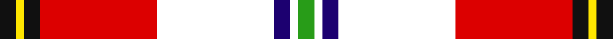
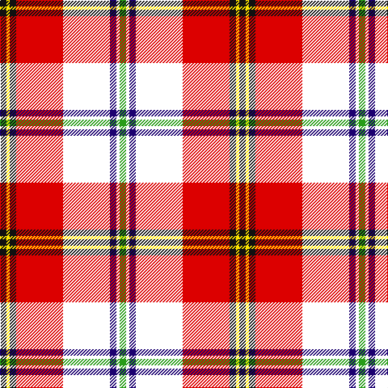

In pattern [GWBWRKYK](/stripes/gwbwrkyk/).

This was sourced from register-of-tartans.  It is a [8 stripe tartan](/stripes/stripes8/).

Original link https://www.tartanregister.gov.uk/tartanDetails.aspx?ref=11191

## Attestations

This cloth appears in 2 source records; the oldest owns this page.

- 26/11/2014 — Clan MacLeod Societies of Canada (register-of-tartans, [record](https://www.tartanregister.gov.uk/tartanDetails.aspx?ref=11191))
- 2014 — Clan MacLeod Societies of Canada (tartans-authority, [record](http://www.tartansauthority.com/tartan-ferret/display/11191/))

## Register references

External register numbers recorded for this tartan.

- Scottish Register of Tartans: [11191](https://www.tartanregister.gov.uk/tartanDetails.aspx?ref=11191)

## Thread count
K/8 Y4 K8 R58 W58 DB8 W4 G/8

## Palette
Each colour and the base-6 reference it is a variant of.

| Colour | Shade | Base |
|---|---|---|
| DB | <code style="background-color:#1C0070;">#1C0070</code> `oklch(26.3% 0.162 277.1)` <small>#1C0070</small> | B <code style="background-color:#2A418A;">#2A418A</code> |
| G | <code style="background-color:#289C18;">#289C18</code> `oklch(60.6% 0.191 141.6)` <small>#289C18</small> | G <code style="background-color:#006100;">#006100</code> |
| K | <code style="background-color:#101010;">#101010</code> `oklch(17.3% 0.000 89.9)` <small>#101010</small> | K <code style="background-color:#000000;">#000000</code> |
| R | <code style="background-color:#DC0000;">#DC0000</code> `oklch(56.2% 0.230 29.2)` <small>#DC0000</small> | R <code style="background-color:#CC0000;">#CC0000</code> |
| W | <code style="background-color:#FFFFFF;">#FFFFFF</code> `oklch(100.0% 0.000 89.9)` <small>#FFFFFF</small> | W <code style="background-color:#F7F7F7;">#F7F7F7</code> |
| Y | <code style="background-color:#FFE600;">#FFE600</code> `oklch(91.7% 0.192 101.4)` <small>#FFE600</small> | Y <code style="background-color:#F2BF00;">#F2BF00</code> |

# Sample pattern

## Nearest tartans

The nearest existing variants by ΔTartan distance.

1. [Oor Wullie (DC Thomson)](/setts/s7/ly3r3lo2r20k16w24w2~x2/) — ΔT 1.06
1. [Kyle, Pink (Dance)](/setts/s10/r17k1r2dp2r2k1r3dp8w17ly2~x4/) — ΔT 1.08
1. [MacKellar Dress Red](/setts/s11/r27w2r3p4r3w2r5k13r2w26dg3~x2/) — ΔT 1.14
1. [Crieff Red Dress (Dance)](/setts/s13/k2g2w2g3w33r2dp10r3g3r26g2r4r2~x2/) — ΔT 1.22
1. [Cape Breton Polish Society](/setts/s10/w3r28k1o5k1ly3g8r5w21k2~x2/) — ΔT 1.23
1. [Gillies Red Dress](/setts/s10/ly6k2r12dg4r8k10w24t2w3t2~x2/) — ΔT 1.23
1. [Christie (London)](/setts/s6/w5r25lt18g4k2ly5~x2/) — ΔT 1.26
1. [Etive, Burgundy (Dance)](/setts/s9/r15r1lg3k1w11r3lg3r3w1~x4/) — ΔT 1.28
1. [Cape Breton Polish Society](/setts/s10/w3r28k1lr5k1lo3dg8r5w21k2~x2/) — ΔT 1.30
1. [Virginia Military Institute (Milit.)](/setts/s9/r6w30r2k3r30g3r2w25r6~x2/) — ΔT 1.38

## Neighbour map

Every grey dot is one of 14299 variants placed by the first two principal components of the ΔTartan feature space (44% of its variance). Red is this tartan; blue dots are its nearest — click one to open its page.

<svg viewBox="0 0 640 380" role="img" style="max-width:100%;height:auto;border:1px solid #e0e0e0;border-radius:4px;display:block" xmlns="http://www.w3.org/2000/svg"><image href="/nn/cloud.v1.png" width="640" height="380"/><a href="/setts/s7/ly3r3lo2r20k16w24w2~x2/"><circle cx="120.4" cy="117.3" r="4" fill="#3465a4"><title>Oor Wullie (DC Thomson)</title></circle></a><a href="/setts/s10/r17k1r2dp2r2k1r3dp8w17ly2~x4/"><circle cx="200.4" cy="84.9" r="4" fill="#3465a4"><title>Kyle, Pink (Dance)</title></circle></a><a href="/setts/s11/r27w2r3p4r3w2r5k13r2w26dg3~x2/"><circle cx="178.7" cy="85.6" r="4" fill="#3465a4"><title>MacKellar Dress Red</title></circle></a><a href="/setts/s13/k2g2w2g3w33r2dp10r3g3r26g2r4r2~x2/"><circle cx="170.9" cy="54.0" r="4" fill="#3465a4"><title>Crieff Red Dress (Dance)</title></circle></a><a href="/setts/s10/w3r28k1o5k1ly3g8r5w21k2~x2/"><circle cx="201.8" cy="59.6" r="4" fill="#3465a4"><title>Cape Breton Polish Society</title></circle></a><a href="/setts/s10/ly6k2r12dg4r8k10w24t2w3t2~x2/"><circle cx="104.2" cy="104.3" r="4" fill="#3465a4"><title>Gillies Red Dress</title></circle></a><a href="/setts/s6/w5r25lt18g4k2ly5~x2/"><circle cx="166.6" cy="129.5" r="4" fill="#3465a4"><title>Christie (London)</title></circle></a><a href="/setts/s9/r15r1lg3k1w11r3lg3r3w1~x4/"><circle cx="205.0" cy="114.9" r="4" fill="#3465a4"><title>Etive, Burgundy (Dance)</title></circle></a><a href="/setts/s10/w3r28k1lr5k1lo3dg8r5w21k2~x2/"><circle cx="201.4" cy="54.3" r="4" fill="#3465a4"><title>Cape Breton Polish Society</title></circle></a><a href="/setts/s9/r6w30r2k3r30g3r2w25r6~x2/"><circle cx="236.5" cy="100.3" r="4" fill="#3465a4"><title>Virginia Military Institute (Milit.)</title></circle></a><circle cx="166.7" cy="86.6" r="5" fill="#c00000"/></svg>

ID: /setts/s8/k4ly2k4r29w29db4w2g4~x2/
