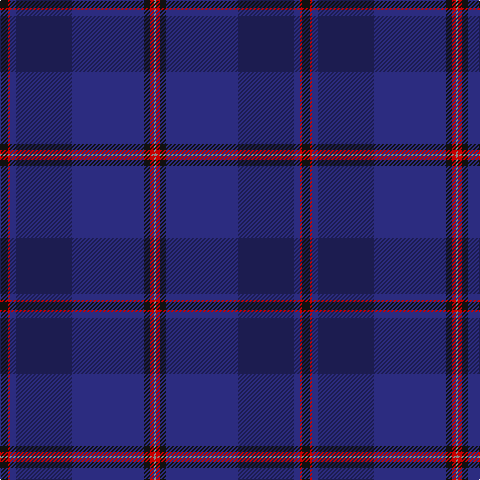

**Bands:** [KRBBBKRR](/stripes/krbbbkrr/) · **Stripes:** [K R DB DB DB K R O](/stripes/stripes8/) K R DB DB DB K R O

This was sourced from tartans-authority.  It is a [8 band tartan](/bands/bands8/).

Original link http://www.tartansauthority.com/tartan-ferret/display/7832/

## Attestations

This cloth appears in 2 source records; the oldest owns this page.

- pre 2008 — ODL (Corporate) (tartans-authority, [record](http://www.tartansauthority.com/tartan-ferret/display/7832/))
- undated — ODL (register-of-tartans, [record](https://www.tartanregister.gov.uk/tartanDetails.aspx?ref=5785))

## Register references

External register numbers recorded for this tartan.

- Scottish Register of Tartans: [5785](https://www.tartanregister.gov.uk/tartanDetails.aspx?ref=5785)
- Scottish Tartans Authority (ITI): 7832

## Thread count
K/8 R2 DBa6 DB56 DBa72 K6 R4 N/2

## Palette
Each colour and its ΔE from the base-6 reference it is a variant of.

| Colour | Shade | Base | ΔE (OKLab) |
|---|---|---|---|
| DB | <code style="background-color:#1C1C50;">#1C1C50</code> `#1C1C50` | B <code style="background-color:#2A418A;">#2A418A</code> | 0.14 |
| DBa | <code style="background-color:#2C2C80;">#2C2C80</code> `#2C2C80` | B <code style="background-color:#2A418A;">#2A418A</code> | 0.06 |
| K | <code style="background-color:#101010;">#101010</code> `#101010` | K <code style="background-color:#000000;">#000000</code> | 0.17 |
| N | <code style="background-color:#888888;">#888888</code> `#888888` | R <code style="background-color:#CC0000;">#CC0000</code> | 0.24 |
| R | <code style="background-color:#C80000;">#C80000</code> `#C80000` | R <code style="background-color:#CC0000;">#CC0000</code> | 0.01 |

# Sample pattern

## Nearest tartans

The nearest existing variants by ΔTartan distance.

1. [Scottish Thistle](/setts/s10/dt2k3dt33k11k3dt3dp15dt4o1dt2~x2/) — ΔT 1.35
1. [Payne (Name)](/setts/s14/db2k1db4db5dp3db20k8db4k1db2k1db33ly1db1~x2/) — ΔT 1.40
1. [Rutherford, John (Personal)](/setts/s7/db64r3k3r3dp61dg5dp6~x2/) — ΔT 1.42
1. [Spirit of Wales (Fashion)](/setts/s10/dt4dp2dt22k2dt1db2dt1k2db24w2~x2/) — ΔT 1.44
1. [Little Hunting](/setts/s8/db5db3db4db3db4k28db8r1~x2/) — ΔT 1.69
1. [Finnie (Personal)](/setts/s8/k4y1dp5y1k20db37y4db4~x2/) — ΔT 1.69
1. [US Navy Edzell](/setts/s6/dt104db16w8db66r3db16/) — ΔT 1.76
1. [Scottish Heritage](/setts/s8/k2db6k1db7dg13k11db42r2~x2/) — ΔT 1.81
1. [Dauphinee, Andrew Hunter (Personal)](/setts/s9/r3dt32db2dt3db4dt2db16w1db1~x2/) — ΔT 1.86
1. [Scottish Canals Corporate Tartan Tartan Number: 3916. Earliest known date: 2001 Designed by Claire Donaldson of House of Edgar for BWB. Initially called Highland Canals, later changed (April 2002) to Caledonian Canal and then in January 2003 to Scottish Canals. See products available Copyright © Blair Urquhart, Comrie, 2015](/setts/s12/g2db1db29db2g9db26ly2~x2/) — ΔT 1.88

## Neighbour map

Every grey dot is one of 14299 variants placed by the first two principal components of the ΔTartan feature space (44% of its variance). Red is this tartan; blue dots are its nearest — click one to open its page.

<svg viewBox="0 0 640 380" role="img" style="max-width:100%;height:auto;border:1px solid #e0e0e0;border-radius:4px;display:block" xmlns="http://www.w3.org/2000/svg"><image href="/nn/cloud.v1.png" width="640" height="380"/><a href="/setts/s10/dt2k3dt33k11k3dt3dp15dt4o1dt2~x2/"><circle cx="458.2" cy="186.2" r="4" fill="#3465a4"><title>Scottish Thistle</title></circle></a><a href="/setts/s14/db2k1db4db5dp3db20k8db4k1db2k1db33ly1db1~x2/"><circle cx="463.0" cy="166.0" r="4" fill="#3465a4"><title>Payne (Name)</title></circle></a><a href="/setts/s7/db64r3k3r3dp61dg5dp6~x2/"><circle cx="430.9" cy="204.3" r="4" fill="#3465a4"><title>Rutherford, John (Personal)</title></circle></a><a href="/setts/s10/dt4dp2dt22k2dt1db2dt1k2db24w2~x2/"><circle cx="397.9" cy="182.7" r="4" fill="#3465a4"><title>Spirit of Wales (Fashion)</title></circle></a><a href="/setts/s8/db5db3db4db3db4k28db8r1~x2/"><circle cx="474.5" cy="230.1" r="4" fill="#3465a4"><title>Little Hunting</title></circle></a><a href="/setts/s8/k4y1dp5y1k20db37y4db4~x2/"><circle cx="466.4" cy="197.5" r="4" fill="#3465a4"><title>Finnie (Personal)</title></circle></a><a href="/setts/s6/dt104db16w8db66r3db16/"><circle cx="458.5" cy="228.8" r="4" fill="#3465a4"><title>US Navy Edzell</title></circle></a><a href="/setts/s8/k2db6k1db7dg13k11db42r2~x2/"><circle cx="461.5" cy="178.8" r="4" fill="#3465a4"><title>Scottish Heritage</title></circle></a><a href="/setts/s9/r3dt32db2dt3db4dt2db16w1db1~x2/"><circle cx="529.3" cy="204.8" r="4" fill="#3465a4"><title>Dauphinee, Andrew Hunter (Personal)</title></circle></a><a href="/setts/s12/g2db1db29db2g9db26ly2~x2/"><circle cx="376.5" cy="198.2" r="4" fill="#3465a4"><title>Scottish Canals Corporate Tartan Tartan Number: 3916. Earliest known date: 2001 Designed by Claire Donaldson of House of Edgar for BWB. Initially called Highland Canals, later changed (April 2002) to Caledonian Canal and then in January 2003 to Scottish Canals. See products available Copyright © Blair Urquhart, Comrie, 2015</title></circle></a><circle cx="452.8" cy="184.2" r="5" fill="#c00000"/></svg>

ID: /setts/s8/k4r1db3db28db36k3r2o1~x2/
