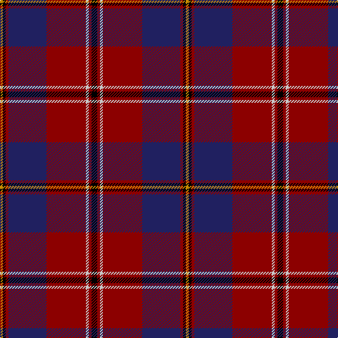

In pattern [KRWRBRKY](/stripes/krwrbrky/).

This was sourced from tartans-authority.  It is a [8 stripe tartan](/stripes/stripes8/).

Original link http://www.tartansauthority.com/tartan-ferret/display/3044/

## Attestations

This cloth appears in 2 source records; the oldest owns this page.

- 2000 April — Toronto Fire Services (Corporate) (tartans-authority, [record](http://www.tartansauthority.com/tartan-ferret/display/3044/))
- undated — Toronto Fire Services (register-of-tartans, [record](https://www.tartanregister.gov.uk/tartanDetails.aspx?ref=5375))

## Register references

External register numbers recorded for this tartan.

- Scottish Register of Tartans: [5375](https://www.tartanregister.gov.uk/tartanDetails.aspx?ref=5375)
- Scottish Tartans Authority (ITI): 3044

## Thread count
K/8 DR4 N4 DR56 DB54 DR4 K4 DY/4

## Palette
Each colour and the base-6 reference it is a variant of.

| Colour | Shade | Base |
|---|---|---|
| DB | <code style="background-color:#202060;">#202060</code> `oklch(28.9% 0.111 276.9)` <small>#202060</small> | B <code style="background-color:#2A418A;">#2A418A</code> |
| DR | <code style="background-color:#8C0000;">#8C0000</code> `oklch(40.2% 0.165 29.2)` <small>#8C0000</small> | R <code style="background-color:#CC0000;">#CC0000</code> |
| DY | <code style="background-color:#C88C00;">#C88C00</code> `oklch(68.2% 0.142 78.2)` <small>#C88C00</small> | Y <code style="background-color:#F2BF00;">#F2BF00</code> |
| K | <code style="background-color:#000000;">#000000</code> `oklch(0.0% 0.000 0.0)` <small>#000000</small> | K <code style="background-color:#000000;">#000000</code> |
| N | <code style="background-color:#C8C8C8;">#C8C8C8</code> `oklch(83.3% 0.000 89.9)` <small>#C8C8C8</small> | W <code style="background-color:#F7F7F7;">#F7F7F7</code> |

# Sample pattern

## Nearest tartans

The nearest existing variants by ΔTartan distance, with this tartan at the top so the swatches line up against it.

ΔTartan

Tartan

Sett

—

<a href="/ttd/edit/#slug=k4r2lb2r28db27r2k2lo2~x2">Toronto Fire Services (Corporate)</a> <a class="nn-out" href="/setts/s8/k4r2lb2r28db27r2k2lo2~x2/" title="open its dictionary page">↗</a>

1.13

<a href="/ttd/edit/#slug=r8m12k6m33k72o6k8w6">Sreijsener (Name)</a> <a class="nn-out" href="/setts/s8/r8m12k6m33k72o6k8w6/" title="open its dictionary page">↗</a>

1.16

<a href="/ttd/edit/#slug=k2db2g2db22r4g3r3g2r22k2r2ly2~x2">Harris, Jeffrey S (Personal)</a> <a class="nn-out" href="/setts/s12/k2db2g2db22r4g3r3g2r22k2r2ly2~x2/" title="open its dictionary page">↗</a>

1.22

<a href="/ttd/edit/#slug=r4ly2r34db10y4db4t4db23w3~x2">Heirloom Red Alba (Fashion)</a> <a class="nn-out" href="/setts/s9/r4ly2r34db10y4db4t4db23w3~x2/" title="open its dictionary page">↗</a>

1.22

<a href="/ttd/edit/#slug=ly4k30dr30k2dr2ly2k2dr5w5g2~x2">Haileybury</a> <a class="nn-out" href="/setts/s10/ly4k30dr30k2dr2ly2k2dr5w5g2~x2/" title="open its dictionary page">↗</a>

1.23

<a href="/ttd/edit/#slug=db2r2db28k11r27w2r2~x2">Americana - 1978 #2 (Fashion)</a> <a class="nn-out" href="/setts/s7/db2r2db28k11r27w2r2~x2/" title="open its dictionary page">↗</a>

1.23

<a href="/ttd/edit/#slug=r9k3r9k2b4k4dp4k3dp2k32y6~x2">Brotherhood of Dirk (Corporate)</a> <a class="nn-out" href="/setts/s11/r9k3r9k2b4k4dp4k3dp2k32y6~x2/" title="open its dictionary page">↗</a>

1.27

<a href="/ttd/edit/#slug=dt50r26k9r4w2lo2r10~x2">Java Saint Andrew Society Dress</a> <a class="nn-out" href="/setts/s7/dt50r26k9r4w2lo2r10~x2/" title="open its dictionary page">↗</a>

1.28

<a href="/ttd/edit/#slug=dp3lo2r19r4dp6k36dp2lo3~x2">Hyland Evening (Personal)</a> <a class="nn-out" href="/setts/s8/dp3lo2r19r4dp6k36dp2lo3~x2/" title="open its dictionary page">↗</a>

1.29

<a href="/ttd/edit/#slug=db6r1db2r1db2k18r8g2~x4">Brown Family Tartan Tartan Number: 432. Earliest known date: 1850 The Scott Adie collection, a book of manufacturers samples, was recently sold at auction. The book is dated 1850 and the samples are thought to represent the tartans available for purchase between 1840-50. See products available Copyright © Blair Urquhart, Comrie, 2015</a> <a class="nn-out" href="/setts/s8/db6r1db2r1db2k18r8g2~x4/" title="open its dictionary page">↗</a>

1.30

<a href="/ttd/edit/#slug=k5k5k2r47k18w2k5dg9k7w3~x2">Rikaco Holiday</a> <a class="nn-out" href="/setts/s10/k5k5k2r47k18w2k5dg9k7w3~x2/" title="open its dictionary page">↗</a>

## Neighbour map

Every grey dot is one of 14299 variants placed by the first two principal components of the ΔTartan feature space (44% of its variance). Red is this tartan; blue dots are its nearest — click one to open its page.

<svg viewBox="0 0 640 380" role="img" style="max-width:100%;height:auto;border:1px solid #e0e0e0;border-radius:4px;display:block" xmlns="http://www.w3.org/2000/svg"><image href="/nn/cloud.v1.png" width="640" height="380"/><a href="/setts/s8/r8m12k6m33k72o6k8w6/"><circle cx="319.5" cy="153.6" r="4" fill="#3465a4"><title>Sreijsener (Name)</title></circle></a><a href="/setts/s12/k2db2g2db22r4g3r3g2r22k2r2ly2~x2/"><circle cx="269.9" cy="134.3" r="4" fill="#3465a4"><title>Harris, Jeffrey S (Personal)</title></circle></a><a href="/setts/s9/r4ly2r34db10y4db4t4db23w3~x2/"><circle cx="252.8" cy="123.7" r="4" fill="#3465a4"><title>Heirloom Red Alba (Fashion)</title></circle></a><a href="/setts/s10/ly4k30dr30k2dr2ly2k2dr5w5g2~x2/"><circle cx="257.4" cy="123.6" r="4" fill="#3465a4"><title>Haileybury</title></circle></a><a href="/setts/s7/db2r2db28k11r27w2r2~x2/"><circle cx="270.5" cy="168.0" r="4" fill="#3465a4"><title>Americana - 1978 #2 (Fashion)</title></circle></a><a href="/setts/s11/r9k3r9k2b4k4dp4k3dp2k32y6~x2/"><circle cx="314.7" cy="133.5" r="4" fill="#3465a4"><title>Brotherhood of Dirk (Corporate)</title></circle></a><a href="/setts/s7/dt50r26k9r4w2lo2r10~x2/"><circle cx="313.7" cy="134.4" r="4" fill="#3465a4"><title>Java Saint Andrew Society Dress</title></circle></a><a href="/setts/s8/dp3lo2r19r4dp6k36dp2lo3~x2/"><circle cx="254.5" cy="113.0" r="4" fill="#3465a4"><title>Hyland Evening (Personal)</title></circle></a><a href="/setts/s8/db6r1db2r1db2k18r8g2~x4/"><circle cx="284.9" cy="164.4" r="4" fill="#3465a4"><title>Brown Family Tartan Tartan Number: 432. Earliest known date: 1850 The Scott Adie collection, a book of manufacturers samples, was recently sold at auction. The book is dated 1850 and the samples are thought to represent the tartans available for purchase between 1840-50. See products available Copyright © Blair Urquhart, Comrie, 2015</title></circle></a><a href="/setts/s10/k5k5k2r47k18w2k5dg9k7w3~x2/"><circle cx="278.6" cy="115.4" r="4" fill="#3465a4"><title>Rikaco Holiday</title></circle></a><circle cx="294.4" cy="144.3" r="5" fill="#c00000"/></svg>

ID: /setts/s8/k4r2lb2r28db27r2k2lo2~x2/
