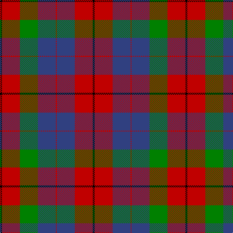

This page is one **sett** — a single exact thread-count. It belongs to the [tartan](/tartans/k4r37db37r2db37g37r37k4/)
(the same proportion at any scale), whose colour order is pattern [KRBRBGRK](/stripes/krbrbgrk/).

Sourced from weddslist.  It is a [8 stripe tartan](/stripes/stripes8/).

Original link http://www.weddslist.com/cgi-bin/tartans/pg.pl?source=sts

## Also known as

This cloth is also recorded under:

- Skene, of Cromar

## Thread count
K/4 R37 G37 B37 R2 B37 R37 K/4

## Palette

Palette: <strong>Ingles Buchan</strong> <small style="color:#888">(1 of 4 colours)</small>
<table><thead><tr><th>Colour</th><th>Threads</th><th>Shade</th><th>Base</th><th>OKLCh</th></tr></thead><tbody><tr><td>K/</td><td style="text-align:right;font-variant-numeric:tabular-nums">4</td><td><code style="background-color:#000000;">#000000</code> <small style="color:#888">#000000</small></td><td>K <code style="background-color:#000000;">#000000</code></td><td><small style="color:#888">oklch(0.0% 0.000 0.0)</small></td></tr><tr><td>R</td><td style="text-align:right;font-variant-numeric:tabular-nums">37</td><td><code style="background-color:#C00000;">#C00000</code> <small style="color:#888">#C00000</small></td><td>R <code style="background-color:#CC0000;">#CC0000</code></td><td><small style="color:#888">oklch(50.7% 0.208 29.2)</small></td></tr><tr><td>G</td><td style="text-align:right;font-variant-numeric:tabular-nums">37</td><td><code style="background-color:#008000;">#008000</code> <small style="color:#888">#008000</small></td><td>G <code style="background-color:#006100;">#006100</code></td><td><small style="color:#888">oklch(52.0% 0.177 142.5)</small></td></tr><tr><td>B</td><td style="text-align:right;font-variant-numeric:tabular-nums">37</td><td><code style="background-color:#304080;">#304080</code> <small style="color:#888">#304080</small></td><td>B <code style="background-color:#2A418A;">#2A418A</code></td><td><small style="color:#888">oklch(39.4% 0.109 270.2)</small></td></tr><tr><td>R</td><td style="text-align:right;font-variant-numeric:tabular-nums">2</td><td><code style="background-color:#C00000;">#C00000</code> <small style="color:#888">#C00000</small></td><td>R <code style="background-color:#CC0000;">#CC0000</code></td><td><small style="color:#888">oklch(50.7% 0.208 29.2)</small></td></tr><tr><td>B</td><td style="text-align:right;font-variant-numeric:tabular-nums">37</td><td><code style="background-color:#304080;">#304080</code> <small style="color:#888">#304080</small></td><td>B <code style="background-color:#2A418A;">#2A418A</code></td><td><small style="color:#888">oklch(39.4% 0.109 270.2)</small></td></tr><tr><td>R</td><td style="text-align:right;font-variant-numeric:tabular-nums">37</td><td><code style="background-color:#C00000;">#C00000</code> <small style="color:#888">#C00000</small></td><td>R <code style="background-color:#CC0000;">#CC0000</code></td><td><small style="color:#888">oklch(50.7% 0.208 29.2)</small></td></tr><tr><td>K/</td><td style="text-align:right;font-variant-numeric:tabular-nums">4</td><td><code style="background-color:#000000;">#000000</code> <small style="color:#888">#000000</small></td><td>K <code style="background-color:#000000;">#000000</code></td><td><small style="color:#888">oklch(0.0% 0.000 0.0)</small></td></tr></tbody></table>

# Sample pattern

## Nearest tartans

The nearest existing variants by ΔTartan distance, with this tartan at the top so the swatches line up against it.

ΔTartan

Tartan

Sett

—

<a href="/ttd/edit/#slug=k4r37db37r2db37g37r37k4">Skene, of Cromar</a> <a class="nn-out" href="/setts/s8/k4r37db37r2db37g37r37k4/" title="open its dictionary page">↗</a>

0.45

<a href="/ttd/edit/#slug=k4r37db37r2db37g37r37k4~x2">Skene of Cromar - 1950 (Clan)</a> <a class="nn-out" href="/setts/s8/k4r37db37r2db37g37r37k4~x2/" title="open its dictionary page">↗</a>

0.65

<a href="/setts/s8/db18r18dp2g12db1~x4/">Wyeth (Personal)</a>

0.78

<a href="/ttd/edit/#slug=db1r5dg18r4db9r10w1~x4">MacKintosh Geddes</a> <a class="nn-out" href="/setts/s7/db1r5dg18r4db9r10w1~x4/" title="open its dictionary page">↗</a>

0.89

<a href="/ttd/edit/#slug=r12ly4r38dg25db8dg10db8dg8db25r3">MacEdward (Personal)</a> <a class="nn-out" href="/setts/s10/r12ly4r38dg25db8dg10db8dg8db25r3/" title="open its dictionary page">↗</a>

0.95

<a href="/ttd/edit/#slug=r25g10db30w4db30g10r25w2~x2">Highland Spring Dress (2004)</a> <a class="nn-out" href="/setts/s8/r25g10db30w4db30g10r25w2~x2/" title="open its dictionary page">↗</a>

1.04

<a href="/ttd/edit/#slug=dp1r5g15r3dp9r10w1~x4">Geddes</a> <a class="nn-out" href="/setts/s7/dp1r5g15r3dp9r10w1~x4/" title="open its dictionary page">↗</a>

1.06

<a href="/ttd/edit/#slug=dg12g6dg6r15k1r1k2~x2">Cook (Name)</a> <a class="nn-out" href="/setts/s7/dg12g6dg6r15k1r1k2~x2/" title="open its dictionary page">↗</a>

1.07

<a href="/ttd/edit/#slug=db8r8dg17w3r35db10dg15w3~x2">James of Glencarr (Personal)</a> <a class="nn-out" href="/setts/s8/db8r8dg17w3r35db10dg15w3~x2/" title="open its dictionary page">↗</a>

1.12

<a href="/ttd/edit/#slug=db18r18dp2g12db1~x4">Wyeth (Personal)</a> <a class="nn-out" href="/setts/s5/db18r18dp2g12db1~x4/" title="open its dictionary page">↗</a>

1.12

<a href="/ttd/edit/#slug=o2dr14o1k14o14ly2~x2">United Distillers</a> <a class="nn-out" href="/setts/s6/o2dr14o1k14o14ly2~x2/" title="open its dictionary page">↗</a>

## Neighbour map

Every grey dot is one of 14359 variants placed by the first two principal components of the ΔTartan feature space (44% of its variance). Red is this tartan; blue dots are its nearest — click one to open its page.

<svg viewBox="0 0 640 380" role="img" style="max-width:100%;height:auto;border:1px solid #e0e0e0;border-radius:4px;display:block" xmlns="http://www.w3.org/2000/svg"><image href="/nn/cloud.v1.png" width="640" height="380"/><a href="/setts/s8/k4r37db37r2db37g37r37k4~x2/"><circle cx="234.4" cy="191.1" r="4" fill="#3465a4"><title>Skene of Cromar - 1950 (Clan)</title></circle></a><a href="/setts/s8/db18r18dp2g12db1~x4/"><circle cx="251.3" cy="189.4" r="4" fill="#3465a4"><title>Wyeth (Personal)</title></circle></a><a href="/setts/s7/db1r5dg18r4db9r10w1~x4/"><circle cx="249.2" cy="180.8" r="4" fill="#3465a4"><title>MacKintosh Geddes</title></circle></a><a href="/setts/s10/r12ly4r38dg25db8dg10db8dg8db25r3/"><circle cx="215.0" cy="184.9" r="4" fill="#3465a4"><title>MacEdward (Personal)</title></circle></a><a href="/setts/s8/r25g10db30w4db30g10r25w2~x2/"><circle cx="231.0" cy="198.0" r="4" fill="#3465a4"><title>Highland Spring Dress (2004)</title></circle></a><a href="/setts/s7/dp1r5g15r3dp9r10w1~x4/"><circle cx="242.8" cy="188.2" r="4" fill="#3465a4"><title>Geddes</title></circle></a><a href="/setts/s7/dg12g6dg6r15k1r1k2~x2/"><circle cx="252.7" cy="191.9" r="4" fill="#3465a4"><title>Cook (Name)</title></circle></a><a href="/setts/s8/db8r8dg17w3r35db10dg15w3~x2/"><circle cx="227.4" cy="186.1" r="4" fill="#3465a4"><title>James of Glencarr (Personal)</title></circle></a><a href="/setts/s5/db18r18dp2g12db1~x4/"><circle cx="241.5" cy="208.1" r="4" fill="#3465a4"><title>Wyeth (Personal)</title></circle></a><a href="/setts/s6/o2dr14o1k14o14ly2~x2/"><circle cx="204.0" cy="194.3" r="4" fill="#3465a4"><title>United Distillers</title></circle></a><circle cx="228.2" cy="189.1" r="5" fill="#c00000"/></svg>

ID: /setts/s8/k4r37db37r2db37g37r37k4/
