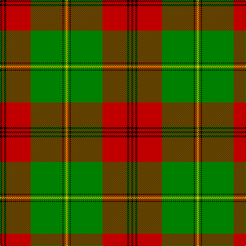

In pattern [KRKRGKGY](/patterns/krkrgkgy/).

This was sourced from weddslist.  It is a [8 stripes tartan](/stripes/stripes8/).

Original link http://www.weddslist.com/cgi-bin/tartans/pg.pl?source=sts

## Thread count
K/4 R4 K4 R48 G62 K2 G4 Y/4

## Palette
Each colour and its ΔE from the base-6 reference it is a variant of.

| Colour | Shade | Base | ΔE (OKLab) |
|---|---|---|---|
| G | <code style="background-color:#008000;">#008000</code> `#008000` | G <code style="background-color:#006400;">#006400</code> | 0.09 |
| K | <code style="background-color:#000000;">#000000</code> `#000000` | K <code style="background-color:#000000;">#000000</code> | 0.00 |
| R | <code style="background-color:#C00000;">#C00000</code> `#C00000` | R <code style="background-color:#C80000;">#C80000</code> | 0.02 |
| Y | <code style="background-color:#F0C000;">#F0C000</code> `#F0C000` | Y <code style="background-color:#E8C000;">#E8C000</code> | 0.01 |

# Sample pattern

## Nearest tartans

The nearest existing variants by ΔTartan distance.

1. [MacDonald of Kingsburgh Clan Tartan Tartan Number: 1562. Earliest known date: 1746 D.W.Stewart recorded this pattern from a relic, worn by Prince Charles Edward, and hidden in a cleft of a rock, to be recovered later and eventually preserved in the Advocates' Library in Edinburgh. See products available Copyright © Blair Urquhart, Comrie, 2015](/setts/s9/r6g6y2r36w2g42y2g2y6-g006818-rc80000-we0e0e0-ye8c000/) — ΔT 0.99
1. [MacDonald of Kingsburgh](/setts/s9/r6g6y2r36w2g42y2g2y6-g008000-rc00000-we0e0e0-yf0c000/) — ΔT 1.06
1. [MacDonald of Kingsburgh -1746 (Clan)](/setts/s9/g16ga2g2ga84w4r80g4ga4r6-g308024-ga003814-rc85840-wfcfcfc/) — ΔT 1.13
1. [Pollock Clan Tartan Tartan Number: 867. Earliest known date: 1980 Based on the Maxwell sett which in turn comes from the Vestiarium Scoticum (1842). Details of the Clan Society's design came from Rhys A Pollock in America. Pollocks were feudal dependents of the Maxwells who lived in the Scottish Lowlands. See products available Copyright © Blair Urquhart, Comrie, 2015](/setts/s7/g6r32w8k12g56r2g6-g006818-k101010-rc80000-we0e0e0/) — ΔT 1.13
1. [Pollock](/setts/s7/g6r32w8k12g56r2g6-g008000-k000000-rc00000-we0e0e0/) — ΔT 1.19
1. [Oriel](/setts/s9/r24b4r6g40k8g40r60k4r2-b304080-g008000-k000000-rc00000/) — ΔT 1.23
1. [Brisbane (Artefact)](/setts/s8/g72w12y4r8y4r12y4r40-g006818-rc80000-wffffff-ye8c000/) — ΔT 1.23
1. [Brisbane (Artefact)](/setts/s8/g72w12y4r8y4r12y4r40-g006818-rc80000-wc0c0c0-ye8c000/) — ΔT 1.28
1. [MacMillan Anc (Clans Originaux)](/setts/s11/y20k4g6k4g80k4g6r50g12y20k2-g006818-k101010-r901c38-yd8b000/) — ΔT 1.30
1. [Longmore (Name)](/setts/s9/g30y6g54r4g4r66b4w2b8-b1474b4-g006818-rc80000-we0e0e0-ye8c000/) — ΔT 1.37

## Neighbour map

Every grey dot is one of 15726 variants placed by the first two principal components of the ΔTartan feature space (44% of its variance). Red is this tartan; blue dots are its nearest — click one to open its page.

<svg viewBox="0 0 640 380" role="img" style="max-width:100%;height:auto;border:1px solid #e0e0e0;border-radius:4px;display:block" xmlns="http://www.w3.org/2000/svg"><image href="/nn/cloud.v1.png" width="640" height="380"/><a href="/setts/s9/r6g6y2r36w2g42y2g2y6-g006818-rc80000-we0e0e0-ye8c000/"><circle cx="325.6" cy="130.7" r="4" fill="#3465a4"><title>MacDonald of Kingsburgh Clan Tartan Tartan Number: 1562. Earliest known date: 1746 D.W.Stewart recorded this pattern from a relic, worn by Prince Charles Edward, and hidden in a cleft of a rock, to be recovered later and eventually preserved in the Advocates' Library in Edinburgh. See products available Copyright © Blair Urquhart, Comrie, 2015</title></circle></a><a href="/setts/s9/r6g6y2r36w2g42y2g2y6-g008000-rc00000-we0e0e0-yf0c000/"><circle cx="323.8" cy="130.5" r="4" fill="#3465a4"><title>MacDonald of Kingsburgh</title></circle></a><a href="/setts/s9/g16ga2g2ga84w4r80g4ga4r6-g308024-ga003814-rc85840-wfcfcfc/"><circle cx="339.2" cy="103.2" r="4" fill="#3465a4"><title>MacDonald of Kingsburgh -1746 (Clan)</title></circle></a><a href="/setts/s7/g6r32w8k12g56r2g6-g006818-k101010-rc80000-we0e0e0/"><circle cx="339.5" cy="148.9" r="4" fill="#3465a4"><title>Pollock Clan Tartan Tartan Number: 867. Earliest known date: 1980 Based on the Maxwell sett which in turn comes from the Vestiarium Scoticum (1842). Details of the Clan Society's design came from Rhys A Pollock in America. Pollocks were feudal dependents of the Maxwells who lived in the Scottish Lowlands. See products available Copyright © Blair Urquhart, Comrie, 2015</title></circle></a><a href="/setts/s7/g6r32w8k12g56r2g6-g008000-k000000-rc00000-we0e0e0/"><circle cx="320.3" cy="142.0" r="4" fill="#3465a4"><title>Pollock</title></circle></a><a href="/setts/s9/r24b4r6g40k8g40r60k4r2-b304080-g008000-k000000-rc00000/"><circle cx="323.3" cy="137.5" r="4" fill="#3465a4"><title>Oriel</title></circle></a><a href="/setts/s8/g72w12y4r8y4r12y4r40-g006818-rc80000-wffffff-ye8c000/"><circle cx="281.1" cy="138.9" r="4" fill="#3465a4"><title>Brisbane (Artefact)</title></circle></a><a href="/setts/s8/g72w12y4r8y4r12y4r40-g006818-rc80000-wc0c0c0-ye8c000/"><circle cx="296.0" cy="145.9" r="4" fill="#3465a4"><title>Brisbane (Artefact)</title></circle></a><a href="/setts/s11/y20k4g6k4g80k4g6r50g12y20k2-g006818-k101010-r901c38-yd8b000/"><circle cx="319.8" cy="106.5" r="4" fill="#3465a4"><title>MacMillan Anc (Clans Originaux)</title></circle></a><a href="/setts/s9/g30y6g54r4g4r66b4w2b8-b1474b4-g006818-rc80000-we0e0e0-ye8c000/"><circle cx="331.1" cy="112.5" r="4" fill="#3465a4"><title>Longmore (Name)</title></circle></a><circle cx="339.1" cy="115.6" r="5" fill="#c00000"/></svg>

ID: /setts/s8/k4r4k4r48g62k2g4y4-g008000-k000000-rc00000-yf0c000/
