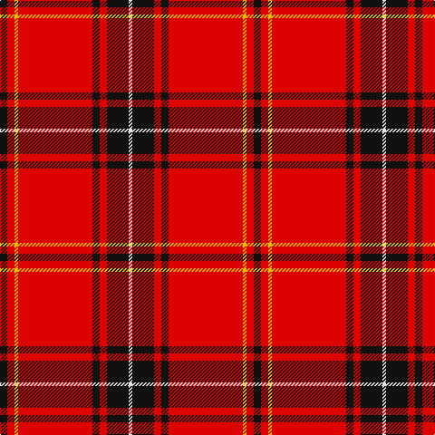

This page is one **sett** — a single exact thread-count. It belongs to the [tartan](/tartans/k4r4y2r41k4r4k12ln2/)
(the same proportion at any scale), whose colour order is pattern [KRYRKRKW](/stripes/kryrkrkw/).

Sourced from register-of-tartans.  It is a [8 stripe tartan](/stripes/stripes8/).

Original link https://www.tartanregister.gov.uk/tartanDetails.aspx?ref=15

## Also known as

This cloth is also recorded under:

- Aberdeen F. C.

2 attestations — the source records this cloth was collapsed from (oldest owns this page)

<ul>
<li>13/05/2002 — Aberdeen Football Club (2002) (register-of-tartans, <a href="https://www.tartanregister.gov.uk/tartanDetails.aspx?ref=15">record</a>)</li>
<li>May 2002 — Aberdeen F. C. (2002) (Sports) (tartans-authority, <a href="http://www.tartansauthority.com/tartan-ferret/display/4536/">record</a>)</li>
</ul>

## Register references

External register numbers recorded for this tartan.

- Scottish Register of Tartans: [15](https://www.tartanregister.gov.uk/tartanDetails.aspx?ref=15)
- Scottish Tartans World Register: 2892

## Thread count
K/8 R8 Y4 R82 K8 R8 K24 LN/4

## Palette
Each colour and the base-6 reference it is a variant of.

| Colour | Shade | Base |
|---|---|---|
| K | <code style="background-color:#101010;">#101010</code> `oklch(17.3% 0.000 89.9)` <small>#101010</small> | K <code style="background-color:#000000;">#000000</code> |
| LN | <code style="background-color:#E0E0E0;">#E0E0E0</code> `oklch(90.7% 0.000 89.9)` <small>#E0E0E0</small> | W <code style="background-color:#F7F7F7;">#F7F7F7</code> |
| R | <code style="background-color:#DC0000;">#DC0000</code> `oklch(56.2% 0.230 29.2)` <small>#DC0000</small> | R <code style="background-color:#CC0000;">#CC0000</code> |
| Y | <code style="background-color:#E8C000;">#E8C000</code> `oklch(81.9% 0.168 93.7)` <small>#E8C000</small> | Y <code style="background-color:#F2BF00;">#F2BF00</code> |

# Sample pattern

## Nearest tartans

The nearest existing variants by ΔTartan distance, with this tartan at the top so the swatches line up against it.

ΔTartan

Tartan

Sett

—

<a href="/ttd/edit/#slug=k4r4ly2r41k4r4k12w2~x2">Aberdeen Football Club (2002)</a> <a class="nn-out" href="/setts/s8/k4r4ly2r41k4r4k12w2~x2/" title="open its dictionary page">↗</a>

1.00

<a href="/ttd/edit/#slug=r12dg6k1dg2k1dg1k6r24lb2~x2">Stuart of Bute</a> <a class="nn-out" href="/setts/s9/r12dg6k1dg2k1dg1k6r24lb2~x2/" title="open its dictionary page">↗</a>

1.01

<a href="/ttd/edit/#slug=r12y6k1y2k1y1k6r24w2~x4">Stuart of Bute</a> <a class="nn-out" href="/setts/s9/r12y6k1y2k1y1k6r24w2~x4/" title="open its dictionary page">↗</a>

1.04

<a href="/ttd/edit/#slug=r18k1ly3k1lr1r3k2r2lr2~x4">Anthony Plaid Red</a> <a class="nn-out" href="/setts/s9/r18k1ly3k1lr1r3k2r2lr2~x4/" title="open its dictionary page">↗</a>

1.10

<a href="/ttd/edit/#slug=r4g13r3k4r3k3r40k4r2o4~x2">Galway</a> <a class="nn-out" href="/setts/s10/r4g13r3k4r3k3r40k4r2o4~x2/" title="open its dictionary page">↗</a>

1.13

<a href="/ttd/edit/#slug=r12g6k1g2k1g1k6r24w2~x4">Stuart of Bute, The Htg (Clan)</a> <a class="nn-out" href="/setts/s9/r12g6k1g2k1g1k6r24w2~x4/" title="open its dictionary page">↗</a>

1.13

<a href="/ttd/edit/#slug=r12g6k1g2k1g1k6r24w2~x2">Stuart/Stewart of Bute</a> <a class="nn-out" href="/setts/s9/r12g6k1g2k1g1k6r24w2~x2/" title="open its dictionary page">↗</a>

1.20

<a href="/ttd/edit/#slug=r8w4r50k12r4k15g5~x2">Instakilt, Red (Fashion)</a> <a class="nn-out" href="/setts/s7/r8w4r50k12r4k15g5~x2/" title="open its dictionary page">↗</a>

1.25

<a href="/ttd/edit/#slug=k2r1k2r14w1r1w1~x8">White Stripes Dress, (Corporate)</a> <a class="nn-out" href="/setts/s7/k2r1k2r14w1r1w1~x8/" title="open its dictionary page">↗</a>

1.25

<a href="/ttd/edit/#slug=r58k12r4k2ly2k2r10w5k2ly4~x2">Unnamed C20th - Skirt</a> <a class="nn-out" href="/setts/s10/r58k12r4k2ly2k2r10w5k2ly4~x2/" title="open its dictionary page">↗</a>

1.26

<a href="/ttd/edit/#slug=r64k8w3k8w3b4w3r18~x2">Inverness - 2000 (Fashion)</a> <a class="nn-out" href="/setts/s8/r64k8w3k8w3b4w3r18~x2/" title="open its dictionary page">↗</a>

## Neighbour map

Every grey dot is one of 14299 variants placed by the first two principal components of the ΔTartan feature space (44% of its variance). Red is this tartan; blue dots are its nearest — click one to open its page.

<svg viewBox="0 0 640 380" role="img" style="max-width:100%;height:auto;border:1px solid #e0e0e0;border-radius:4px;display:block" xmlns="http://www.w3.org/2000/svg"><image href="/nn/cloud.v1.png" width="640" height="380"/><a href="/setts/s9/r12dg6k1dg2k1dg1k6r24lb2~x2/"><circle cx="400.2" cy="118.2" r="4" fill="#3465a4"><title>Stuart of Bute</title></circle></a><a href="/setts/s9/r12y6k1y2k1y1k6r24w2~x4/"><circle cx="413.8" cy="120.3" r="4" fill="#3465a4"><title>Stuart of Bute</title></circle></a><a href="/setts/s9/r18k1ly3k1lr1r3k2r2lr2~x4/"><circle cx="442.3" cy="126.0" r="4" fill="#3465a4"><title>Anthony Plaid Red</title></circle></a><a href="/setts/s10/r4g13r3k4r3k3r40k4r2o4~x2/"><circle cx="411.0" cy="114.1" r="4" fill="#3465a4"><title>Galway</title></circle></a><a href="/setts/s9/r12g6k1g2k1g1k6r24w2~x4/"><circle cx="416.7" cy="125.0" r="4" fill="#3465a4"><title>Stuart of Bute, The Htg (Clan)</title></circle></a><a href="/setts/s9/r12g6k1g2k1g1k6r24w2~x2/"><circle cx="396.1" cy="117.3" r="4" fill="#3465a4"><title>Stuart/Stewart of Bute</title></circle></a><a href="/setts/s7/r8w4r50k12r4k15g5~x2/"><circle cx="366.4" cy="150.1" r="4" fill="#3465a4"><title>Instakilt, Red (Fashion)</title></circle></a><a href="/setts/s7/k2r1k2r14w1r1w1~x8/"><circle cx="475.9" cy="146.0" r="4" fill="#3465a4"><title>White Stripes Dress, (Corporate)</title></circle></a><a href="/setts/s10/r58k12r4k2ly2k2r10w5k2ly4~x2/"><circle cx="477.3" cy="90.5" r="4" fill="#3465a4"><title>Unnamed C20th - Skirt</title></circle></a><a href="/setts/s8/r64k8w3k8w3b4w3r18~x2/"><circle cx="484.4" cy="126.4" r="4" fill="#3465a4"><title>Inverness - 2000 (Fashion)</title></circle></a><circle cx="435.5" cy="115.7" r="5" fill="#c00000"/></svg>

ID: /setts/s8/k4r4ly2r41k4r4k12w2~x2/
