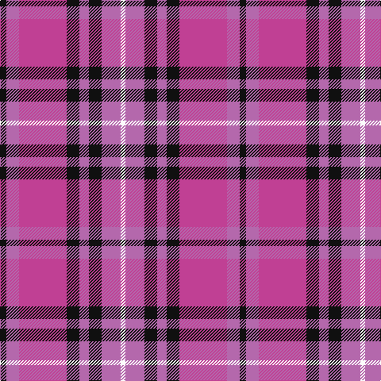

In pattern [KRRKRKRW](/patterns/krrkrkrw/).

This was sourced from tartans-authority.  It is a [8 stripes tartan](/stripes/stripes8/).

Original link http://www.tartansauthority.com/tartan-ferret/display/11005/

## Thread count
K/8 Pa16 P60 K16 Pa12 K16 Pa24 W/6

## Palette
Each colour and its ΔE from the base-6 reference it is a variant of.

| Colour | Shade | Base | ΔE (OKLab) |
|---|---|---|---|
| K | <code style="background-color:#101010;">#101010</code> `#101010` | K <code style="background-color:#000000;">#000000</code> | 0.17 |
| P | <code style="background-color:#C04094;">#C04094</code> `#C04094` | R <code style="background-color:#CC0000;">#CC0000</code> | 0.16 |
| Pa | <code style="background-color:#B468AC;">#B468AC</code> `#B468AC` | R <code style="background-color:#CC0000;">#CC0000</code> | 0.21 |
| W | <code style="background-color:#FCFCFC;">#FCFCFC</code> `#FCFCFC` | W <code style="background-color:#F7F7F7;">#F7F7F7</code> | 0.01 |

# Sample pattern

## Nearest tartans

The nearest existing variants by ΔTartan distance.

1. [Ainslie](/setts/s9/b12k3b2r2b2r12w2k1w2~b2c2c80-k101010-rc80000-wfcfcfc~x4/) — ΔT 1.30
1. [Brigadoon](/setts/s8/w4b19r4ba2r4ba23y4ba2~b1c1c50-ba780078-rc80000-we0e0e0-ye8c000~x2/) — ΔT 1.32
1. [Little's (Corporate)](/setts/s6/b1r8w1b4ra8w1~b1c1c50-r888888-ra901c38-we0e0e0~x6/) — ΔT 1.53
1. [Masai Shuka 17 (Artefact)](/setts/s6/k4b32r30b2w5k2~b4444bc-k101010-rc80000-we0e0e0~x2/) — ΔT 1.53
1. [Unnamed](/setts/s10/r18y2b6y2b4y2b12y3r4g2~b3850c8-g009468-r880000-yfccc00~x2/) — ΔT 1.54
1. [St George's School](/setts/s10/r10k4r4k6r28k10y4b30k4b7~b2c2c80-k101010-rc80000-ydc943c~x2/) — ΔT 1.55
1. [Harrower, John Anthony (Personal)](/setts/s8/g8b5k1b17r10b2r10w2~b3850c8-g003820-k101010-rff0000-wc8c8c8~x2/) — ΔT 1.55
1. [FC Barcelona (Corporate)](/setts/s10/r3b3r18ra2r2ra3r2ra4b18y2~b3850c8-r880000-rac80000-ye8c000~x2/) — ΔT 1.56
1. [Afternoon Tea / Assam](/setts/s6/r15ra98b72ba25b8w15~b440044-ba5f749c-re87878-ra901c38-wf0e0c8/) — ΔT 1.56
1. [Thompson/Thomson/MacTavish](/setts/s6/b2r12ba2b6k6b1~b3c82af-ba2c4084-k101010-rdc0000~x4/) — ΔT 1.57

## Neighbour map

Every grey dot is one of 15726 variants placed by the first two principal components of the ΔTartan feature space (44% of its variance). Red is this tartan; blue dots are its nearest — click one to open its page.

<svg viewBox="0 0 640 380" role="img" style="max-width:100%;height:auto;border:1px solid #e0e0e0;border-radius:4px;display:block" xmlns="http://www.w3.org/2000/svg"><image href="/nn/cloud.v1.png" width="640" height="380"/><a href="/setts/s9/b12k3b2r2b2r12w2k1w2~b2c2c80-k101010-rc80000-wfcfcfc~x4/"><circle cx="220.2" cy="156.3" r="4" fill="#3465a4"><title>Ainslie</title></circle></a><a href="/setts/s8/w4b19r4ba2r4ba23y4ba2~b1c1c50-ba780078-rc80000-we0e0e0-ye8c000~x2/"><circle cx="217.6" cy="151.9" r="4" fill="#3465a4"><title>Brigadoon</title></circle></a><a href="/setts/s6/b1r8w1b4ra8w1~b1c1c50-r888888-ra901c38-we0e0e0~x6/"><circle cx="182.0" cy="208.6" r="4" fill="#3465a4"><title>Little's (Corporate)</title></circle></a><a href="/setts/s6/k4b32r30b2w5k2~b4444bc-k101010-rc80000-we0e0e0~x2/"><circle cx="283.4" cy="165.2" r="4" fill="#3465a4"><title>Masai Shuka 17 (Artefact)</title></circle></a><a href="/setts/s10/r18y2b6y2b4y2b12y3r4g2~b3850c8-g009468-r880000-yfccc00~x2/"><circle cx="202.2" cy="169.2" r="4" fill="#3465a4"><title>Unnamed</title></circle></a><a href="/setts/s10/r10k4r4k6r28k10y4b30k4b7~b2c2c80-k101010-rc80000-ydc943c~x2/"><circle cx="206.1" cy="187.8" r="4" fill="#3465a4"><title>St George's School</title></circle></a><a href="/setts/s8/g8b5k1b17r10b2r10w2~b3850c8-g003820-k101010-rff0000-wc8c8c8~x2/"><circle cx="213.0" cy="154.8" r="4" fill="#3465a4"><title>Harrower, John Anthony (Personal)</title></circle></a><a href="/setts/s10/r3b3r18ra2r2ra3r2ra4b18y2~b3850c8-r880000-rac80000-ye8c000~x2/"><circle cx="267.8" cy="170.3" r="4" fill="#3465a4"><title>FC Barcelona (Corporate)</title></circle></a><a href="/setts/s6/r15ra98b72ba25b8w15~b440044-ba5f749c-re87878-ra901c38-wf0e0c8/"><circle cx="236.3" cy="177.8" r="4" fill="#3465a4"><title>Afternoon Tea / Assam</title></circle></a><a href="/setts/s6/b2r12ba2b6k6b1~b3c82af-ba2c4084-k101010-rdc0000~x4/"><circle cx="215.3" cy="194.3" r="4" fill="#3465a4"><title>Thompson/Thomson/MacTavish</title></circle></a><circle cx="200.2" cy="182.3" r="5" fill="#c00000"/></svg>

ID: /setts/s8/k4r8ra30k8r6k8r12w3~k101010-rb468ac-rac04094-wfcfcfc~x2/
