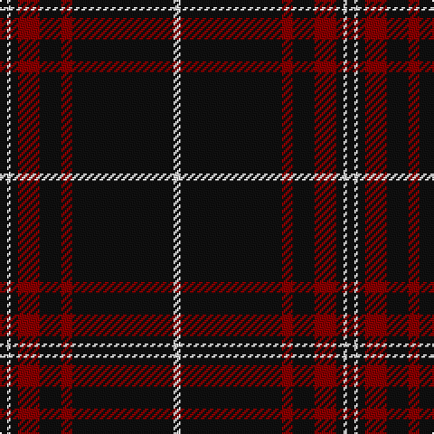

In pattern [KWKRKRKW](/patterns/kwkrkrkw/).

This was sourced from tartans-authority.  It is a [8 stripes tartan](/stripes/stripes8/).

Original link http://www.tartansauthority.com/tartan-ferret/display/6444/

## Thread count
K/4 LN2 K4 DR12 K12 DR6 K56 LN/4

## Palette
Each colour and its ΔE from the base-6 reference it is a variant of.

| Colour | Shade | Base | ΔE (OKLab) |
|---|---|---|---|
| DR | <code style="background-color:#880000;">#880000</code> `#880000` | R <code style="background-color:#C80000;">#C80000</code> | 0.14 |
| K | <code style="background-color:#101010;">#101010</code> `#101010` | K <code style="background-color:#000000;">#000000</code> | 0.17 |
| LN | <code style="background-color:#E0E0E0;">#E0E0E0</code> `#E0E0E0` | W <code style="background-color:#F4F4F0;">#F4F4F0</code> | 0.06 |

# Sample pattern

## Nearest tartans

The nearest existing variants by ΔTartan distance.

1. [Brockton](/setts/s8/k4w2k4r12k12r6k56w4-k101010-r880000-wffffff/) — ΔT 0.32
1. [Royal Army PTC Assoc. (Military)](/setts/s8/k118r6k12r6k16r30k4y6-k101010-rc80000-ye8c000/) — ΔT 0.50
1. [Maier (Personal)](/setts/s10/r14k6r6k44r6k6r6k74y4k8-k101010-rc80000-ye8c000/) — ΔT 1.02
1. [Menzies Hunting](/setts/s8/k96r8k4r8k12r4k6r18-k101010-rc80000/) — ΔT 1.12
1. [Sunderland of Scotland (Fashion)](/setts/s7/r4k84r20k12r20k36ra4-k101010-r888888-rac80000/) — ΔT 1.17
1. [Highland Brewing Company](/setts/s8/k84b4r6k10r32k16y4k6-b2888c4-k101010-ra00000-ye8c000/) — ΔT 1.20
1. [Whitaker (2014)](/setts/s8/k120r6k30r6w4r10b6r4-b3850c8-k101010-rdc0000-wc0c0c0/) — ΔT 1.21
1. [Harley Davidson](/setts/s10/k49r8k4b6ra4b6k4r8k49ra2-b5c5c5c-k101010-rb84c00-ra888888/) — ΔT 1.21
1. [Harvie Family Tartan Tartan Number: 1177. Earliest known date: 1985 LT = Grey-Brown See products available Copyright © Blair Urquhart, Comrie, 2015](/setts/s5/k8r22k64y2k8-k101010-rc80000-ye8c000/) — ΔT 1.25
1. [Harvie](/setts/s5/k8r22k64y2k8-k101010-rdc0000-ye8c000/) — ΔT 1.28

## Neighbour map

Every grey dot is one of 15726 variants placed by the first two principal components of the ΔTartan feature space (44% of its variance). Red is this tartan; blue dots are its nearest — click one to open its page.

<svg viewBox="0 0 640 380" role="img" style="max-width:100%;height:auto;border:1px solid #e0e0e0;border-radius:4px;display:block" xmlns="http://www.w3.org/2000/svg"><image href="/nn/cloud.v1.png" width="640" height="380"/><a href="/setts/s8/k4w2k4r12k12r6k56w4-k101010-r880000-wffffff/"><circle cx="520.7" cy="155.5" r="4" fill="#3465a4"><title>Brockton</title></circle></a><a href="/setts/s8/k118r6k12r6k16r30k4y6-k101010-rc80000-ye8c000/"><circle cx="539.0" cy="148.5" r="4" fill="#3465a4"><title>Royal Army PTC Assoc. (Military)</title></circle></a><a href="/setts/s10/r14k6r6k44r6k6r6k74y4k8-k101010-rc80000-ye8c000/"><circle cx="542.3" cy="171.3" r="4" fill="#3465a4"><title>Maier (Personal)</title></circle></a><a href="/setts/s8/k96r8k4r8k12r4k6r18-k101010-rc80000/"><circle cx="566.7" cy="174.0" r="4" fill="#3465a4"><title>Menzies Hunting</title></circle></a><a href="/setts/s7/r4k84r20k12r20k36ra4-k101010-r888888-rac80000/"><circle cx="479.3" cy="193.3" r="4" fill="#3465a4"><title>Sunderland of Scotland (Fashion)</title></circle></a><a href="/setts/s8/k84b4r6k10r32k16y4k6-b2888c4-k101010-ra00000-ye8c000/"><circle cx="480.0" cy="159.7" r="4" fill="#3465a4"><title>Highland Brewing Company</title></circle></a><a href="/setts/s8/k120r6k30r6w4r10b6r4-b3850c8-k101010-rdc0000-wc0c0c0/"><circle cx="566.6" cy="132.1" r="4" fill="#3465a4"><title>Whitaker (2014)</title></circle></a><a href="/setts/s10/k49r8k4b6ra4b6k4r8k49ra2-b5c5c5c-k101010-rb84c00-ra888888/"><circle cx="506.2" cy="151.7" r="4" fill="#3465a4"><title>Harley Davidson</title></circle></a><a href="/setts/s5/k8r22k64y2k8-k101010-rc80000-ye8c000/"><circle cx="547.9" cy="189.3" r="4" fill="#3465a4"><title>Harvie Family Tartan Tartan Number: 1177. Earliest known date: 1985 LT = Grey-Brown See products available Copyright © Blair Urquhart, Comrie, 2015</title></circle></a><a href="/setts/s5/k8r22k64y2k8-k101010-rdc0000-ye8c000/"><circle cx="540.0" cy="185.2" r="4" fill="#3465a4"><title>Harvie</title></circle></a><circle cx="530.2" cy="159.5" r="5" fill="#c00000"/></svg>

ID: /setts/s8/k4w2k4r12k12r6k56w4-k101010-r880000-we0e0e0/
