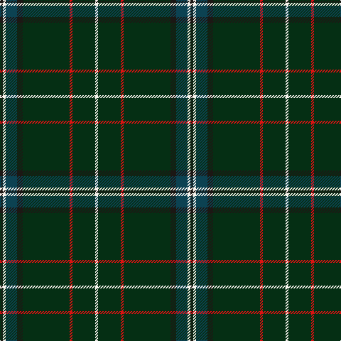

In pattern [KWBKGRGW](/patterns/kwbkgrgw/).

This was sourced from register-of-tartans.  It is a [8 stripes tartan](/stripes/stripes8/).

Original link https://www.tartanregister.gov.uk/tartanDetails.aspx?ref=10526

## Thread count
K/4 W4 DB16 K8 DG66 R4 DG32 W/4

## Palette
Each colour and its ΔE from the base-6 reference it is a variant of.

| Colour | Shade | Base | ΔE (OKLab) |
|---|---|---|---|
| DB | <code style="background-color:#0C4252;">#0C4252</code> `#0C4252` | B <code style="background-color:#2C4084;">#2C4084</code> | 0.10 |
| DG | <code style="background-color:#052F14;">#052F14</code> `#052F14` | G <code style="background-color:#006400;">#006400</code> | 0.19 |
| K | <code style="background-color:#1C1714;">#1C1714</code> `#1C1714` | K <code style="background-color:#000000;">#000000</code> | 0.21 |
| R | <code style="background-color:#DD1212;">#DD1212</code> `#DD1212` | R <code style="background-color:#C80000;">#C80000</code> | 0.05 |
| W | <code style="background-color:#F9F5EF;">#F9F5EF</code> `#F9F5EF` | W <code style="background-color:#F4F4F0;">#F4F4F0</code> | 0.01 |

# Sample pattern

ID: /setts/s8/k4w4b16k8g66r4g32w4-b0c4252-g052f14-k1c1714-rdd1212-wf9f5ef/
