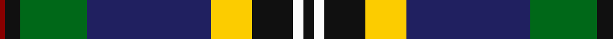
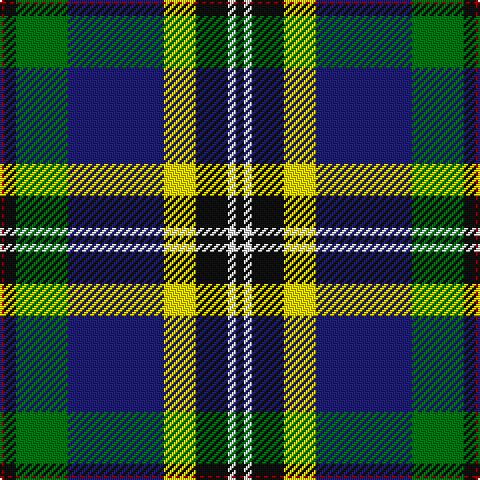

In pattern [KWKYBGKR](/patterns/kwkybgkr/).

This was sourced from tartans-authority.  It is a [8 stripes tartan](/stripes/stripes8/).

Original link http://www.tartansauthority.com/tartan-ferret/display/11053/

## Thread count
DR/2 K6 G26 DB48 Y16 K16 W4 K/4

## Palette
Each colour and its ΔE from the base-6 reference it is a variant of.

| Colour | Shade | Base | ΔE (OKLab) |
|---|---|---|---|
| DB | <code style="background-color:#202060;">#202060</code> `#202060` | B <code style="background-color:#2A418A;">#2A418A</code> | 0.11 |
| DR | <code style="background-color:#880000;">#880000</code> `#880000` | R <code style="background-color:#CC0000;">#CC0000</code> | 0.15 |
| G | <code style="background-color:#006818;">#006818</code> `#006818` | G <code style="background-color:#006100;">#006100</code> | 0.02 |
| K | <code style="background-color:#101010;">#101010</code> `#101010` | K <code style="background-color:#000000;">#000000</code> | 0.17 |
| W | <code style="background-color:#FCFCFC;">#FCFCFC</code> `#FCFCFC` | W <code style="background-color:#F7F7F7;">#F7F7F7</code> | 0.01 |
| Y | <code style="background-color:#FCCC00;">#FCCC00</code> `#FCCC00` | Y <code style="background-color:#F2BF00;">#F2BF00</code> | 0.04 |

# Sample pattern

## Nearest tartans

The nearest existing variants by ΔTartan distance.

1. [Vienna Highlander (Fashion)](/setts/s8/y6k4r30k20b46ra4b2w4-b14283c-k101010-r888888-rac8002c-wfcfcfc-yd09800/) — ΔT 0.71
1. [Climb, The](/setts/s8/y4g18k32r4b60y6g12w2-b5f749c-g23321b-k000000-rca2625-wf9f5ef-yb7d38b/) — ΔT 0.74
1. [Froben, Christian (Personal)](/setts/s8/k4w4k16y16b48g26k6r2-b141e46-g004c00-k101010-r781c38-wfcfcfc-ydc9436/) — ΔT 0.78
1. [Birch](/setts/s9/g6b8g46k20r4k20ba36k2w6-b800080-ba5480b0-g008000-k000000-rc00020-we0e0e0/) — ΔT 0.83
1. [Minnesota (District)](/setts/s8/k12w6k4b60r18k8g40y6-b2c2c80-g289c18-k101010-ra00024-we0e0e0-ye8c000/) — ΔT 0.85
1. [Bergen Scottish](/setts/s7/b10w6r24g74k24ba42w4-b2c2c80-ba202060-g006818-k101010-rc80000-wf8f8f8/) — ΔT 0.86
1. [Birch Family Tartan Tartan Number: 2157. Earliest known date: 1993 The Birch family tartan was designed and produced by Mr Robin Birch of Connell Reid kiltmaker, Blairgowrie. The new sett has been recorded by the Scottish Tartans Society. See products available Copyright © Blair Urquhart, Comrie, 2015](/setts/s9/g6b8g46k20r4k20ba36k2w6-b780078-ba5c8ca8-g006818-k101010-rc8002c-we0e0e0/) — ΔT 0.93
1. [Whitson Family Tartan Tartan Number: 1422. Earliest known date: 1984 UK Design No 514358 See products available Copyright © Blair Urquhart, Comrie, 2015](/setts/s9/w8k2g38y2k38b26r4b8r4-b2c2c80-g006818-k101010-rc80000-we0e0e0-ye8c000/) — ΔT 0.96
1. [Whitson](/setts/s9/w8k2g38y2k38b26r4b8r4-b304080-g008000-k000000-rc00000-we0e0e0-yf0c000/) — ΔT 1.01
1. [Brehat (Personal)](/setts/s11/g30b4r6w6ba6b3k14w14ba50g50w2-b780078-ba2c2c80-g006818-k101010-rc80000-wffffff/) — ΔT 1.07

## Neighbour map

Every grey dot is one of 15726 variants placed by the first two principal components of the ΔTartan feature space (44% of its variance). Red is this tartan; blue dots are its nearest — click one to open its page.

<svg viewBox="0 0 640 380" role="img" style="max-width:100%;height:auto;border:1px solid #e0e0e0;border-radius:4px;display:block" xmlns="http://www.w3.org/2000/svg"><image href="/nn/cloud.v1.png" width="640" height="380"/><a href="/setts/s8/y6k4r30k20b46ra4b2w4-b14283c-k101010-r888888-rac8002c-wfcfcfc-yd09800/"><circle cx="196.7" cy="117.2" r="4" fill="#3465a4"><title>Vienna Highlander (Fashion)</title></circle></a><a href="/setts/s8/y4g18k32r4b60y6g12w2-b5f749c-g23321b-k000000-rca2625-wf9f5ef-yb7d38b/"><circle cx="201.1" cy="99.3" r="4" fill="#3465a4"><title>Climb, The</title></circle></a><a href="/setts/s8/k4w4k16y16b48g26k6r2-b141e46-g004c00-k101010-r781c38-wfcfcfc-ydc9436/"><circle cx="182.3" cy="127.4" r="4" fill="#3465a4"><title>Froben, Christian (Personal)</title></circle></a><a href="/setts/s9/g6b8g46k20r4k20ba36k2w6-b800080-ba5480b0-g008000-k000000-rc00020-we0e0e0/"><circle cx="129.8" cy="116.8" r="4" fill="#3465a4"><title>Birch</title></circle></a><a href="/setts/s8/k12w6k4b60r18k8g40y6-b2c2c80-g289c18-k101010-ra00024-we0e0e0-ye8c000/"><circle cx="149.5" cy="131.5" r="4" fill="#3465a4"><title>Minnesota (District)</title></circle></a><a href="/setts/s7/b10w6r24g74k24ba42w4-b2c2c80-ba202060-g006818-k101010-rc80000-wf8f8f8/"><circle cx="165.2" cy="143.9" r="4" fill="#3465a4"><title>Bergen Scottish</title></circle></a><a href="/setts/s9/g6b8g46k20r4k20ba36k2w6-b780078-ba5c8ca8-g006818-k101010-rc8002c-we0e0e0/"><circle cx="155.2" cy="125.7" r="4" fill="#3465a4"><title>Birch Family Tartan Tartan Number: 2157. Earliest known date: 1993 The Birch family tartan was designed and produced by Mr Robin Birch of Connell Reid kiltmaker, Blairgowrie. The new sett has been recorded by the Scottish Tartans Society. See products available Copyright © Blair Urquhart, Comrie, 2015</title></circle></a><a href="/setts/s9/w8k2g38y2k38b26r4b8r4-b2c2c80-g006818-k101010-rc80000-we0e0e0-ye8c000/"><circle cx="138.3" cy="124.8" r="4" fill="#3465a4"><title>Whitson Family Tartan Tartan Number: 1422. Earliest known date: 1984 UK Design No 514358 See products available Copyright © Blair Urquhart, Comrie, 2015</title></circle></a><a href="/setts/s9/w8k2g38y2k38b26r4b8r4-b304080-g008000-k000000-rc00000-we0e0e0-yf0c000/"><circle cx="114.5" cy="116.5" r="4" fill="#3465a4"><title>Whitson</title></circle></a><a href="/setts/s11/g30b4r6w6ba6b3k14w14ba50g50w2-b780078-ba2c2c80-g006818-k101010-rc80000-wffffff/"><circle cx="187.5" cy="97.7" r="4" fill="#3465a4"><title>Brehat (Personal)</title></circle></a><circle cx="162.0" cy="116.9" r="5" fill="#c00000"/></svg>

ID: /setts/s8/k4w4k16y16b48g26k6r2-b202060-g006818-k101010-r880000-wfcfcfc-yfccc00/
