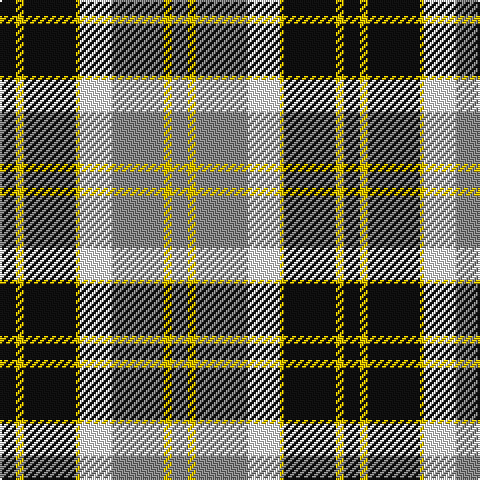

In pattern [KYKYWRYR](/patterns/kykywryr/).

This was sourced from register-of-tartans.  It is a [8 stripes tartan](/stripes/stripes8/).

Original link https://www.tartanregister.gov.uk/tartanDetails.aspx?ref=198

## Thread count
K/8 Y4 K26 Y2 W16 N26 Y4 N/8

## Palette
Each colour and its ΔE from the base-6 reference it is a variant of.

| Colour | Shade | Base | ΔE (OKLab) |
|---|---|---|---|
| K | <code style="background-color:#101010;">#101010</code> `#101010` | K <code style="background-color:#000000;">#000000</code> | 0.17 |
| N | <code style="background-color:#888888;">#888888</code> `#888888` | R <code style="background-color:#CC0000;">#CC0000</code> | 0.24 |
| W | <code style="background-color:#FCFCFC;">#FCFCFC</code> `#FCFCFC` | W <code style="background-color:#F7F7F7;">#F7F7F7</code> | 0.01 |
| Y | <code style="background-color:#E8C000;">#E8C000</code> `#E8C000` | Y <code style="background-color:#F2BF00;">#F2BF00</code> | 0.02 |

# Sample pattern

## Nearest tartans

The nearest existing variants by ΔTartan distance.

1. [Bannockbane, Dark Tan](/setts/s8/b4y2b13y1w8ba13y2ba4x2~b401000-ba5480b0-we0e0e0-yf0c000/) — ΔT 0.51
1. [Bannockbane Blue Trade Tartan Tartan Number: 665. Earliest known date: c.1984 A fashion pattern from the early 1970s. Other variants of the design appeared up to 1984. No place or family of the name is known and the pattern has no association with Bannockburn, or famous battle of 1314. Donald Broun may have been a designer with Edinburgh Woollen Mills. See products available Copyright © Blair Urquhart, Comrie, 2015](/setts/s8/b4y2b13w8y1k13y2k4x2~b5c8ca8-k101010-we0e0e0-ye8c000/) — ΔT 0.54
1. [Bannockbane Light Tan](/setts/s8/k4y2k13y1w8ya13y2ya4x2~k101010-we0e0e0-ye8c000-yaa08858/) — ΔT 0.56
1. [Cape Breton (yellow stripes)](/setts/s7/y6k6g30k8w18k6y3x2~g789484-k000000-wc0c0c0-ye8c000/) — ΔT 0.67
1. [National Trust](/setts/s8/g2b8g8r3b1w12g2b1x2~b401000-g004010-r906030-we0e0e0/) — ΔT 0.68
1. [Bannockbane Hunting (MacBean and Bishop)](/setts/s8/g3r2g14r1w10ga14r2ga3x2~g002814-ga808080-rbe7832-we0e0e0/) — ΔT 0.69
1. [Bannockbane Tan](/setts/s8/b4y2b13w13y1ba13y2ba4x2~b2888c4-ba441800-we0e0e0-ye8c000/) — ΔT 0.72
1. [Bannock Bane M.407](/setts/s8/b4g3b21g2w14r22g3r4x2~b080848-g604000-rbe7832-we0e0e0/) — ΔT 0.77
1. [Unidentified (ex Tony Murray)](/setts/s8/b8w22b5w4k24r6k2r6x2~b003c64-k101010-rc80000-we0e0e0/) — ΔT 0.78
1. [Black and White Golf](/setts/s7/y9k32g6w20y3w9k5x2~g008b00-k101010-wffffff-yd9b666/) — ΔT 0.93

## Neighbour map

Every grey dot is one of 15726 variants placed by the first two principal components of the ΔTartan feature space (44% of its variance). Red is this tartan; blue dots are its nearest — click one to open its page.

<svg viewBox="0 0 640 380" role="img" style="max-width:100%;height:auto;border:1px solid #e0e0e0;border-radius:4px;display:block" xmlns="http://www.w3.org/2000/svg"><image href="/nn/cloud.v1.png" width="640" height="380"/><a href="/setts/s8/b4y2b13y1w8ba13y2ba4x2~b401000-ba5480b0-we0e0e0-yf0c000/"><circle cx="161.4" cy="173.1" r="4" fill="#3465a4"><title>Bannockbane, Dark Tan</title></circle></a><a href="/setts/s8/b4y2b13w8y1k13y2k4x2~b5c8ca8-k101010-we0e0e0-ye8c000/"><circle cx="150.8" cy="174.4" r="4" fill="#3465a4"><title>Bannockbane Blue Trade Tartan Tartan Number: 665. Earliest known date: c.1984 A fashion pattern from the early 1970s. Other variants of the design appeared up to 1984. No place or family of the name is known and the pattern has no association with Bannockburn, or famous battle of 1314. Donald Broun may have been a designer with Edinburgh Woollen Mills. See products available Copyright © Blair Urquhart, Comrie, 2015</title></circle></a><a href="/setts/s8/k4y2k13y1w8ya13y2ya4x2~k101010-we0e0e0-ye8c000-yaa08858/"><circle cx="154.8" cy="171.2" r="4" fill="#3465a4"><title>Bannockbane Light Tan</title></circle></a><a href="/setts/s7/y6k6g30k8w18k6y3x2~g789484-k000000-wc0c0c0-ye8c000/"><circle cx="145.2" cy="182.8" r="4" fill="#3465a4"><title>Cape Breton (yellow stripes)</title></circle></a><a href="/setts/s8/g2b8g8r3b1w12g2b1x2~b401000-g004010-r906030-we0e0e0/"><circle cx="141.1" cy="171.1" r="4" fill="#3465a4"><title>National Trust</title></circle></a><a href="/setts/s8/g3r2g14r1w10ga14r2ga3x2~g002814-ga808080-rbe7832-we0e0e0/"><circle cx="165.0" cy="168.1" r="4" fill="#3465a4"><title>Bannockbane Hunting (MacBean and Bishop)</title></circle></a><a href="/setts/s8/b4y2b13w13y1ba13y2ba4x2~b2888c4-ba441800-we0e0e0-ye8c000/"><circle cx="139.4" cy="169.8" r="4" fill="#3465a4"><title>Bannockbane Tan</title></circle></a><a href="/setts/s8/b4g3b21g2w14r22g3r4x2~b080848-g604000-rbe7832-we0e0e0/"><circle cx="156.8" cy="169.5" r="4" fill="#3465a4"><title>Bannock Bane M.407</title></circle></a><a href="/setts/s8/b8w22b5w4k24r6k2r6x2~b003c64-k101010-rc80000-we0e0e0/"><circle cx="137.4" cy="167.7" r="4" fill="#3465a4"><title>Unidentified (ex Tony Murray)</title></circle></a><a href="/setts/s7/y9k32g6w20y3w9k5x2~g008b00-k101010-wffffff-yd9b666/"><circle cx="175.3" cy="178.6" r="4" fill="#3465a4"><title>Black and White Golf</title></circle></a><circle cx="149.4" cy="170.1" r="5" fill="#c00000"/></svg>

ID: /setts/s8/k4y2k13y1w8r13y2r4x2~k101010-r888888-wfcfcfc-ye8c000/
