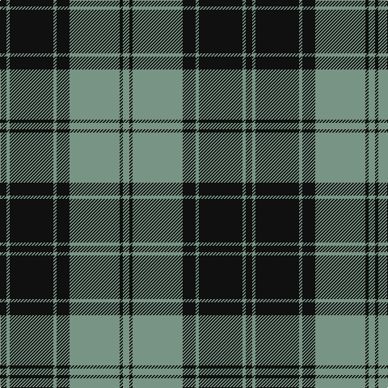

In pattern [GKGKGKGK](/stripes/gkgkgkgk/).

This was sourced from tartans-authority.  It is a [8 stripe tartan](/stripes/stripes8/).

Original link http://www.tartansauthority.com/tartan-ferret/display/6268/

## Thread count
K/8 LG4 K54 LG4 K16 LG62 K4 LG/8

## Palette
Each colour and its ΔE from the base-6 reference it is a variant of.

| Colour | Shade | Base | ΔE (OKLab) |
|---|---|---|---|
| K | <code style="background-color:#101010;">#101010</code> `#101010` | K <code style="background-color:#000000;">#000000</code> | 0.17 |
| LG | <code style="background-color:#789484;">#789484</code> `#789484` | G <code style="background-color:#006100;">#006100</code> | 0.24 |

# Sample pattern

## Nearest tartans

The nearest existing variants by ΔTartan distance.

1. [Douglas, Grey (Vestiarium Scoticum)](/setts/s8/k10o1k2o1k4o10k1o2~x4/) — ΔT 0.98
1. [West Point](/setts/s8/k13o1k1o1k4o10ly1o1~x6/) — ΔT 1.07
1. [Watertown Library Assoc.](/setts/s14/k4y2k27y2k8y31k2y4~x2/) — ΔT 1.14
1. [Korner-Macpherson (Personal)](/setts/s7/y5r3y35k28y4k11y2~x2/) — ΔT 1.19
1. [West Point Military Academy (Mil.)](/setts/s8/k10o1k2o1k4o10ly1o2~x4/) — ΔT 1.26
1. [Nowell/Noel 1951 (Name)](/setts/s8/lr3k24lr6k8w4k8lr35k2~x2/) — ΔT 1.31
1. [Martin's Own](/setts/s8/k10t1k2t1k4t10g1t2~x4/) — ΔT 1.35
1. [Moffat (1984)](/setts/s7/k39o3k3o3k14o28r3~x2/) — ΔT 1.37
1. [Bute Heather, Black](/setts/s10/k6y20k6y4k4y8y2k8y2k5~x2/) — ΔT 1.50
1. [DDB Canada (Fashion)](/setts/s7/k1o2k7o11k18ly2k1~x2/) — ΔT 1.53

## Neighbour map

Every grey dot is one of 14299 variants placed by the first two principal components of the ΔTartan feature space (44% of its variance). Red is this tartan; blue dots are its nearest — click one to open its page.

<svg viewBox="0 0 640 380" role="img" style="max-width:100%;height:auto;border:1px solid #e0e0e0;border-radius:4px;display:block" xmlns="http://www.w3.org/2000/svg"><image href="/nn/cloud.v1.png" width="640" height="380"/><a href="/setts/s8/k10o1k2o1k4o10k1o2~x4/"><circle cx="353.6" cy="221.3" r="4" fill="#3465a4"><title>Douglas, Grey (Vestiarium Scoticum)</title></circle></a><a href="/setts/s8/k13o1k1o1k4o10ly1o1~x6/"><circle cx="351.6" cy="182.5" r="4" fill="#3465a4"><title>West Point</title></circle></a><a href="/setts/s14/k4y2k27y2k8y31k2y4~x2/"><circle cx="348.3" cy="172.4" r="4" fill="#3465a4"><title>Watertown Library Assoc.</title></circle></a><a href="/setts/s7/y5r3y35k28y4k11y2~x2/"><circle cx="347.6" cy="187.8" r="4" fill="#3465a4"><title>Korner-Macpherson (Personal)</title></circle></a><a href="/setts/s8/k10o1k2o1k4o10ly1o2~x4/"><circle cx="309.6" cy="202.1" r="4" fill="#3465a4"><title>West Point Military Academy (Mil.)</title></circle></a><a href="/setts/s8/lr3k24lr6k8w4k8lr35k2~x2/"><circle cx="305.1" cy="169.2" r="4" fill="#3465a4"><title>Nowell/Noel 1951 (Name)</title></circle></a><a href="/setts/s8/k10t1k2t1k4t10g1t2~x4/"><circle cx="310.1" cy="208.0" r="4" fill="#3465a4"><title>Martin's Own</title></circle></a><a href="/setts/s7/k39o3k3o3k14o28r3~x2/"><circle cx="372.9" cy="198.0" r="4" fill="#3465a4"><title>Moffat (1984)</title></circle></a><a href="/setts/s10/k6y20k6y4k4y8y2k8y2k5~x2/"><circle cx="340.7" cy="228.1" r="4" fill="#3465a4"><title>Bute Heather, Black</title></circle></a><a href="/setts/s7/k1o2k7o11k18ly2k1~x2/"><circle cx="395.5" cy="187.5" r="4" fill="#3465a4"><title>DDB Canada (Fashion)</title></circle></a><circle cx="361.9" cy="193.0" r="5" fill="#c00000"/></svg>

ID: /setts/s8/k4y2k27y2k8y31k2y4~x2/
