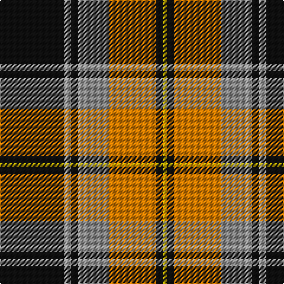

In pattern [KYKYRYKY](/patterns/kykyryky/).

This was sourced from register-of-tartans.  It is a [8 stripes tartan](/stripes/stripes8/).

Original link https://www.tartanregister.gov.uk/tartanDetails.aspx?ref=693

## Attestations

This cloth appears in 2 source records; the oldest owns this page.

- 01/02/2007 — Clyde Valley HOG (register-of-tartans, [record](https://www.tartanregister.gov.uk/tartanDetails.aspx?ref=693))
- February 2007 — Clyde Valley HOG (Corporate) (tartans-authority, [record](http://www.tartansauthority.com/tartan-ferret/display/7103/))

## Register references

External register numbers recorded for this tartan.

- Scottish Register of Tartans: [693](https://www.tartanregister.gov.uk/tartanDetails.aspx?ref=693)
- Scottish Tartans Authority (ITI): 7103

## Thread count
K/54 Na6 K6 Na6 N20 O40 K6 Y/3

## Palette
Each colour and its ΔE from the base-6 reference it is a variant of.

| Colour | Shade | Base | ΔE (OKLab) |
|---|---|---|---|
| K | <code style="background-color:#101010;">#101010</code> `#101010` | K <code style="background-color:#000000;">#000000</code> | 0.17 |
| N | <code style="background-color:#888888;">#888888</code> `#888888` | R <code style="background-color:#CC0000;">#CC0000</code> | 0.24 |
| Na | <code style="background-color:#A0A0A0;">#A0A0A0</code> `#A0A0A0` | Y <code style="background-color:#F2BF00;">#F2BF00</code> | 0.21 |
| O | <code style="background-color:#D87C00;">#D87C00</code> `#D87C00` | Y <code style="background-color:#F2BF00;">#F2BF00</code> | 0.17 |
| Y | <code style="background-color:#E8C000;">#E8C000</code> `#E8C000` | Y <code style="background-color:#F2BF00;">#F2BF00</code> | 0.02 |

# Sample pattern

## Nearest tartans

The nearest existing variants by ΔTartan distance.

1. [Dalveen (Fashion)](/setts/s8/g3ga2g21ga1w11k21ga2k3~g744c00-ga006818-k101010-we0e0e0~x2/) — ΔT 0.90
1. [Bryan Wedding (Personal)](/setts/s6/g30y5b10k10w2k2~b5c8ca8-g604000-k101010-wfcfcfc-yfccc00~x2/) — ΔT 0.96
1. [Braemar or Blair Atholl](/setts/s8/b2w2k6b3k2r14k1r1~b441800-k101010-ra07c58-wffffff~x4/) — ΔT 0.98
1. [Southdown (Fashion)](/setts/s9/k3r1k3w5k5w3k5g23r3~g604000-k101010-rc80000-wf8f8f8~x2/) — ΔT 0.99
1. [Cates Dress (Clan)](/setts/s12/y2w1r2k20r9k20y7ra20k5y1k1r1~k101010-rc80000-ra888888-wf8f8f8-ye8c000~x2/) — ΔT 1.01
1. [Dunlop Hunting](/setts/s8/k3r1k18w1y18g1y1w2~g006818-k101010-rc80000-wfcfcfc-ya08858~x4/) — ΔT 1.03
1. [Stewart, Fawn](/setts/s10/r24k5ra2k2w2b8w3k2w2r2~b505050-k000000-r906030-rac00000-we0e0e0~x2/) — ΔT 1.05
1. [Merric Dark Camel.. Trade Tartan Tartan Number: 1688. Earliest known date: 1985 School colours. See products available Copyright © Blair Urquhart, Comrie, 2015](/setts/s7/r2w8k14g25w2k2w2~g604000-k101010-rc80000-we0e0e0~x2/) — ΔT 1.06
1. [Blair Atholl (Fashion)](/setts/s8/b2y2k6b3k2r14k1r1~b441800-k101010-ra07c58-yb8b8b8~x4/) — ΔT 1.10
1. [Distripress Annual Congress 2012](/setts/s8/r12k2w8k4b16r2k31b2~b666666-k101010-rff0000-wffffff/) — ΔT 1.11

## Neighbour map

Every grey dot is one of 15726 variants placed by the first two principal components of the ΔTartan feature space (44% of its variance). Red is this tartan; blue dots are its nearest — click one to open its page.

<svg viewBox="0 0 640 380" role="img" style="max-width:100%;height:auto;border:1px solid #e0e0e0;border-radius:4px;display:block" xmlns="http://www.w3.org/2000/svg"><image href="/nn/cloud.v1.png" width="640" height="380"/><a href="/setts/s8/g3ga2g21ga1w11k21ga2k3~g744c00-ga006818-k101010-we0e0e0~x2/"><circle cx="195.6" cy="131.7" r="4" fill="#3465a4"><title>Dalveen (Fashion)</title></circle></a><a href="/setts/s6/g30y5b10k10w2k2~b5c8ca8-g604000-k101010-wfcfcfc-yfccc00~x2/"><circle cx="250.7" cy="162.7" r="4" fill="#3465a4"><title>Bryan Wedding (Personal)</title></circle></a><a href="/setts/s8/b2w2k6b3k2r14k1r1~b441800-k101010-ra07c58-wffffff~x4/"><circle cx="254.5" cy="157.5" r="4" fill="#3465a4"><title>Braemar or Blair Atholl</title></circle></a><a href="/setts/s9/k3r1k3w5k5w3k5g23r3~g604000-k101010-rc80000-wf8f8f8~x2/"><circle cx="251.3" cy="130.1" r="4" fill="#3465a4"><title>Southdown (Fashion)</title></circle></a><a href="/setts/s12/y2w1r2k20r9k20y7ra20k5y1k1r1~k101010-rc80000-ra888888-wf8f8f8-ye8c000~x2/"><circle cx="246.4" cy="113.7" r="4" fill="#3465a4"><title>Cates Dress (Clan)</title></circle></a><a href="/setts/s8/k3r1k18w1y18g1y1w2~g006818-k101010-rc80000-wfcfcfc-ya08858~x4/"><circle cx="264.0" cy="121.9" r="4" fill="#3465a4"><title>Dunlop Hunting</title></circle></a><a href="/setts/s10/r24k5ra2k2w2b8w3k2w2r2~b505050-k000000-r906030-rac00000-we0e0e0~x2/"><circle cx="230.5" cy="121.2" r="4" fill="#3465a4"><title>Stewart, Fawn</title></circle></a><a href="/setts/s7/r2w8k14g25w2k2w2~g604000-k101010-rc80000-we0e0e0~x2/"><circle cx="231.9" cy="166.3" r="4" fill="#3465a4"><title>Merric Dark Camel.. Trade Tartan Tartan Number: 1688. Earliest known date: 1985 School colours. See products available Copyright © Blair Urquhart, Comrie, 2015</title></circle></a><a href="/setts/s8/b2y2k6b3k2r14k1r1~b441800-k101010-ra07c58-yb8b8b8~x4/"><circle cx="266.2" cy="162.7" r="4" fill="#3465a4"><title>Blair Atholl (Fashion)</title></circle></a><a href="/setts/s8/r12k2w8k4b16r2k31b2~b666666-k101010-rff0000-wffffff/"><circle cx="235.7" cy="154.2" r="4" fill="#3465a4"><title>Distripress Annual Congress 2012</title></circle></a><circle cx="227.1" cy="133.7" r="5" fill="#c00000"/></svg>

ID: /setts/s8/k54y6k6y6r20ya40k6yb3~k101010-r888888-ya0a0a0-yad87c00-ybe8c000/
