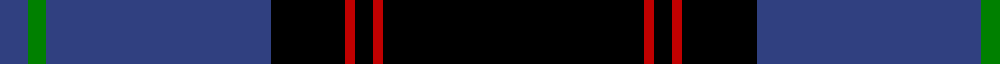

In pattern [BGBKRKRK](/patterns/bgbkrkrk/).

This was sourced from weddslist.  It is a [8 stripes tartan](/stripes/stripes8/).

Original link http://www.weddslist.com/cgi-bin/tartans/pg.pl?source=sts

## Thread count
B/6 G4 B48 K16 R2 K4 R2 K/56

## Palette
Each colour and its ΔE from the base-6 reference it is a variant of.

| Colour | Shade | Base | ΔE (OKLab) |
|---|---|---|---|
| B | <code style="background-color:#304080;">#304080</code> `#304080` | B <code style="background-color:#2C4084;">#2C4084</code> | 0.01 |
| G | <code style="background-color:#008000;">#008000</code> `#008000` | G <code style="background-color:#006400;">#006400</code> | 0.09 |
| K | <code style="background-color:#000000;">#000000</code> `#000000` | K <code style="background-color:#000000;">#000000</code> | 0.00 |
| R | <code style="background-color:#C00000;">#C00000</code> `#C00000` | R <code style="background-color:#C80000;">#C80000</code> | 0.02 |

# Sample pattern

## Nearest tartans

The nearest existing variants by ΔTartan distance.

1. [Dunlop](/setts/s8/k6r2k60w2b56r2b2w6-b304080-k000000-rc00000-we0e0e0/) — ΔT 1.05
1. [Hope-Weir / Weir](/setts/s8/k16y2k2b56k24g4k2ba4-b304080-ba5480b0-g008000-k000000-yf0c000/) — ΔT 1.22
1. [Ramsay](/setts/s6/k8w4k56b60k2b6-b304080-k000000-we0e0e0/) — ΔT 1.27
1. [Angus](/setts/s9/k6r2k64b56r2b4r2b4r6-b304080-k000000-rc00000/) — ΔT 1.28
1. [Scotland's Own](/setts/s12/b8w2b60k30ba8b4k4b4k20b8ba4b4-b304080-ba800080-k000000-we0e0e0/) — ΔT 1.32
1. [Genet, Edmond Charles 'Citizen' (Personal)](/setts/s7/r8k18g18ka80r4ka4w4-g285800-k101010-ka000028-rdc0000-wf8f8f8/) — ΔT 1.32
1. [Bristow Helicopters](/setts/s14/b56k2w2b4k2r4k2b4w2k2b30k32b6k32-b304080-k000000-rc00000-we0e0e0/) — ΔT 1.38
1. [Dunlop](/setts/s8/k6r2k60w2b56r2b2w6-b2c2c80-k101010-rc80000-we0e0e0/) — ΔT 1.48
1. [Pride of Nova Scotia (Corporate)](/setts/s7/k6y4k72b32k10b4w6-b344454-k00002c-we0e0e0-ybc8c00/) — ΔT 1.49
1. [Home](/setts/s8/k28r1k2r1k8b24g2b3-b00005c-g004c00-k000000-rc80000/) — ΔT 1.54

## Neighbour map

Every grey dot is one of 15726 variants placed by the first two principal components of the ΔTartan feature space (44% of its variance). Red is this tartan; blue dots are its nearest — click one to open its page.

<svg viewBox="0 0 640 380" role="img" style="max-width:100%;height:auto;border:1px solid #e0e0e0;border-radius:4px;display:block" xmlns="http://www.w3.org/2000/svg"><image href="/nn/cloud.v1.png" width="640" height="380"/><a href="/setts/s8/k6r2k60w2b56r2b2w6-b304080-k000000-rc00000-we0e0e0/"><circle cx="324.5" cy="125.4" r="4" fill="#3465a4"><title>Dunlop</title></circle></a><a href="/setts/s8/k16y2k2b56k24g4k2ba4-b304080-ba5480b0-g008000-k000000-yf0c000/"><circle cx="315.2" cy="123.1" r="4" fill="#3465a4"><title>Hope-Weir / Weir</title></circle></a><a href="/setts/s6/k8w4k56b60k2b6-b304080-k000000-we0e0e0/"><circle cx="360.8" cy="176.8" r="4" fill="#3465a4"><title>Ramsay</title></circle></a><a href="/setts/s9/k6r2k64b56r2b4r2b4r6-b304080-k000000-rc00000/"><circle cx="361.0" cy="136.9" r="4" fill="#3465a4"><title>Angus</title></circle></a><a href="/setts/s12/b8w2b60k30ba8b4k4b4k20b8ba4b4-b304080-ba800080-k000000-we0e0e0/"><circle cx="360.2" cy="123.2" r="4" fill="#3465a4"><title>Scotland's Own</title></circle></a><a href="/setts/s7/r8k18g18ka80r4ka4w4-g285800-k101010-ka000028-rdc0000-wf8f8f8/"><circle cx="354.2" cy="143.9" r="4" fill="#3465a4"><title>Genet, Edmond Charles 'Citizen' (Personal)</title></circle></a><a href="/setts/s14/b56k2w2b4k2r4k2b4w2k2b30k32b6k32-b304080-k000000-rc00000-we0e0e0/"><circle cx="356.7" cy="116.0" r="4" fill="#3465a4"><title>Bristow Helicopters</title></circle></a><a href="/setts/s8/k6r2k60w2b56r2b2w6-b2c2c80-k101010-rc80000-we0e0e0/"><circle cx="354.6" cy="135.5" r="4" fill="#3465a4"><title>Dunlop</title></circle></a><a href="/setts/s7/k6y4k72b32k10b4w6-b344454-k00002c-we0e0e0-ybc8c00/"><circle cx="410.5" cy="174.1" r="4" fill="#3465a4"><title>Pride of Nova Scotia (Corporate)</title></circle></a><a href="/setts/s8/k28r1k2r1k8b24g2b3-b00005c-g004c00-k000000-rc80000/"><circle cx="405.5" cy="172.7" r="4" fill="#3465a4"><title>Home</title></circle></a><circle cx="364.1" cy="149.9" r="5" fill="#c00000"/></svg>

ID: /setts/s8/k56r2k4r2k16b48g4b6-b304080-g008000-k000000-rc00000/
