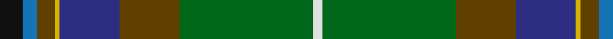

In pattern [KBGYBGGW](/patterns/kbgybggw/).

This was sourced from register-of-tartans.  It is a [8 stripes tartan](/stripes/stripes8/).

Original link https://www.tartanregister.gov.uk/tartanDetails.aspx?ref=4097

## Attestations

This cloth appears in 2 source records; the oldest owns this page.

- 01/01/1996 — Teviotdale (register-of-tartans, [record](https://www.tartanregister.gov.uk/tartanDetails.aspx?ref=4097))
- 1996 — Teviotdale (District) (tartans-authority, [record](http://www.tartansauthority.com/tartan-ferret/display/5136/))

## Thread count
K/10 B6 T8 Y2 DB26 T26 G58 LN/4

## Palette
Each colour and its ΔE from the base-6 reference it is a variant of.

| Colour | Shade | Base | ΔE (OKLab) |
|---|---|---|---|
| B | <code style="background-color:#1474B4;">#1474B4</code> `#1474B4` | B <code style="background-color:#2A418A;">#2A418A</code> | 0.15 |
| DB | <code style="background-color:#2C2C80;">#2C2C80</code> `#2C2C80` | B <code style="background-color:#2A418A;">#2A418A</code> | 0.06 |
| G | <code style="background-color:#006818;">#006818</code> `#006818` | G <code style="background-color:#006100;">#006100</code> | 0.02 |
| K | <code style="background-color:#101010;">#101010</code> `#101010` | K <code style="background-color:#000000;">#000000</code> | 0.17 |
| LN | <code style="background-color:#E0E0E0;">#E0E0E0</code> `#E0E0E0` | W <code style="background-color:#F7F7F7;">#F7F7F7</code> | 0.07 |
| T | <code style="background-color:#604000;">#604000</code> `#604000` | G <code style="background-color:#006100;">#006100</code> | 0.14 |
| Y | <code style="background-color:#D8B000;">#D8B000</code> `#D8B000` | Y <code style="background-color:#F2BF00;">#F2BF00</code> | 0.06 |

# Sample pattern

## Nearest tartans

The nearest existing variants by ΔTartan distance.

1. [Batten of Argyll Clan Tartan Tartan Number: 5768. Earliest known date: 2003 The Baddenach family originally emigrated from Argyll, Scotland to Jamestown, Virginia. This can be worn by all of the name or its anglicised variants (Batten, Batton, Battin, Badden etc). IT is also to serve as the official tartan for the St Andrews Legion/St Andrews Legion Pipes & Drums headquartered in Richmond Virginia, whose founder is the designer of this tartan. It may also serve as a tartan for anyone having Scottish ancestors who settled in the Virginia Colony. See products available Copyright © Blair Urquhart, Comrie, 2015](/setts/s8/b5k1g5ba15ga15gb28k2r4x2~b780078-ba440044-g5c6428-ga003820-gb006818-k101010-rc80000/) — ΔT 0.91
1. [Stirling University](/setts/s9/g28r4k3ga2k1gb2r3b20y2x2~b2c4084-g005020-ga808080-gb002814-k101010-rdc0000-ye8c000/) — ΔT 1.05
1. [Hughes Interconnection Int. (Pers)](/setts/s9/w4k2b18y4b18g26ga18k1r2x2~b1870a4-g603800-ga00643c-k101010-rb468ac-wfcfcfc-ye8c000/) — ΔT 1.16
1. [Stirling University Corporate Tartan Tartan Number: 2074. Earliest known date: Aug 1992 This is a simplified Stirling and Bannockburn district sett with the Universities 'Green and Grey' striped through the black. See products available Copyright © Blair Urquhart, Comrie, 2015](/setts/s9/g28r4k3ra2k1ga2r3b20y2x2~b2c2c80-g006818-ga003820-k101010-rc80000-ra888888-ye8c000/) — ΔT 1.18
1. [Jones (Name)](/setts/s7/r4w1g6ga25k8b15w2x2~b2c2c80-g5c6428-ga006818-k101010-rc80000-wc0c0c0/) — ΔT 1.19
1. [Teviotdale District Tartan Tartan Number: 5136. Earliest known date: 01/01/1996 Lochcarron. The colours are representative of those in the valley through which flows the River Teviot in the Scottish Borders. Sample in Scottish Tartans Authority's Johnston Collection. Blues lightened to show sett. See products available Copyright © Blair Urquhart, Comrie, 2015](/setts/s14/k5ka3g4y1b13g13ga29w2ga29g13b13y1g4ka3x2~b2c2c80-g604000-ga006818-k101010-ka000000-we0e0e0-yd8b000/) — ΔT 1.22
1. [Fujitsu](/setts/s8/w1b6ba9r12k12g32k6y1x2~b1c1c50-ba780078-g006818-k101010-r880000-we0e0e0-ye8c000/) — ΔT 1.23
1. [Aberuchill District Tartan Tartan Number: 6814. Earliest known date: 2005 Aberuchill lends it name to the area south of Comrie where the river Ruchil meets the river Earn. The two rivers form the boundaries of the Aberuchill Estate for which this tartan was created. See products available Copyright © Blair Urquhart, Comrie, 2015](/setts/s8/r8k2g10b30g30ga55k4ra6~b440044-g58581c-ga006818-k101010-r9c68a4-rab84c00/) — ΔT 1.24
1. [Aberuchill](/setts/s8/r8k2g10b30g30ga55k4y6~b440044-g603800-ga006818-k101010-rb468ac-yd87c00/) — ΔT 1.29
1. [Highland Wedding (Fashion)](/setts/s8/r9b8r8g52w2k32b44ba4~b003c64-ba1474b4-g006818-k101010-rc80000-we0e0e0/) — ΔT 1.33

## Neighbour map

Every grey dot is one of 15726 variants placed by the first two principal components of the ΔTartan feature space (44% of its variance). Red is this tartan; blue dots are its nearest — click one to open its page.

<svg viewBox="0 0 640 380" role="img" style="max-width:100%;height:auto;border:1px solid #e0e0e0;border-radius:4px;display:block" xmlns="http://www.w3.org/2000/svg"><image href="/nn/cloud.v1.png" width="640" height="380"/><a href="/setts/s8/b5k1g5ba15ga15gb28k2r4x2~b780078-ba440044-g5c6428-ga003820-gb006818-k101010-rc80000/"><circle cx="198.6" cy="123.7" r="4" fill="#3465a4"><title>Batten of Argyll Clan Tartan Tartan Number: 5768. Earliest known date: 2003 The Baddenach family originally emigrated from Argyll, Scotland to Jamestown, Virginia. This can be worn by all of the name or its anglicised variants (Batten, Batton, Battin, Badden etc). IT is also to serve as the official tartan for the St Andrews Legion/St Andrews Legion Pipes &amp; Drums headquartered in Richmond Virginia, whose founder is the designer of this tartan. It may also serve as a tartan for anyone having Scottish ancestors who settled in the Virginia Colony. See products available Copyright © Blair Urquhart, Comrie, 2015</title></circle></a><a href="/setts/s9/g28r4k3ga2k1gb2r3b20y2x2~b2c4084-g005020-ga808080-gb002814-k101010-rdc0000-ye8c000/"><circle cx="244.9" cy="92.5" r="4" fill="#3465a4"><title>Stirling University</title></circle></a><a href="/setts/s9/w4k2b18y4b18g26ga18k1r2x2~b1870a4-g603800-ga00643c-k101010-rb468ac-wfcfcfc-ye8c000/"><circle cx="179.2" cy="113.6" r="4" fill="#3465a4"><title>Hughes Interconnection Int. (Pers)</title></circle></a><a href="/setts/s9/g28r4k3ra2k1ga2r3b20y2x2~b2c2c80-g006818-ga003820-k101010-rc80000-ra888888-ye8c000/"><circle cx="231.2" cy="86.8" r="4" fill="#3465a4"><title>Stirling University Corporate Tartan Tartan Number: 2074. Earliest known date: Aug 1992 This is a simplified Stirling and Bannockburn district sett with the Universities 'Green and Grey' striped through the black. See products available Copyright © Blair Urquhart, Comrie, 2015</title></circle></a><a href="/setts/s7/r4w1g6ga25k8b15w2x2~b2c2c80-g5c6428-ga006818-k101010-rc80000-wc0c0c0/"><circle cx="206.7" cy="141.5" r="4" fill="#3465a4"><title>Jones (Name)</title></circle></a><a href="/setts/s14/k5ka3g4y1b13g13ga29w2ga29g13b13y1g4ka3x2~b2c2c80-g604000-ga006818-k101010-ka000000-we0e0e0-yd8b000/"><circle cx="219.9" cy="95.1" r="4" fill="#3465a4"><title>Teviotdale District Tartan Tartan Number: 5136. Earliest known date: 01/01/1996 Lochcarron. The colours are representative of those in the valley through which flows the River Teviot in the Scottish Borders. Sample in Scottish Tartans Authority's Johnston Collection. Blues lightened to show sett. See products available Copyright © Blair Urquhart, Comrie, 2015</title></circle></a><a href="/setts/s8/w1b6ba9r12k12g32k6y1x2~b1c1c50-ba780078-g006818-k101010-r880000-we0e0e0-ye8c000/"><circle cx="198.0" cy="106.6" r="4" fill="#3465a4"><title>Fujitsu</title></circle></a><a href="/setts/s8/r8k2g10b30g30ga55k4ra6~b440044-g58581c-ga006818-k101010-r9c68a4-rab84c00/"><circle cx="241.4" cy="141.4" r="4" fill="#3465a4"><title>Aberuchill District Tartan Tartan Number: 6814. Earliest known date: 2005 Aberuchill lends it name to the area south of Comrie where the river Ruchil meets the river Earn. The two rivers form the boundaries of the Aberuchill Estate for which this tartan was created. See products available Copyright © Blair Urquhart, Comrie, 2015</title></circle></a><a href="/setts/s8/r8k2g10b30g30ga55k4y6~b440044-g603800-ga006818-k101010-rb468ac-yd87c00/"><circle cx="230.4" cy="134.1" r="4" fill="#3465a4"><title>Aberuchill</title></circle></a><a href="/setts/s8/r9b8r8g52w2k32b44ba4~b003c64-ba1474b4-g006818-k101010-rc80000-we0e0e0/"><circle cx="190.5" cy="137.2" r="4" fill="#3465a4"><title>Highland Wedding (Fashion)</title></circle></a><circle cx="221.2" cy="115.6" r="5" fill="#c00000"/></svg>

ID: /setts/s8/k5b3g4y1ba13g13ga29w2x2~b1474b4-ba2c2c80-g604000-ga006818-k101010-we0e0e0-yd8b000/
